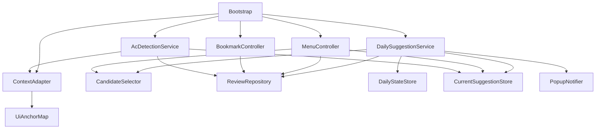
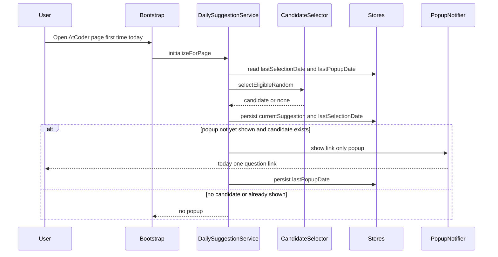
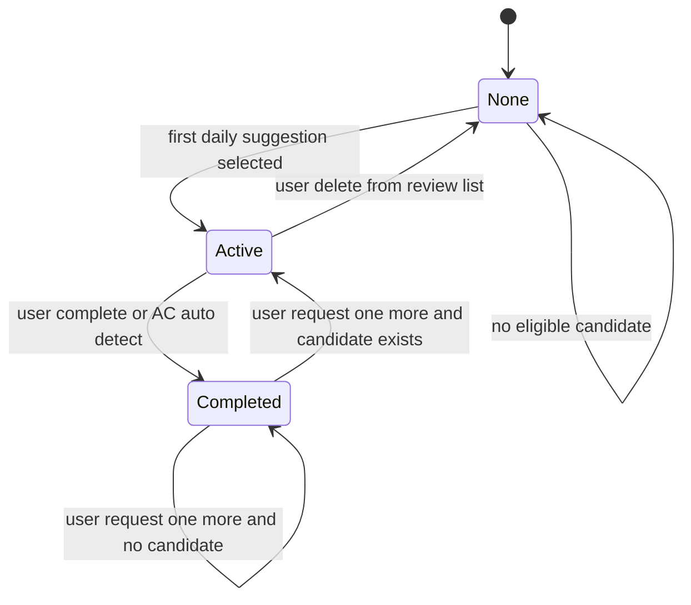

# Design Document

## Overview
ac-revisit は AtCoder 上で動作するユーザースクリプトとして、復習対象の登録、14日固定の候補判定、1日1問の提案、Current Suggestion 操作をブラウザ内だけで完結させる。外部サーバー通信を持たず、永続化はブラウザストレージのみを利用する。

本設計は greenfield 前提で、単一スクリプト内に「ページ適応」「提案ドメイン」「永続化」「UI提示」を責務分離したモジュール境界を設ける。これにより AtCoder DOM 変化の影響を局所化し、MVP要件を満たしつつ設計拡張余地を残す。

### Goals
- 要件 1.1-9.3 を満たすアーキテクチャと契約を明示する。
- Current Suggestion の状態遷移を破綻なく扱える境界を定義する。
- 1日1回通知と「もう1問」を両立する日次制御モデルを定義する。

### Non-Goals
- 実装コード、UIスタイル詳細、フレームワーク導入手順。
- MVP対象外機能（一覧、タグ、メモ、統計など）。
- 外部API連携、クラウド同期、サーバーサイド構成。

## Architecture

### Architecture Pattern & Boundary Map
**Architecture Integration**:
- Selected pattern: 機能別モジュール分割（Page Adapter + Domain Services + Storage + UI Presenter）
- Domain/feature boundaries: DOM依存境界とドメインロジック境界を分離
- Existing patterns preserved: 既存コードがないため新規定義
- New components rationale: 要件群を独立検証可能な責務単位で分解
- Steering compliance: steering は空のため、テンプレート原則と要件を唯一基準として適合



### Technology Stack

| Layer | Choice / Version | Role in Feature | Notes |
|-------|------------------|-----------------|-------|
| Frontend / UI | Vanilla DOM API (Browser standard) | トグル、メニュー導線、ポップアップ表示 | 外部UIライブラリ不使用 |
| Script Runtime | Tampermonkey Stable (2026-02時点) | ユーザースクリプト実行基盤 | `@match` と `@grant` を最小化 |
| Data / Storage | Tampermonkey GM Storage (`GM_getValue`/`GM_setValue`) | 復習対象、日次状態、現在提案の永続化 | ユーザースクリプト領域に保存 |
| Messaging / Events | In-memory custom events | モジュール間通知 | 同期処理中心、外部キューなし |
| Infrastructure / Runtime | AtCoder page context + Greasy Fork distribution | 実行対象と配布チャネル | AtCoder ドメイン限定 |

## System Flows





## Requirements Traceability

| Requirement | Summary | Components | Interfaces | Flows |
|-------------|---------|------------|------------|-------|
| 1.1 | 未ログイン時は機能非提供 | ContextAdapter, Bootstrap | `PageContextService` | 起動判定 |
| 1.2 | ブラウザ内永続化 | ReviewRepository, DailyStateStore, CurrentSuggestionStore | `StoragePort` | 全フロー |
| 1.3 | 外部通信なし | 全コンポーネント | 設計制約 | 全フロー |
| 2.1 | 問題ページトグル表示 | BookmarkController, ContextAdapter | `BookmarkViewPort` | 登録フロー |
| 2.2 | 提出詳細ページトグル表示 | BookmarkController, ContextAdapter | `BookmarkViewPort` | 登録フロー |
| 2.3 | 登録操作 | BookmarkController, ReviewRepository | `ReviewTargetService` | 登録フロー |
| 2.4 | 解除操作 | BookmarkController, ReviewRepository, CurrentSuggestionStore | `ReviewTargetService` | 解除フロー |
| 3.1 | 14日固定 | CandidateSelector | `EligibilityPolicy` | 候補判定 |
| 3.2 | 初回は登録日起点 | CandidateSelector | `EligibilityPolicy` | 候補判定 |
| 3.3 | 完了後は完了日起点 | CandidateSelector | `EligibilityPolicy` | 候補判定 |
| 3.4 | 最適化なし | CandidateSelector | 設計制約 | 候補判定 |
| 4.1 | 1日初回アクセスで提案 | DailySuggestionService | `DailySuggestionService` | 日次提案 |
| 4.2 | 1日1回ポップアップ | DailySuggestionService, PopupNotifier, DailyStateStore | `PopupPort` | 日次提案 |
| 4.3 | 2回目以降通知なし | DailyStateStore, DailySuggestionService | `DailyStateService` | 日次提案 |
| 4.4 | 候補なしなら通知なし | CandidateSelector, DailySuggestionService | `CandidateService` | 日次提案 |
| 4.5 | ポップアップに操作ボタンなし | PopupNotifier | `PopupPort` | 日次提案 |
| 4.6 | ローカル日付判定 | DailyStateService | `DatePolicy` | 日次提案 |
| 5.1 | 現在提案は1問のみ | CurrentSuggestionStore | `CurrentSuggestionService` | 状態遷移 |
| 5.2 | メニュー導線表示 | MenuController, ContextAdapter | `MenuEntryPort` | メニュー表示 |
| 5.3 | 提案なし時に無効遷移しない | MenuController | `MenuEntryPort` | メニュー表示 |
| 5.4 | クリアまで提案保持 | CurrentSuggestionStore | `CurrentSuggestionService` | 状態遷移 |
| 6.1 | 完了記録 | MenuController, ReviewRepository | `CompletionService` | 操作フロー |
| 6.2 | 削除時クリア | MenuController, ReviewRepository, CurrentSuggestionStore | `ReviewTargetService` | 操作フロー |
| 6.3 | 削除後自動差替えなし | MenuController | `CurrentSuggestionService` | 操作フロー |
| 6.4 | 未完了でもう1問不可 | MenuController | `SuggestionActionPolicy` | 操作フロー |
| 6.5 | 完了済みで候補から再提案 | MenuController, CandidateSelector | `SuggestionActionService` | 操作フロー |
| 6.6 | もう1問時に追加通知なし | MenuController, DailyStateStore | `DailyStateService` | 操作フロー |
| 6.7 | 候補なしで新規作成しない | CandidateSelector, MenuController | `SuggestionActionService` | 操作フロー |
| 7.1 | 提出詳細で当日AC判定 | AcDetectionService, ContextAdapter | `AcDetectionPort` | AC補助 |
| 7.2 | 条件一致で自動完了 | AcDetectionService, ReviewRepository | `CompletionService` | AC補助 |
| 7.3 | 非ブロッキング実行 | AcDetectionService | `AcDetectionPort` | AC補助 |
| 7.4 | 失敗時手動継続可能 | AcDetectionService, MenuController | `CompletionService` | AC補助 |
| 7.5 | 提出一覧は対象外 | ContextAdapter, AcDetectionService | `PageContextService` | AC補助 |
| 7.6 | AC以外は自動完了しない | AcDetectionService | `AcDetectionPort` | AC補助 |
| 8.1 | 一覧画面なし | 全体スコープ制約 | 設計制約 | - |
| 8.2 | 追加機能群なし | 全体スコープ制約 | 設計制約 | - |
| 8.3 | 動的間隔変更なし | CandidateSelector | `EligibilityPolicy` | 候補判定 |
| 9.1 | Greasy Fork 配布前提 | PackagingConstraint | 配布制約 | - |
| 9.2 | Tampermonkey 実行 | Bootstrap | Runtime制約 | 起動 |
| 9.3 | AtCoder以外では動作対象外 | ContextAdapter | `PageContextService` | 起動判定 |

## Components and Interfaces

| Component | Domain/Layer | Intent | Req Coverage | Key Dependencies (P0/P1) | Contracts |
|-----------|--------------|--------|--------------|--------------------------|-----------|
| Bootstrap | Runtime | 起動順序と初期連携を統括 | 1.1, 4.1, 9.2 | ContextAdapter P0, DailySuggestionService P0 | Service |
| ContextAdapter | Integration | ページ種別とDOMアンカー抽出 | 1.1, 2.1, 2.2, 5.2, 7.1, 7.5, 9.3 | DOM P0 | Service, State |
| ReviewRepository | Data | 復習対象の永続化と整合管理 | 1.2, 2.3, 2.4, 6.1, 6.2 | GMStorageAdapter P0 | Service, State |
| CurrentSuggestionStore | Data | 現在提案1件の保持/クリア | 5.1, 5.4, 6.2, 6.3 | GMStorageAdapter P0 | Service, State |
| DailyStateStore | Data | 日次選定/通知の履歴保持 | 4.2, 4.3, 4.6, 6.6 | GMStorageAdapter P0 | Service, State |
| CandidateSelector | Domain | 14日固定の候補選定とランダム抽出 | 3.1-3.4, 4.1, 4.4, 6.5, 6.7, 8.3 | ReviewRepository P0 | Service |
| DailySuggestionService | Domain | 日次初回提案の制御 | 4.1-4.6, 5.1 | CandidateSelector P0, DailyStateStore P0 | Service |
| BookmarkController | UI | 問題/提出詳細ページの登録トグル | 2.1-2.4 | ContextAdapter P0, ReviewRepository P0 | Service |
| MenuController | UI | メニュー導線と完了/削除/もう1問操作 | 5.2, 5.3, 6.1-6.7 | CurrentSuggestionStore P0, CandidateSelector P0 | Service |
| PopupNotifier | UI | リンクのみポップアップ提示 | 4.2, 4.5 | DailySuggestionService P0 | Service |
| AcDetectionService | Domain | 提出詳細ページ限定の当日AC補助 | 7.1-7.6 | ContextAdapter P0, ReviewRepository P0 | Service |

### Shared Contracts

#### StoragePort
```typescript
interface StoragePort {
  read<T>(key: string, fallback: T): T;
  write<T>(key: string, value: T): OperationResult;
  remove(key: string): OperationResult;
}
```

#### EligibilityPolicy
```typescript
interface EligibilityPolicy {
  isEligible(input: {
    todayLocalDate: LocalDateString;
    registeredAt: LocalDateString;
    lastCompletedAt?: LocalDateString;
  }): boolean;
}
```

#### CandidateService
```typescript
interface CandidateService {
  selectEligibleRandom(input: {
    todayLocalDate: LocalDateString;
    reviewItems: ReviewItem[];
  }): CandidateResult;
}
```

#### SuggestionActionPolicy
```typescript
interface SuggestionActionPolicy {
  canRequestAnother(input: {
    current: CurrentSuggestion | null;
  }): boolean;
}
```

#### SuggestionActionService
```typescript
interface SuggestionActionService {
  requestAnother(input: {
    todayLocalDate: LocalDateString;
    current: CurrentSuggestion | null;
  }): SuggestionActionResult;
}
```

#### PopupPort
```typescript
interface PopupPort {
  showProblemLink(input: {
    problemId: string;
    problemUrl: string;
  }): void;
}
```

#### MenuEntryPort
```typescript
interface MenuEntryPort {
  renderCurrentSuggestionEntry(input: {
    current: CurrentSuggestion | null;
  }): void;
}
```

#### BookmarkViewPort
```typescript
interface BookmarkViewPort {
  renderToggle(input: {
    problemId: string;
    isRegistered: boolean;
  }): void;
}
```

### Domain Layer

#### CandidateSelector

| Field | Detail |
|-------|--------|
| Intent | 候補集合の生成とランダム1件選定 |
| Requirements | 3.1, 3.2, 3.3, 3.4, 4.1, 4.4, 6.5, 6.7, 8.3 |

**Responsibilities & Constraints**
- 14日固定ルールで eligible 判定。
- 完了日時がある場合は完了日、ない場合は登録日で判定。
- 候補なしを正常系として返却。

**Dependencies**
- Inbound: DailySuggestionService — 日次提案要求 (P0)
- Inbound: MenuController — もう1問要求 (P0)
- Outbound: ReviewRepository — 復習対象取得 (P0)

**Contracts**: Service [x] / API [ ] / Event [ ] / Batch [ ] / State [ ]

##### Service Interface
```typescript
interface CandidateSelectorService {
  selectEligibleRandom(input: {
    todayLocalDate: string;
    reviewItems: ReviewItem[];
  }): CandidateResult;
}
```
- Preconditions: `todayLocalDate` は `YYYY-MM-DD`。
- Postconditions: 候補がある場合は1件のみ返す。
- Invariants: 復習間隔は常に14日固定。

#### DailySuggestionService

| Field | Detail |
|-------|--------|
| Intent | 1日初回アクセス時の提案選定と通知制御 |
| Requirements | 4.1, 4.2, 4.3, 4.4, 4.6, 5.1 |

**Responsibilities & Constraints**
- その日の初回選定判定。
- 通知回数制御は選定制御と分離。
- Current Suggestion の単一性を維持。
- `currentSuggestion.status == active` が既に存在する場合、日次初回アクセスでも新規選定で上書きしない。
- 日次選定は `currentSuggestion == null` または `currentSuggestion.status == completed` の場合のみ実行する。

**Dependencies**
- Inbound: Bootstrap — ページ起動時呼び出し (P0)
- Outbound: CandidateSelector — 候補取得 (P0)
- Outbound: DailyStateStore — 日次履歴更新 (P0)
- Outbound: CurrentSuggestionStore — 現在提案更新 (P0)
- Outbound: PopupNotifier — 通知表示 (P1)

**Contracts**: Service [x] / API [ ] / Event [ ] / Batch [ ] / State [ ]

##### Service Interface
```typescript
interface DailySuggestionService {
  initializeDailySuggestion(input: {
    pageContext: PageContext;
    todayLocalDate: string;
  }): DailySuggestionOutcome;
}
```
- Preconditions: `pageContext.isAtcoder == true`。
- Postconditions: 提案成立時のみ `currentSuggestion` が更新され、既存の `active` 提案は保持される。
- Invariants: 当日ポップアップは最大1回。

#### AcDetectionService

| Field | Detail |
|-------|--------|
| Intent | 提出詳細ページで現在提案への当日ACを補助判定 |
| Requirements | 7.1, 7.2, 7.3, 7.4, 7.5, 7.6 |

**Responsibilities & Constraints**
- 提出詳細ページのみ対象。
- 現在提案の問題ID一致かつ当日ACのみ完了処理。
- 判定失敗時は失敗を握りつぶさずログ化し、UI操作は継続。

**Dependencies**
- Inbound: Bootstrap — ページ起動後の補助判定開始 (P1)
- Outbound: ContextAdapter — ページ情報取得 (P0)
- Outbound: CurrentSuggestionStore — 対象照合 (P0)
- Outbound: ReviewRepository — 完了反映 (P0)

**Contracts**: Service [x] / API [ ] / Event [ ] / Batch [ ] / State [ ]

##### Service Interface
```typescript
interface AcDetectionService {
  evaluateSubmissionPage(input: {
    pageContext: SubmissionDetailContext;
    todayLocalDate: string;
  }): Promise<AcDetectionOutcome>;
}
```
- Preconditions: 提出詳細ページであること。
- Postconditions: 条件一致時のみ完了更新。
- Invariants: AC以外の結果で完了更新しない。

### Integration Layer

#### ContextAdapter

| Field | Detail |
|-------|--------|
| Intent | URL・DOMからページ種別と必要要素を抽出 |
| Requirements | 1.1, 2.1, 2.2, 5.2, 7.1, 7.5, 9.3 |

**Responsibilities & Constraints**
- AtCoderドメイン以外を即時除外。
- ログイン状態をDOMから判定し、未ログイン時は機能提供対象外として扱う。
- 問題ページ/提出詳細ページ/一般ページを識別。
- メニューアンカー、問題ID、提出結果要素を抽出。

**Dependencies**
- Inbound: Bootstrap — 起動判定 (P0)
- Outbound: DOM — セレクタ参照 (P0)

**Contracts**: Service [x] / API [ ] / Event [ ] / Batch [ ] / State [x]

##### Service Interface
```typescript
interface PageContextService {
  detectContext(input: { locationHref: string; documentRef: Document }): PageContext;
}
```
- Preconditions: 現在ドキュメント参照が有効。
- Postconditions: `pageType` と `isLoggedIn` が必ず設定される。
- Invariants: AtCoder外または未ログイン時は `isSupported=false`。

### Data Layer

#### ReviewRepository

| Field | Detail |
|-------|--------|
| Intent | 復習対象の永続化CRUDと完了日更新 |
| Requirements | 1.2, 2.3, 2.4, 3.2, 3.3, 6.1, 6.2 |

**Responsibilities & Constraints**
- 問題IDを主キーとして一意管理。
- 削除は論理無効化ではなく物理削除。
- 完了記録時に `lastCompletedAt` を更新。

**Dependencies**
- Inbound: BookmarkController (P0)
- Inbound: MenuController (P0)
- Outbound: GMStorageAdapter (P0)

**Contracts**: Service [x] / API [ ] / Event [ ] / Batch [ ] / State [x]

##### Service Interface
```typescript
interface ReviewTargetService {
  addTarget(input: { problemId: string; registeredAt: string }): OperationResult;
  removeTarget(input: { problemId: string }): OperationResult;
  markCompleted(input: { problemId: string; completedAt: string }): OperationResult;
  listTargets(): ReviewItem[];
}
```
- Preconditions: `problemId` は空でない。
- Postconditions: 成功時にストア内容が同期される。
- Invariants: 同一 `problemId` は1件のみ。

#### CurrentSuggestionStore

| Field | Detail |
|-------|--------|
| Intent | 現在提案問題を単一レコードで管理 |
| Requirements | 5.1, 5.4, 6.2, 6.3 |

**Responsibilities & Constraints**
- 現在提案は0件または1件。
- 対象削除時は必ずクリア。
- 明示更新があるまで保持。

**Dependencies**
- Inbound: DailySuggestionService (P0)
- Inbound: MenuController (P0)
- Outbound: GMStorageAdapter (P0)

**Contracts**: Service [x] / API [ ] / Event [ ] / Batch [ ] / State [x]

##### Service Interface
```typescript
interface CurrentSuggestionService {
  getCurrent(): CurrentSuggestion | null;
  setCurrent(input: CurrentSuggestion): OperationResult;
  clearCurrent(reason: 'deleted' | 'manual' | 'integrity_repair'): OperationResult;
}
```

#### DailyStateStore

| Field | Detail |
|-------|--------|
| Intent | 日次選定と通知回数制御の状態を管理 |
| Requirements | 4.2, 4.3, 4.6, 6.6 |

**Responsibilities & Constraints**
- `lastSelectionDate` と `lastPopupDate` を分離。
- ローカル日付文字列で比較。

**Dependencies**
- Inbound: DailySuggestionService (P0)
- Inbound: MenuController (P1)
- Outbound: GMStorageAdapter (P0)

**Contracts**: Service [x] / API [ ] / Event [ ] / Batch [ ] / State [x]

##### Service Interface
```typescript
interface DailyStateService {
  getDailyState(): DailyState;
  markSelection(date: string): OperationResult;
  markPopupShown(date: string): OperationResult;
}
```

### UI Layer

#### BookmarkController

| Field | Detail |
|-------|--------|
| Intent | 問題ページ・提出詳細ページでの登録トグル提供 |
| Requirements | 2.1, 2.2, 2.3, 2.4 |

**Responsibilities & Constraints**
- ページ種別ごとの表示制御。
- 操作結果を即時反映し二重登録を防止。

**Dependencies**
- Inbound: Bootstrap (P0)
- Outbound: ContextAdapter (P0)
- Outbound: ReviewRepository (P0)

**Contracts**: Service [x] / API [ ] / Event [ ] / Batch [ ] / State [ ]

#### MenuController

| Field | Detail |
|-------|--------|
| Intent | ハンバーガーメニュー導線と3操作の制御 |
| Requirements | 5.2, 5.3, 6.1, 6.2, 6.3, 6.4, 6.5, 6.6, 6.7 |

**Responsibilities & Constraints**
- 完了/削除/もう1問の遷移条件を強制。
- 提案なし時に無効リンクを作らない。
- 削除操作は `ReviewRepository.removeTarget` 成功後に `CurrentSuggestionStore.clearCurrent('deleted')` を実行する。
- 上記の部分失敗時は `ScriptMeta.needsIntegrityRepair=true` を記録し、次回起動時に整合性修復を実行する。

**Dependencies**
- Inbound: Bootstrap (P0)
- Outbound: CurrentSuggestionStore (P0)
- Outbound: ReviewRepository (P0)
- Outbound: CandidateSelector (P0)

**Contracts**: Service [x] / API [ ] / Event [ ] / Batch [ ] / State [ ]

#### PopupNotifier

| Field | Detail |
|-------|--------|
| Intent | 日次1回のリンクのみ通知を提示 |
| Requirements | 4.2, 4.5 |

**Responsibilities & Constraints**
- 問題リンクのみ表示。
- 操作ボタンは表示しない。

**Dependencies**
- Inbound: DailySuggestionService (P1)

**Contracts**: Service [x] / API [ ] / Event [ ] / Batch [ ] / State [ ]

## Data Models

### Domain Model
- Aggregate: `ReviewCatalog`（復習対象集合）
- Aggregate: `SuggestionSession`（現在提案と日次制御）
- Value Object: `LocalDateString`（`YYYY-MM-DD`）
- Invariants:
  - 現在提案は0または1件。
  - 復習候補の判定間隔は固定14日。
  - 削除済み問題は復習対象にも現在提案にも存在しない。

### Logical Data Model

| Entity | Key | Attributes | Rules |
|--------|-----|------------|-------|
| ReviewItem | `problemId` | `registeredAt`, `lastCompletedAt?` | `problemId` 一意、削除は物理削除 |
| CurrentSuggestion | singleton | `problemId`, `suggestedAt`, `status` | `status` は `active` または `completed` |
| DailyState | singleton | `lastSelectionDate?`, `lastPopupDate?` | 日次判定はローカル日付で比較 |
| ScriptMeta | singleton | `schemaVersion`, `needsIntegrityRepair?` | 互換性管理と起動時整合性修復フラグ |

### Physical Data Model
- Storage: Tampermonkey GM Storage
- Key namespace:
  - `ac-revisit.reviewItems`
  - `ac-revisit.currentSuggestion`
  - `ac-revisit.dailyState`
  - `ac-revisit.meta`
- Consistency:
  - 書き込みは `GM_setValue` によるキー単位更新
  - 読み取り失敗時は既定値復元で継続
  - `@grant` に `GM_getValue`/`GM_setValue`/`GM_deleteValue` を明示

### Data Contracts & Integration

**State Schemas**
```typescript
type LocalDateString = string;

interface ReviewItem {
  problemId: string;
  registeredAt: LocalDateString;
  lastCompletedAt?: LocalDateString;
}

interface CurrentSuggestion {
  problemId: string;
  suggestedAt: LocalDateString;
  status: 'active' | 'completed';
}

interface DailyState {
  lastSelectionDate?: LocalDateString;
  lastPopupDate?: LocalDateString;
}
```

## Error Handling

### Error Strategy
- 入力境界（URL解析、DOM抽出、ストレージ読み書き）で即時検証。
- 判定失敗は「機能停止」ではなく「該当機能スキップ」で劣化運転。
- 操作系（完了/削除）は失敗時に再試行可能な状態を保持。
- 削除系の部分失敗（対象削除成功かつ currentSuggestion クリア失敗）は `needsIntegrityRepair` を立て、次回 `Bootstrap` 起動時に `currentSuggestion` と `reviewItems` の照合で自動修復する。

### Error Categories and Responses
- User Errors: 対象問題が見つからない場合は操作無効化して誤操作を防止。
- System Errors: GMストレージ読み書き失敗時はメモリ既定値で継続し、通知機能のみ抑止可能。
- System Errors: 削除フローの部分失敗時は整合性修復フラグを保存し、メニュー導線は安全側（リンク非活性）で表示する。
- Business Logic Errors: 未完了で「もう1問」要求時は状態変更なしで終了。

### Monitoring
- コンソールログカテゴリを `ac-revisit:*` で統一。
- 重大エラー（データ破損、整合性崩壊）は1日1回まで警告出力。

## Testing Strategy

- Unit Tests:
  - 14日閾値判定（登録日基準/完了日基準）
  - ランダム選定の候補集合制約
  - 日付キー比較と1日判定
  - CurrentSuggestion 単一性制約
- Integration Tests:
  - 問題ページでの登録/解除とストア反映
  - 日次初回アクセス時の提案・通知制御
  - メニュー操作（完了/削除/もう1問）
  - 削除フロー部分失敗時に `needsIntegrityRepair` が立ち、次回起動時に整合性修復されること
  - 提出詳細ページでのAC自動完了
- E2E/UI Tests:
  - 非ログイン状態で機能非表示
  - 通知がリンクのみで1日1回であること
  - 削除後に自動差し替えしないこと

## Security Considerations
- `@match` を AtCoder ドメインに限定し、対象外ページで動作しない。
- 外部通信を設計上排除し、データはローカルのみ保持。
- XSS面では挿入UIのテキストをエスケープし、HTML直挿入を避ける。

## Performance & Scalability
- 判定処理はページロード時の単発実行を原則とし、常時ポーリングを行わない。
- 候補選定は `O(n)`（n: 復習対象件数）で十分。
- DOM探索はページ種別に応じた最小セレクタのみ実行。
