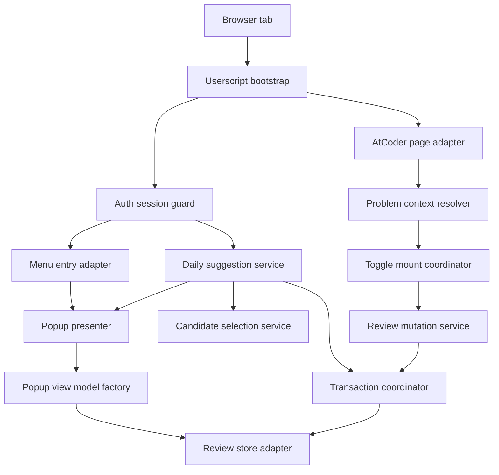
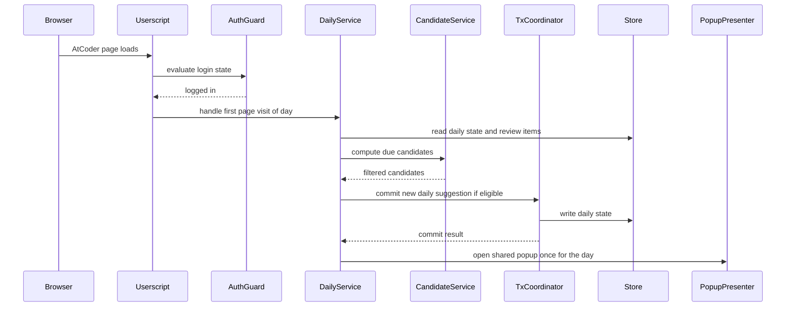
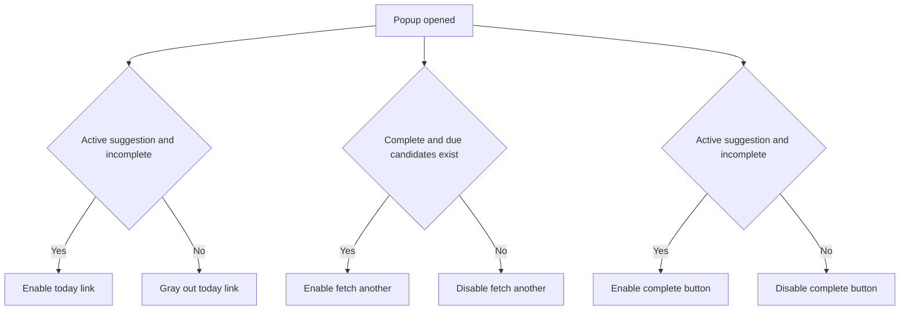
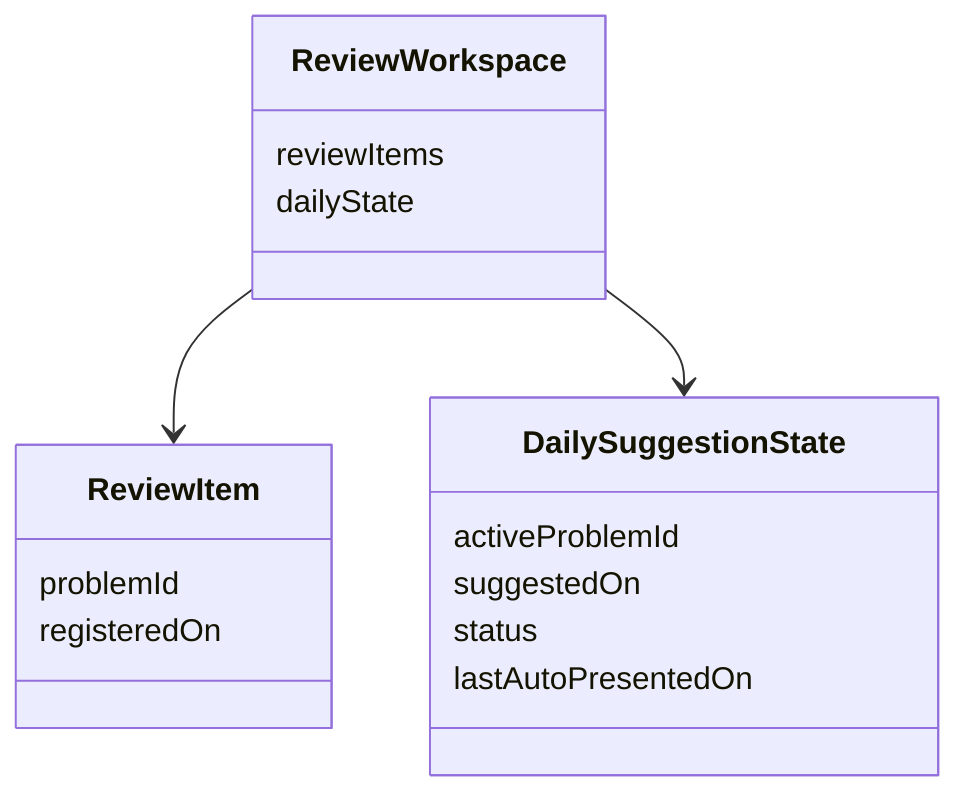

# Design Document

## Overview
`ac-revisit` は AtCoder 上で動作する Tampermonkey 向けユーザースクリプトとして、復習対象の登録、14 日経過後の候補判定、当日 1 回の「今日の一問」提案を提供する。設計の中心は、AtCoder の DOM への最小限の差し込み、問題データと日次状態の厳密な分離、そして単一トランザクションでの状態遷移である。

本機能は greenfield の userscript 実装であり、既存アプリケーション境界は存在しない。`package.json` は最小構成のため、配布メタデータ生成、TypeScript 型チェック、ESLint 実行、ユーザースクリプト向け出力をこの設計で新設する。

### Goals
- AtCoder の問題ページと提出詳細ページで復習対象トグルを提供する
- 当日最初のアクセス時に 14 日経過済み候補から 1 問だけ提案する
- 問題データと今日の一問状態を分離し、削除と完了を単一トランザクションで扱う
- Greasy Fork 配布に必要な userscript metadata と品質チェック経路を定義する

### Non-Goals
- 自動 AC 検知
- 復習対象一覧、統計、ストリーク、タグ、メモ
- 動的間隔調整や定着判定
- 外部 API、外部サーバー、同期機能

## Requirements Traceability

| Requirement | Summary | Components | Interfaces | Flows |
|-------------|---------|------------|------------|-------|
| 1.1 | Greasy Fork 配布形態 | UserscriptPackageSpec | Metadata Contract | Build and publish |
| 1.2 | Tampermonkey 前提 | UserscriptPackageSpec | Metadata Contract | Build and publish |
| 1.3 | TypeScript 実装 | ToolchainProfile | Tooling Contract | Build and validate |
| 1.4 | ESLint 実行 | ToolchainProfile | Tooling Contract | Build and validate |
| 1.5 | 独立型チェック | ToolchainProfile | Tooling Contract | Build and validate |
| 2.1 | ログイン済みのみ利用 | AuthSessionGuard | Service Interface | Startup gate |
| 2.2 | 未ログイン時トグル非表示 | AuthSessionGuard, ToggleMountCoordinator | Service Interface, State Contract | Startup gate |
| 2.3 | 未ログイン時リンク非表示 | AuthSessionGuard, MenuEntryAdapter | Service Interface, State Contract | Startup gate |
| 2.4 | ブラウザ内永続化 | ReviewStoreAdapter | Service Interface, State Contract | All write flows |
| 2.5 | 外部通信なし | UserscriptBootstrap | Service Interface | Build and publish |
| 2.6 | 問題データは識別子と登録日のみ | ReviewStoreAdapter | State Contract | Register and mutate |
| 2.7 | 追加フィールドを保持しない | ReviewStoreAdapter | State Contract | Register and mutate |
| 3.1 | 問題ページのトグル | ToggleMountCoordinator, ProblemContextResolver | Service Interface | Register and mutate |
| 3.2 | 提出詳細ページのトグル | ToggleMountCoordinator, ProblemContextResolver | Service Interface | Register and mutate |
| 3.3 | 登録時に当日を登録日設定 | ReviewMutationService | Service Interface | Register and mutate |
| 3.4 | 解除時に完全削除 | ReviewMutationService | Service Interface | Register and mutate |
| 3.5 | 提案中解除の単一トランザクション | ReviewMutationService, TransactionCoordinator | Service Interface | Register and mutate |
| 4.1 | 14 日経過のみ候補 | CandidateSelectionService | Service Interface | Daily suggestion |
| 4.2 | 固定 14 日のみ | CandidateSelectionService | Service Interface | Daily suggestion |
| 4.3 | 当日初回にランダム 1 問選定 | DailySuggestionService | Service Interface, State Contract | Daily suggestion |
| 4.4 | 自動表示は暦日 1 回 | DailySuggestionService | State Contract | Daily suggestion |
| 4.5 | 候補なしなら自動設定なし | DailySuggestionService | Service Interface | Daily suggestion |
| 4.6 | 常に 1 問のみ提案中 | DailySuggestionService, PopupViewModelFactory | State Contract | Daily suggestion |
| 4.7 | 状態は今日の一問のみ | DailySuggestionService, ReviewStoreAdapter | State Contract | All state transitions |
| 5.1 | メニュー常設リンク | MenuEntryAdapter | Service Interface | Startup gate |
| 5.2 | 候補なしでもリンク表示 | MenuEntryAdapter | State Contract | Startup gate |
| 5.3 | リンク押下でポップアップ | MenuEntryAdapter, PopupPresenter | Service Interface | Popup actions |
| 5.4 | 自動通知も同一 UI | DailySuggestionService, PopupPresenter | Service Interface | Daily suggestion |
| 5.5 | 候補なし時は追加通知なし | DailySuggestionService | State Contract | Daily suggestion |
| 6.1 | 今日の問題へ有効条件 | PopupViewModelFactory | State Contract | Popup actions |
| 6.2 | 今日の問題へグレーアウト | PopupViewModelFactory | State Contract | Popup actions |
| 6.3 | もう一問有効条件 | PopupViewModelFactory | State Contract | Popup actions |
| 6.4 | もう一問無効条件 | PopupViewModelFactory | State Contract | Popup actions |
| 6.5 | もう一問で再抽選し未完了へ | ReviewMutationService, DailySuggestionService | Service Interface | Popup actions |
| 6.6 | 未完了の差し替え禁止 | ReviewMutationService | Service Interface | Popup actions |
| 6.7 | 完了ボタン有効条件 | PopupViewModelFactory | State Contract | Popup actions |
| 6.8 | 完了ボタン無効条件 | PopupViewModelFactory | State Contract | Popup actions |
| 6.9 | 完了操作の単一トランザクション | ReviewMutationService, TransactionCoordinator | Service Interface | Popup actions |
| 7.1 | 自動 AC 検知なし | UserscriptBootstrap | Service Interface | Scope guard |
| 7.2 | 一覧画面なし | MenuEntryAdapter, PopupPresenter | Service Interface | Scope guard |
| 7.3 | デュー可視化なし | PopupViewModelFactory | State Contract | Scope guard |
| 7.4 | メモなし | ReviewStoreAdapter | State Contract | Scope guard |
| 7.5 | タグなし | ReviewStoreAdapter | State Contract | Scope guard |
| 7.6 | ストリークなし | DailySuggestionService | State Contract | Scope guard |
| 7.7 | 統計なし | PopupPresenter | State Contract | Scope guard |
| 7.8 | 動的間隔調整なし | CandidateSelectionService | Service Interface | Scope guard |
| 7.9 | 定着判定なし | ReviewMutationService | Service Interface | Scope guard |
| 7.10 | 自己判断で完了 | PopupPresenter, ReviewMutationService | Service Interface | Popup actions |

## Architecture

### Architecture Pattern & Boundary Map
- Selected pattern: レイヤードな feature slices。DOM 入出力、アプリケーションサービス、永続化を分離し、userscript でも責務を明確化する。
- Domain boundaries:
  - Packaging and tooling
  - Runtime bootstrap and page integration
  - Review domain services
  - Persistence and transaction coordination
  - Popup rendering state
- Existing patterns preserved: 既存コードは未整備のため、最小依存・型安全・単方向依存を新規標準とする。
- Steering compliance: `.kiro/steering/` は未配置のため、設計原則はテンプレートと要件を基準に採用する。



### Technology Stack & Alignment

| Layer | Choice / Version | Role in Feature | Notes |
|-------|------------------|-----------------|-------|
| Frontend runtime | TypeScript on browser DOM APIs | 型安全な userscript 実装 | `any` 不使用、DOM 型を活用 |
| Userscript host | Tampermonkey current documented APIs | 注入、grant、永続化 | `@match` と `GM_*` を利用 |
| Packaging | Single `.user.js` output with metadata block | Greasy Fork 配布物 | 主機能を単体ファイルへ含める |
| Data / Storage | Tampermonkey userscript storage | 復習データと日次状態の保存 | `GM_getValue` / `GM_setValue` |
| Tooling | TypeScript `noEmit` + ESLint flat config | 型検査と静的解析 | ビルドと検査を分離 |

## System Flows





- 日次自動提案は、ログイン済みで当日初回アクセスかつ候補ありの場合にのみ書き込みを行う。
- ポップアップの有効状態判定は `PopupViewModelFactory` に集約し、UI 側で条件分岐を分散させない。

## Components & Interface Contracts

| Component | Domain/Layer | Intent | Req Coverage | Key Dependencies | Contracts |
|-----------|--------------|--------|--------------|------------------|-----------|
| UserscriptPackageSpec | Packaging | userscript metadata と配布制約を定義する | 1.1, 1.2 | ToolchainProfile P1 | Metadata |
| ToolchainProfile | Packaging | lint と typecheck と build 出力を分離する | 1.3, 1.4, 1.5 | none | Tooling |
| UserscriptBootstrap | Runtime | 起動順序とスコープ制約を統括する | 2.5, 7.1, 7.2 | AuthSessionGuard P0, AtCoderPageAdapter P0 | Service |
| AuthSessionGuard | Runtime | ログイン状態を観測し初期表示を制御する | 2.1, 2.2, 2.3 | AtCoderPageAdapter P0 | Service, State |
| AtCoderPageAdapter | Runtime | ルート判定と DOM 探索を提供する | 3.1, 3.2, 5.1 | none | Service |
| ProblemContextResolver | Runtime | 現在ページから問題識別子を解決する | 3.1, 3.2 | AtCoderPageAdapter P0 | Service |
| ToggleMountCoordinator | UI integration | トグル UI の差し込みとイベント接続を行う | 2.2, 3.1, 3.2 | ProblemContextResolver P0, ReviewMutationService P0 | Service |
| MenuEntryAdapter | UI integration | ハンバーガーメニューに常設リンクを追加する | 2.3, 5.1, 5.2, 5.3 | AtCoderPageAdapter P0, PopupPresenter P0 | Service |
| DailySuggestionService | Application | 日次選定と 1 日 1 回通知を管理する | 4.3, 4.4, 4.5, 4.6, 4.7, 5.4, 5.5 | CandidateSelectionService P0, TransactionCoordinator P0, PopupPresenter P1 | Service, State |
| CandidateSelectionService | Domain | 14 日経過候補の抽出とランダム選定を行う | 4.1, 4.2, 7.8 | ReviewStoreAdapter P0 | Service |
| ReviewMutationService | Domain | 登録、解除、完了、もう一問の状態遷移を行う | 3.3, 3.4, 3.5, 6.5, 6.6, 6.9, 7.9, 7.10 | TransactionCoordinator P0 | Service |
| TransactionCoordinator | Persistence | 複数キー更新を単一コミットとして扱う | 3.5, 6.9 | ReviewStoreAdapter P0 | Service |
| ReviewStoreAdapter | Persistence | review items と daily state を保存する | 2.4, 2.6, 2.7, 4.7, 7.4, 7.5 | Tampermonkey storage P0 | Service, State |
| PopupViewModelFactory | Presentation | ボタン有効状態と表示文言を決定する | 4.6, 6.1, 6.2, 6.3, 6.4, 6.7, 6.8, 7.3, 7.7 | ReviewStoreAdapter P1 | Service, State |
| PopupPresenter | Presentation | 共通ポップアップ UI を表示する | 5.3, 5.4, 6.1, 6.2, 6.3, 6.4, 6.7, 6.8, 7.10 | PopupViewModelFactory P0, ReviewMutationService P0 | Service |

### Packaging

#### UserscriptPackageSpec

| Field | Detail |
|-------|--------|
| Intent | Greasy Fork へ投稿する `.user.js` の公開契約を定義する |
| Requirements | 1.1, 1.2 |

**Responsibilities & Constraints**
- metadata block に配布識別情報を含める
- AtCoder 対象の `@match` と必要な `@grant` を公開契約として固定する
- 主機能は配布ファイル内に含め、外部 JavaScript 読み込みを必須にしない

**Dependencies**
- Outbound: ToolchainProfile — metadata 付き出力を生成する (P1)
- External: Greasy Fork listing rules — 公開要件 (P1)

**Contracts**: Service [ ] / API [ ] / Event [ ] / Batch [ ] / State [ ] / Metadata [x]

##### Metadata Contract
| Key | Purpose | Constraint |
|-----|---------|------------|
| `@name` | スクリプト名 | Greasy Fork 表示に必要 |
| `@description` | 機能説明 | 機能と一致する内容 |
| `@match` | 対象 URL | AtCoder ドメインに限定 |
| `@grant` | 権限宣言 | `GM_getValue`, `GM_setValue` を含む |
| `@run-at` | 注入タイミング | DOM マウント可能な時点 |

**Implementation Notes**
- Integration: ビルド出力時に metadata block を先頭へ付与する。
- Validation: 公開前に metadata 欠落を静的検証する。
- Risks: `@match` の過剰指定は Greasy Fork ルール違反になりうる。

#### ToolchainProfile

| Field | Detail |
|-------|--------|
| Intent | TypeScript、lint、型検査の実行境界を分離する |
| Requirements | 1.3, 1.4, 1.5 |

**Responsibilities & Constraints**
- 実装言語を TypeScript に固定する
- lint と typecheck を独立コマンドとして持つ
- build は配布用 `.user.js` を生成し、typecheck 失敗時は公開しない

**Dependencies**
- External: TypeScript `noEmit` — 型チェック専用実行の根拠 (P1)
- External: ESLint flat config — lint 構成 (P1)

**Contracts**: Service [ ] / API [ ] / Event [ ] / Batch [x] / State [ ]

##### Batch / Job Contract
- Trigger: ローカル開発時または CI 実行時
- Input / validation: TypeScript source tree と lint config
- Output / destination: lint 結果、型チェック結果、配布用 `.user.js`
- Idempotency & recovery: ソース未変更なら再実行で同一結果を返す

**Implementation Notes**
- Integration: `lint`, `typecheck`, `build` を分離する。
- Validation: `typecheck` は `noEmit` 相当で JS 出力を伴わない。
- Risks: build 成功と typecheck 成功を同一意味にしない。

### Runtime Integration

#### UserscriptBootstrap

| Field | Detail |
|-------|--------|
| Intent | 起動順序を統括し、不要機能を生成しない |
| Requirements | 2.5, 7.1, 7.2 |

**Responsibilities & Constraints**
- 外部通信を一切行わない
- 起動時にログイン判定、ページ判定、メニュー差し込み、日次判定を順序制御する
- MVP 非対象画面や非対象機能を生成しない

**Dependencies**
- Outbound: AuthSessionGuard — ログイン制御 (P0)
- Outbound: AtCoderPageAdapter — DOM 探索 (P0)
- Outbound: MenuEntryAdapter — 常設導線 (P1)
- Outbound: DailySuggestionService — 日次選定 (P1)

**Contracts**: Service [x] / API [ ] / Event [ ] / Batch [ ] / State [ ]

##### Service Interface
```typescript
interface UserscriptBootstrapService {
  start(context: BootstrapContext): Result<BootstrapOutcome, BootstrapError>;
}

interface BootstrapContext {
  readonly currentUrl: string;
  readonly currentDateKey: LocalDateKey;
}

interface BootstrapOutcome {
  readonly isLoggedIn: boolean;
  readonly mountedFeatures: readonly MountedFeature[];
}

type MountedFeature = "menu_entry" | "problem_toggle" | "daily_popup";
type LocalDateKey = string;

type BootstrapError =
  | { readonly kind: "dom_unavailable" }
  | { readonly kind: "storage_unavailable" };

type Result<TValue, TError> =
  | { readonly ok: true; readonly value: TValue }
  | { readonly ok: false; readonly error: TError };
```
- Preconditions: AtCoder ページ上で起動していること
- Postconditions: ログイン状態に応じて有効機能のみがマウントされる
- Invariants: 外部ネットワーク呼び出しを行わない

**Implementation Notes**
- Integration: すべての起動分岐はここから開始する。
- Validation: 非ログイン時は UI を差し込まない結果を返す。
- Risks: 起動順序が分散すると 1 日 1 回制御が重複する。

#### AuthSessionGuard

| Field | Detail |
|-------|--------|
| Intent | ログイン状態に基づいて機能露出を制御する |
| Requirements | 2.1, 2.2, 2.3 |

**Responsibilities & Constraints**
- AtCoder ヘッダーからログイン済み状態を判定する
- 未ログイン時はトグルと常設リンクのマウントを拒否する
- 判定不能時は fail closed で未ログイン扱いにする

**Dependencies**
- Inbound: UserscriptBootstrap — 起動時判定依頼 (P0)
- Outbound: AtCoderPageAdapter — DOM 探索 (P0)

**Contracts**: Service [x] / API [ ] / Event [ ] / Batch [ ] / State [x]

##### Service Interface
```typescript
interface AuthSessionGuardService {
  resolveSession(): SessionResolution;
}

type SessionResolution =
  | { readonly kind: "authenticated"; readonly userHandle: string }
  | { readonly kind: "anonymous" }
  | { readonly kind: "indeterminate" };
```
- Preconditions: AtCoder の共通ヘッダーが読み取り可能であること
- Postconditions: ログイン判定結果が 3 値で返る
- Invariants: `anonymous` と `indeterminate` は同等に UI 追加不可

##### State Management
- State model: セッション状態は永続化しない
- Persistence & consistency: DOM 観測ごとに再計算
- Concurrency strategy: 起動ごとの単発評価

**Implementation Notes**
- Integration: 以降のマウント判定の唯一の入口にする。
- Validation: 未ログイン時の DOM 差し込み 0 件を確認する。
- Risks: AtCoder ヘッダー構造変更に影響される。

#### AtCoderPageAdapter

| Field | Detail |
|-------|--------|
| Intent | ルート種別とマウント位置探索を提供する |
| Requirements | 3.1, 3.2, 5.1 |

**Responsibilities & Constraints**
- 問題ページ、提出詳細ページ、その他ページを分類する
- ハンバーガーメニュー挿入位置を探索する
- DOM セレクタ変更の影響をこの層に閉じ込める

**Dependencies**
- Inbound: AuthSessionGuard — セッション判定 (P0)
- Inbound: ToggleMountCoordinator — 問題コンテキスト探索 (P0)
- Inbound: MenuEntryAdapter — リンク差し込み位置探索 (P0)

**Contracts**: Service [x] / API [ ] / Event [ ] / Batch [ ] / State [ ]

##### Service Interface
```typescript
interface AtCoderPageAdapterService {
  detectPage(): AtCoderPage;
  findMenuAnchor(): DomAnchorResult;
  findToggleAnchor(): DomAnchorResult;
}

type AtCoderPage =
  | { readonly kind: "problem"; readonly path: string }
  | { readonly kind: "submission_detail"; readonly path: string }
  | { readonly kind: "other"; readonly path: string };

type DomAnchorResult =
  | { readonly kind: "found"; readonly elementKey: string }
  | { readonly kind: "missing" };
```

**Implementation Notes**
- Integration: 直接 DOM を触る他コンポーネントを禁止する。
- Validation: ルート分類結果とアンカー探索結果を分離する。
- Risks: DOM キーの選定を誤ると UI 差し込みが失敗する。

#### ProblemContextResolver

| Field | Detail |
|-------|--------|
| Intent | 現在ページから問題識別子を抽出する |
| Requirements | 3.1, 3.2 |

**Responsibilities & Constraints**
- 問題ページから問題 ID を抽出する
- 提出詳細ページから対応問題 ID を逆引きする
- 解決不能時はトグルを描画しない

**Dependencies**
- Inbound: ToggleMountCoordinator — トグル初期化 (P0)
- Outbound: AtCoderPageAdapter — 現在ページ種別 (P0)

**Contracts**: Service [x] / API [ ] / Event [ ] / Batch [ ] / State [ ]

##### Service Interface
```typescript
interface ProblemContextResolverService {
  resolveCurrentProblem(): ProblemContextResult;
}

type ProblemContextResult =
  | { readonly kind: "resolved"; readonly problemId: ProblemId; readonly contestId: string }
  | { readonly kind: "not_applicable" }
  | { readonly kind: "unresolvable" };

type ProblemId = string;
```

**Implementation Notes**
- Integration: 問題識別子の正規化責務をここに限定する。
- Validation: 問題ページと提出詳細ページの双方で同一 `ProblemId` に正規化する。
- Risks: URL と DOM のどちらを優先するか実装時に揃える必要がある。

### Domain and Persistence

#### ReviewMutationService

| Field | Detail |
|-------|--------|
| Intent | 復習対象と今日の一問の状態遷移を定義する |
| Requirements | 3.3, 3.4, 3.5, 6.5, 6.6, 6.9, 7.9, 7.10 |

**Responsibilities & Constraints**
- 新規登録時は当日を登録日として作成する
- 解除時は対象を完全削除する
- 提案中解除と完了操作は `TransactionCoordinator` を経由して単一トランザクションとする
- 未完了状態での「もう一問」差し替えを拒否する
- 完了は削除後に当日で再登録する

**Dependencies**
- Inbound: ToggleMountCoordinator — 登録解除要求 (P0)
- Inbound: PopupPresenter — 完了と再抽選要求 (P0)
- Outbound: TransactionCoordinator — 原子的更新 (P0)

**Contracts**: Service [x] / API [ ] / Event [ ] / Batch [ ] / State [ ]

##### Service Interface
```typescript
interface ReviewMutationService {
  registerProblem(input: RegisterProblemInput): Result<MutationOutcome, MutationError>;
  unregisterProblem(input: UnregisterProblemInput): Result<MutationOutcome, MutationError>;
  completeTodayProblem(input: CompleteTodayProblemInput): Result<MutationOutcome, MutationError>;
  fetchNextTodayProblem(input: FetchNextTodayProblemInput): Result<MutationOutcome, MutationError>;
}

interface RegisterProblemInput {
  readonly problemId: ProblemId;
  readonly today: LocalDateKey;
}

interface UnregisterProblemInput {
  readonly problemId: ProblemId;
  readonly today: LocalDateKey;
}

interface CompleteTodayProblemInput {
  readonly today: LocalDateKey;
}

interface FetchNextTodayProblemInput {
  readonly today: LocalDateKey;
}

interface MutationOutcome {
  readonly reviewItems: readonly ReviewItem[];
  readonly dailyState: DailySuggestionState;
}

type MutationError =
  | { readonly kind: "problem_context_missing" }
  | { readonly kind: "today_problem_absent" }
  | { readonly kind: "today_problem_incomplete" }
  | { readonly kind: "candidate_unavailable" }
  | { readonly kind: "storage_conflict" };
```
- Preconditions: 入力日付はローカル暦日キーであること
- Postconditions: 返却値は保存済みスナップショットと一致する
- Invariants: `ReviewItem` に完了フラグを導入しない

**Implementation Notes**
- Integration: すべての更新系操作の単一入口にする。
- Validation: 未完了時の再抽選は `today_problem_incomplete` を返す。
- Risks: 条件分岐が UI 層へ漏れると禁止操作が迂回される。

#### CandidateSelectionService

| Field | Detail |
|-------|--------|
| Intent | 14 日経過候補の抽出と選定を担う |
| Requirements | 4.1, 4.2, 7.8 |

**Responsibilities & Constraints**
- `registeredOn` から 14 日以上経過した `ReviewItem` のみ候補とする
- 固定 14 日以外の間隔ロジックを持たない
- 候補から 1 問のみを抽出する

**Dependencies**
- Inbound: DailySuggestionService — 日次選定 (P0)
- Inbound: ReviewMutationService — もう一問選定 (P0)
- Outbound: ReviewStoreAdapter — review items 読み取り (P0)

**Contracts**: Service [x] / API [ ] / Event [ ] / Batch [ ] / State [ ]

##### Service Interface
```typescript
interface CandidateSelectionService {
  listDueCandidates(input: CandidateQuery): readonly ReviewItem[];
  pickOneCandidate(input: CandidateQuery): Result<ReviewItem, CandidateSelectionError>;
}

interface CandidateQuery {
  readonly today: LocalDateKey;
  readonly reviewItems: readonly ReviewItem[];
}

type CandidateSelectionError = { readonly kind: "no_due_candidates" };
```
- Preconditions: `reviewItems` は重複のない `ProblemId` 集合であること
- Postconditions: 返却候補は必ず 14 日以上経過済み
- Invariants: 候補判定に外部状態を参照しない

**Implementation Notes**
- Integration: ランダム抽選の責務はこの層に固定する。
- Validation: 13 日以下の問題が候補へ入らないことをテストする。
- Risks: 日付差分計算のタイムゾーンずれに注意が必要。

#### DailySuggestionService

| Field | Detail |
|-------|--------|
| Intent | 当日初回アクセス時の提案と通知を管理する |
| Requirements | 4.3, 4.4, 4.5, 4.6, 4.7, 5.4, 5.5 |

**Responsibilities & Constraints**
- 当日初回アクセスかを `lastAutoPresentedOn` で判定する
- 候補がある場合のみ当日の提案を新規設定する
- 候補がない場合は自動通知しない
- 今日の提案問題は常に 1 件以下に保つ

**Dependencies**
- Inbound: UserscriptBootstrap — 起動時実行 (P1)
- Outbound: CandidateSelectionService — 候補判定 (P0)
- Outbound: TransactionCoordinator — 日次状態更新 (P0)
- Outbound: PopupPresenter — 自動表示 (P1)

**Contracts**: Service [x] / API [ ] / Event [ ] / Batch [ ] / State [x]

##### Service Interface
```typescript
interface DailySuggestionService {
  evaluateDailyEntry(input: DailyEntryInput): Result<DailyEntryOutcome, DailyEntryError>;
}

interface DailyEntryInput {
  readonly today: LocalDateKey;
}

interface DailyEntryOutcome {
  readonly dailyState: DailySuggestionState;
  readonly shouldAutoOpenPopup: boolean;
}

type DailyEntryError = { readonly kind: "storage_conflict" };
```

##### State Management
- State model: `DailySuggestionState` は単一レコード
- Persistence & consistency: `activeProblemId`、`status`、`suggestedOn`、`lastAutoPresentedOn` を 1 キーで保持
- Concurrency strategy: 起動ごとに read modify write。二重起動時は最新読み取り後に再評価

**Implementation Notes**
- Integration: 自動ポップアップ判定をここに一本化する。
- Validation: 同一暦日に 2 回目以降は `shouldAutoOpenPopup` が `false` になる。
- Risks: 複数タブ同時起動で重複表示しうるため、最終書き込み後再確認が必要。

#### TransactionCoordinator

| Field | Detail |
|-------|--------|
| Intent | review items と daily state の複合更新を単一論理トランザクションとして扱う |
| Requirements | 3.5, 6.9 |

**Responsibilities & Constraints**
- 更新前スナップショットを読み込む
- 更新計画を構築し、保存順序を固定する
- 途中失敗時は成功済み書き込みを検知し、再実行可能な一貫状態へ戻す

**Dependencies**
- Inbound: ReviewMutationService — 解除と完了操作 (P0)
- Inbound: DailySuggestionService — 日次選定 (P0)
- Outbound: ReviewStoreAdapter — 永続化 (P0)

**Contracts**: Service [x] / API [ ] / Event [ ] / Batch [ ] / State [ ]

##### Service Interface
```typescript
interface TransactionCoordinator {
  commit(input: MutationPlan): Result<MutationSnapshot, TransactionError>;
}

interface MutationPlan {
  readonly nextReviewItems: readonly ReviewItem[];
  readonly nextDailyState: DailySuggestionState;
}

interface MutationSnapshot {
  readonly reviewItems: readonly ReviewItem[];
  readonly dailyState: DailySuggestionState;
}

type TransactionError =
  | { readonly kind: "write_failed" }
  | { readonly kind: "read_failed" };
```
- Preconditions: `MutationPlan` はドメイン検証済みであること
- Postconditions: 成功時は 2 つの保存キーが同一スナップショットを指す
- Invariants: 中間状態を UI 層へ公開しない

**Implementation Notes**
- Integration: ストア直書きを禁止し、この経路に統一する。
- Validation: 失敗時にメモリ状態を更新しない。
- Risks: `GM_*` API の例外処理を包まないと不整合を隠す。

#### ReviewStoreAdapter

| Field | Detail |
|-------|--------|
| Intent | userscript ストレージへの読み書きを抽象化する |
| Requirements | 2.4, 2.6, 2.7, 4.7, 7.4, 7.5 |

**Responsibilities & Constraints**
- `reviewItems` と `dailyState` を別キーで保持する
- 問題データは `problemId` と `registeredOn` のみを保存する
- メモ、タグ、問題ごとの完了情報を保存しない

**Dependencies**
- Inbound: CandidateSelectionService — 読み取り (P0)
- Inbound: TransactionCoordinator — 読み書き (P0)
- External: Tampermonkey `GM_getValue` `GM_setValue` — 永続化基盤 (P0)

**Contracts**: Service [x] / API [ ] / Event [ ] / Batch [ ] / State [x]

##### Service Interface
```typescript
interface ReviewStoreAdapter {
  readSnapshot(): Result<MutationSnapshot, StoreError>;
  writeSnapshot(input: MutationPlan): Result<MutationSnapshot, StoreError>;
}

type StoreError =
  | { readonly kind: "unavailable" }
  | { readonly kind: "serialization_failed" };
```

##### State Management
- State model:
  - `review_items`: `readonly ReviewItem[]`
  - `daily_state`: `DailySuggestionState`
- Persistence & consistency: 両キーの schema version をそろえる
- Concurrency strategy: 保存前に最新スナップショットを再読込し、差異があれば上位層で再計算

**Implementation Notes**
- Integration: 保存 API は JSON 直列化された型安全データのみ扱う。
- Validation: 読み込み時に未知フィールドを破棄し、既知フィールドのみ復元する。
- Risks: schema 変更時の後方互換を考慮する必要がある。

### Presentation

#### MenuEntryAdapter

| Field | Detail |
|-------|--------|
| Intent | メニューリンクの差し込みとクリック連携を担う |
| Requirements | 2.3, 5.1, 5.2, 5.3 |

**Responsibilities & Constraints**
- ログイン済み時のみ常設リンクを追加する
- 候補有無にかかわらずリンクを表示する
- クリック時は `PopupPresenter` に委譲する

**Dependencies**
- Inbound: UserscriptBootstrap — 起動処理 (P1)
- Outbound: AtCoderPageAdapter — 挿入位置探索 (P0)
- Outbound: PopupPresenter — 表示委譲 (P0)

**Contracts**: Service [x] / API [ ] / Event [ ] / Batch [ ] / State [ ]

##### Service Interface
```typescript
interface MenuEntryAdapterService {
  ensureEntryMounted(): Result<MenuEntryMountResult, MenuEntryMountError>;
}

interface MenuEntryMountResult {
  readonly mounted: boolean;
}

type MenuEntryMountError = { readonly kind: "anchor_missing" };
```

**Implementation Notes**
- Integration: 重複マウント防止の識別子を付与する。
- Validation: 候補 0 件でもリンクが存在することを確認する。
- Risks: メニューが遅延生成される場合の監視方式を実装時に選ぶ必要がある。

#### ToggleMountCoordinator

| Field | Detail |
|-------|--------|
| Intent | 問題トグルの描画と登録解除イベント接続を行う |
| Requirements | 2.2, 3.1, 3.2 |

**Responsibilities & Constraints**
- ログイン済みかつ問題文脈解決済みのときだけトグルを表示する
- トグル押下時に `ReviewMutationService` を呼ぶ
- 現在登録状態を反映した単一トグル UI を維持する

**Dependencies**
- Inbound: UserscriptBootstrap — 起動処理 (P1)
- Outbound: ProblemContextResolver — 問題解決 (P0)
- Outbound: ReviewMutationService — 更新実行 (P0)

**Contracts**: Service [x] / API [ ] / Event [ ] / Batch [ ] / State [ ]

**Implementation Notes**
- Integration: 問題ページと提出詳細ページの双方を同一契約で扱う。
- Validation: 未ログイン時と未解決時は描画しない。
- Risks: 表示位置の違いを UI 層で吸収できないと分岐が増える。

#### PopupViewModelFactory

| Field | Detail |
|-------|--------|
| Intent | ポップアップ表示状態を純粋データへ変換する |
| Requirements | 4.6, 6.1, 6.2, 6.3, 6.4, 6.7, 6.8, 7.3, 7.7 |

**Responsibilities & Constraints**
- 「今日の問題へ」「もう一問」「完了」の有効条件を一元判定する
- 無効時はグレーアウト表示情報を返す
- デュー件数可視化や統計値を生成しない

**Dependencies**
- Inbound: PopupPresenter — 描画前計算 (P0)
- Outbound: ReviewStoreAdapter — 状態取得 (P1)

**Contracts**: Service [x] / API [ ] / Event [ ] / Batch [ ] / State [x]

##### Service Interface
```typescript
interface PopupViewModelFactory {
  build(input: PopupViewModelInput): PopupViewModel;
}

interface PopupViewModelInput {
  readonly reviewItems: readonly ReviewItem[];
  readonly dailyState: DailySuggestionState;
  readonly hasDueCandidates: boolean;
}

interface PopupViewModel {
  readonly todayLink: ActionState;
  readonly fetchAnother: ActionState;
  readonly completeToday: ActionState;
  readonly activeProblemId: ProblemId | null;
}

interface ActionState {
  readonly enabled: boolean;
  readonly presentation: "normal" | "grayed";
}
```

##### State Management
- State model: 派生状態のみで永続化しない
- Persistence & consistency: 入力スナップショットに対して決定論的
- Concurrency strategy: 再描画時に毎回再計算

**Implementation Notes**
- Integration: UI 側は `ActionState` のみを見て描画する。
- Validation: 無効状態で必ず `grayed` を返す。
- Risks: 条件式を複数箇所に持つと仕様逸脱が起きる。

#### PopupPresenter

| Field | Detail |
|-------|--------|
| Intent | 常設リンク押下と自動通知で同一ポップアップ UI を表示する |
| Requirements | 5.3, 5.4, 6.1, 6.2, 6.3, 6.4, 6.7, 6.8, 7.10 |

**Responsibilities & Constraints**
- 単一のポップアップテンプレートを用いる
- 常設リンク経由と自動通知経由の両方を同一描画経路に載せる
- ボタン押下時に該当サービスを呼び、再描画に必要な最新状態を取得する

**Dependencies**
- Inbound: MenuEntryAdapter — 手動表示 (P0)
- Inbound: DailySuggestionService — 自動表示 (P1)
- Outbound: PopupViewModelFactory — 表示状態計算 (P0)
- Outbound: ReviewMutationService — 更新処理 (P0)

**Contracts**: Service [x] / API [ ] / Event [ ] / Batch [ ] / State [ ]

##### Service Interface
```typescript
interface PopupPresenterService {
  open(source: PopupOpenSource): Result<PopupSession, PopupError>;
  refresh(): Result<PopupSession, PopupError>;
}

type PopupOpenSource = "menu" | "auto";

interface PopupSession {
  readonly source: PopupOpenSource;
  readonly viewModel: PopupViewModel;
}

type PopupError = { readonly kind: "render_failed" };
```
- Preconditions: ログイン済みであること
- Postconditions: source に依らず同一構造の `PopupSession` を返す
- Invariants: 一覧画面や統計表示へ拡張しない

**Implementation Notes**
- Integration: 表示トリガーの差は `source` のみとする。
- Validation: `menu` と `auto` の UI 構造差分を持たない。
- Risks: 描画更新と書き込み結果の同期がずれると誤表示になる。

## Data Models

### Domain Model
- Aggregate: `ReviewWorkspace`
  - `reviewItems`
  - `dailyState`
- Entity: `ReviewItem`
  - 問題単位の登録情報
  - 不変条件: `problemId` は一意、保持属性は `problemId` と `registeredOn` のみ
- Value Object: `DailySuggestionState`
  - 当日の提案問題と完了状態を保持
  - 不変条件: `activeProblemId` は 0 件または 1 件、`status` は `idle` `incomplete` `complete` のみ
- Domain rule:
  - 完了は「削除して当日で再登録」
  - 問題ごとの完了フラグは禁止



### Logical Data Model

**Structure Definition**:
- `ReviewItem`
  - `problemId: ProblemId`
  - `registeredOn: LocalDateKey`
- `DailySuggestionState`
  - `activeProblemId: ProblemId | null`
  - `suggestedOn: LocalDateKey | null`
  - `status: "idle" | "incomplete" | "complete"`
  - `lastAutoPresentedOn: LocalDateKey | null`
- `SchemaEnvelope`
  - `version: 1`
  - `payload: ReviewItem[] | DailySuggestionState`

**Consistency & Integrity**:
- `reviewItems` は `problemId` 一意
- `dailyState.activeProblemId` が非 null のとき、対象問題は `reviewItems` に存在してよいし、完了処理直後は削除され null 遷移する
- 単一トランザクション対象:
  - 提案中解除
  - 今日の一問完了
  - 当日初回の新規提案設定

### Physical Data Model
- Storage backend: Tampermonkey userscript storage
- Keys:
  - `ac_revisit_review_items_v1`
  - `ac_revisit_daily_state_v1`
- Value format: JSON serialized UTF 8 text
- Recovery rule: 片方だけ欠損している場合は欠損側を空の初期値として扱い、次回正常書き込みで整合化する

### Data Contracts & Integration
- API Data Transfer: 該当なし
- Event Schemas: 該当なし
- Cross-Service Data Management: 該当なし

## Error Handling

### Error Strategy
- DOM 依存エラー: fail closed。マウント位置が見つからない場合は UI を追加しない
- ストレージ読み書きエラー: 更新を中止し、既存 UI 状態を維持する
- ビジネスルール違反: ボタン押下不可状態に加え、サービス層でも拒否して二重防御する
- 日付整合性エラー: 不正日付は当該レコードを無視し、破損データとして扱う

### Error Categories and Responses
- User Errors:
  - 未ログイン — UI をマウントしない
  - 無効ボタン条件 — `ActionState` により押下不可
- System Errors:
  - ストレージ未使用可能 — ポップアップ更新を停止し再描画のみ
  - DOM アンカー欠落 — 当該画面の機能をスキップ
- Business Logic Errors:
  - 候補なしで「もう一問」要求 — `candidate_unavailable`
  - 未完了状態で「もう一問」要求 — `today_problem_incomplete`
  - 提案問題なしで完了要求 — `today_problem_absent`

### Monitoring
- 開発時は `console` ベースの非侵襲ログに限定する
- 本番 userscript ではポップアップ乱発を避け、ユーザー通知は UI の無効状態と最小限メッセージに留める
- 外部監視や送信は行わない

## Testing Strategy

### Unit Tests
- `CandidateSelectionService` が 14 日未満を除外し、14 日以上のみ抽出する
- `PopupViewModelFactory` が各ボタン状態を仕様どおりに返す
- `ReviewMutationService` が未完了時の「もう一問」を拒否する
- `ReviewMutationService` が完了時に削除後再登録スナップショットを返す
- `AuthSessionGuard` が未ログイン時を fail closed で扱う

### Integration Tests
- 問題ページでトグル登録すると `reviewItems` に当日登録される
- 提案中問題の解除で `reviewItems` 削除と `dailyState` 完了が同時反映される
- 当日初回アクセス時のみ自動ポップアップが開く
- 常設リンク押下と自動通知で同一ポップアップ構造が返る
- `GM_*` ストレージの読み書き結果が `MutationSnapshot` と一致する

### E2E/UI Tests
- ログイン済み問題ページでトグルが表示される
- 未ログイン時にトグルと常設リンクが表示されない
- 候補なしでも常設リンクが表示され、追加自動通知は出ない
- 「今日の問題へ」が条件未達時にグレーアウトされる
- 「今日の一問を完了にする」押下後、再度未完了へ戻らず完了状態になる

## Security Considerations
- 外部通信を行わないため、機密データ送信面は持たない
- 保存データは AtCoder の閲覧履歴ではなく、ユーザーの復習対象識別子のみとする
- userscript 権限は `GM_getValue` / `GM_setValue` に限定し、不要な grant を追加しない
