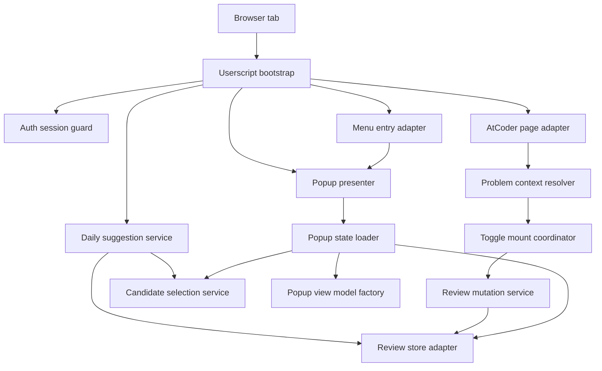
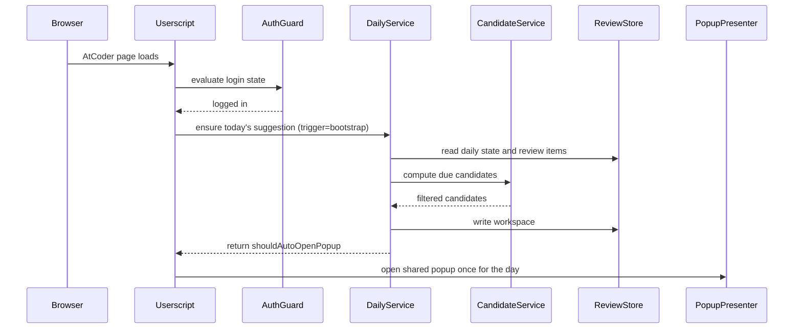
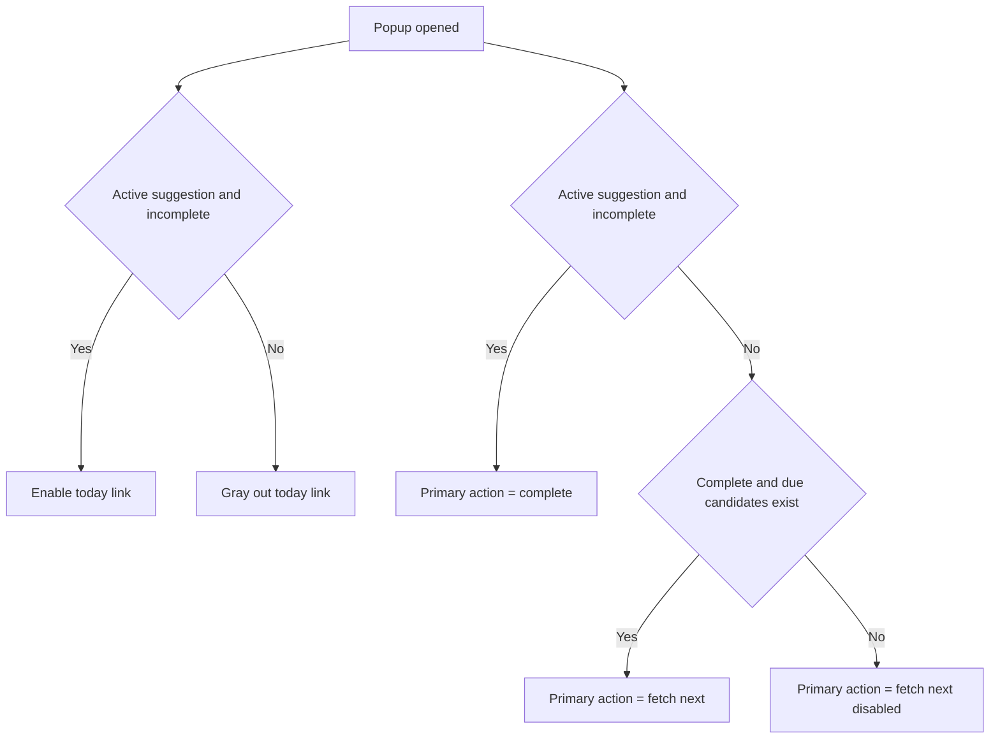
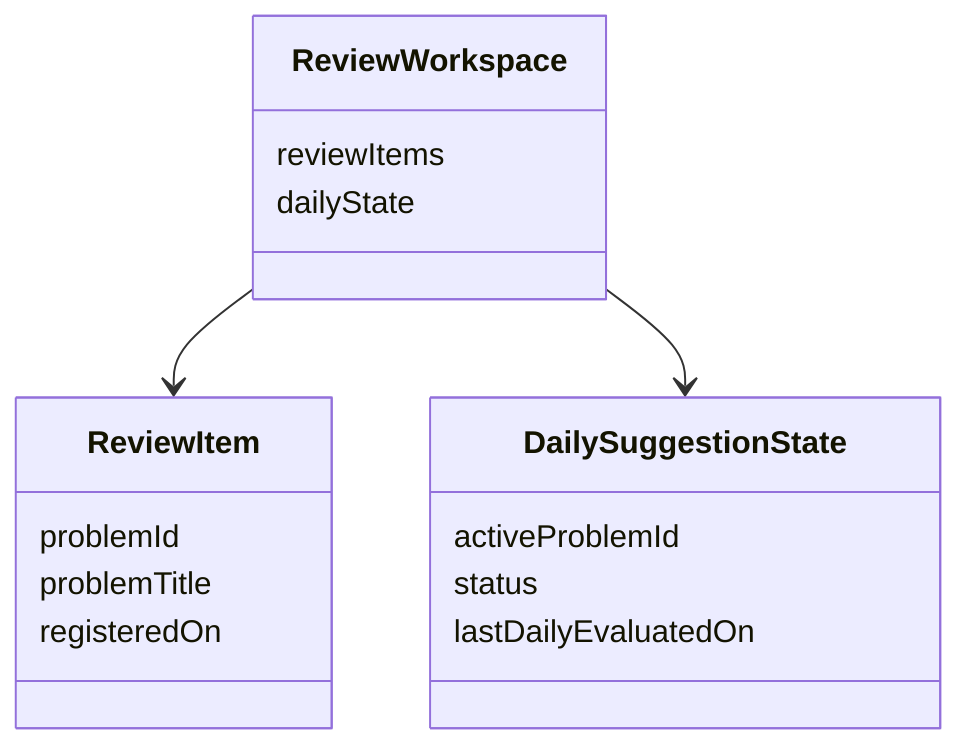

# Design Document

## Overview
`ac-revisit` は AtCoder 上で動作する Tampermonkey 向けユーザースクリプトとして、復習対象の登録、14 日経過後の候補判定、当日 1 回の「今日の一問」提案を提供する。設計の中心は、AtCoder の DOM への最小限の差し込み、単一スナップショット保存、そして日次ルールを壊さない最小限の状態遷移である。

本機能は、既存の `ac-revisit` userscript 実装を前提として、要件と steering に沿う形で責務分割・状態遷移・品質ゲートを明文化し直すものである。`package.json`、既存の `src/` / `test/` 構成、userscript 向け build 経路は現行資産を基盤として扱い、不足する契約や整理が必要な箇所をこの設計で定義する。

### Goals
- AtCoder の問題ページと提出詳細ページで復習対象トグルを提供する
- 当日最初の提案処理時に 14 日経過済み候補から 1 問だけ提案する
- 問題データと今日の一問状態を 1 つの保存スナップショットとして扱い、削除と完了を 1 回の保存で更新する
- Greasy Fork 配布に必要な userscript metadata と品質チェック経路を定義する

### Non-Goals
- 自動 AC 検知
- 復習対象一覧、統計、ストリーク、タグ、メモ
- 動的間隔調整や定着判定
- 外部 API、外部サーバー、同期機能
- 多タブ競合制御、DOM 遅延監視、ロールバック整合

## Requirements Traceability

| Requirement | Summary | Components | Interfaces | Flows |
|-------------|---------|------------|------------|-------|
| 1.1 | Greasy Fork 配布形態 | UserscriptPackageSpec | Metadata Contract | Build and publish |
| 1.2 | Tampermonkey 前提 | UserscriptPackageSpec | Metadata Contract | Build and publish |
| 1.3 | TypeScript 実装 | ToolchainProfile | Tooling Contract | Build and validate |
| 1.4 | ESLint 実行 | ToolchainProfile | Tooling Contract | Build and validate |
| 1.5 | 独立型チェック | ToolchainProfile | Tooling Contract | Build and validate |
| 2.1 | ログイン済みのみ利用 | AuthSessionGuard | Service Interface | Startup gate |
| 2.2 | 未ログイン時トグル非表示 | AuthSessionGuard, ToggleMountCoordinator | Service Interface, State Contract | Startup gate |
| 2.3 | 未ログイン時リンク非表示 | AuthSessionGuard, MenuEntryAdapter | Service Interface, State Contract | Startup gate |
| 2.4 | ブラウザ内永続化 | ReviewStoreAdapter | Service Interface, State Contract | All write flows |
| 2.5 | 外部通信なし | UserscriptBootstrap | Service Interface | Build and publish |
| 2.6 | 問題データは識別子・表示用タイトル・登録日 | ReviewStoreAdapter | State Contract | Register and mutate |
| 2.7 | 禁止追加フィールドを保持しない | ReviewStoreAdapter | State Contract | Register and mutate |
| 2.8 | 判定不能時は未ログイン扱い | AuthSessionGuard, UserscriptBootstrap | Service Interface | Startup gate |
| 2.9 | 保存不整合時は空状態へフォールバック | ReviewStoreAdapter | Service Interface, State Contract | All read flows |
| 2.10 | ストレージ失敗時は再試行せず中止 | ReviewStoreAdapter, DailySuggestionService, ReviewMutationService, PopupPresenter | Service Interface, Error Strategy | All storage-backed flows |
| 2.11 | 単一アカウント前提で保存分離不要 | ReviewStoreAdapter | State Contract | All storage-backed flows |
| 3.1 | 問題ページのトグル | ToggleMountCoordinator, ProblemContextResolver | Service Interface | Register and mutate |
| 3.2 | 提出詳細ページのトグル | ToggleMountCoordinator, ProblemContextResolver | Service Interface | Register and mutate |
| 3.3 | 登録時に当日を登録日設定 | ReviewMutationService | Service Interface | Register and mutate |
| 3.4 | 解除時に完全削除 | ReviewMutationService | Service Interface | Register and mutate |
| 3.5 | 提案中解除の単一トランザクション | ReviewMutationService, ReviewStoreAdapter | Service Interface | Register and mutate |
| 3.6 | 文脈またはアンカー未解決時はトグル省略可 | ToggleMountCoordinator, ProblemContextResolver, AtCoderPageAdapter | Service Interface | Register and mutate |
| 3.7 | トグル文言固定 | ToggleMountCoordinator | Service Interface, Presentation Contract | Register and mutate |
| 3.8 | 問題ページで解説ボタン直後または見出し末尾 | AtCoderPageAdapter, ToggleMountCoordinator | Service Interface, DOM Contract | Register and mutate |
| 3.9 | 提出詳細ページで問題リンク直後 | AtCoderPageAdapter, ToggleMountCoordinator | Service Interface, DOM Contract | Register and mutate |
| 3.10 | 小型ボタンと状態色 | ToggleMountCoordinator | Presentation Contract | Register and mutate |
| 4.1 | 14 日経過のみ候補 | CandidateSelectionService | Service Interface | Daily suggestion |
| 4.2 | 固定 14 日のみ | CandidateSelectionService | Service Interface | Daily suggestion |
| 4.3 | 当日初回の提案処理でランダム 1 問選定 | DailySuggestionService, UserscriptBootstrap, PopupPresenter | Service Interface, State Contract | Daily suggestion |
| 4.4 | 初回自動起動時のみ自動表示 | DailySuggestionService, UserscriptBootstrap | State Contract | Daily suggestion |
| 4.5 | 候補なしなら当日提案なし | DailySuggestionService | Service Interface | Daily suggestion |
| 4.6 | 常に 1 問のみ提案中 | DailySuggestionService, PopupViewModelFactory | State Contract | Daily suggestion |
| 4.7 | 状態は今日の一問のみ | DailySuggestionService, ReviewStoreAdapter | State Contract | All state transitions |
| 5.1 | メニュー常設リンク「ac-revisit 操作」 | MenuEntryAdapter | Service Interface | Startup gate |
| 5.2 | 候補なしでもリンク表示 | MenuEntryAdapter | State Contract | Startup gate |
| 5.3 | リンク押下で当日提案確定後にポップアップ | MenuEntryAdapter, PopupPresenter, DailySuggestionService | Service Interface | Popup actions |
| 5.4 | 自動通知も同一 UI | UserscriptBootstrap, DailySuggestionService, PopupPresenter | Service Interface | Daily suggestion |
| 5.5 | 候補なし時は追加通知なし | DailySuggestionService | State Contract | Daily suggestion |
| 5.6 | アンカー未解決時は常設リンク省略可 | MenuEntryAdapter, AtCoderPageAdapter | Service Interface | Startup gate |
| 5.7 | メニュー項目と同じ `li > a` 構造 | MenuEntryAdapter | DOM Contract | Startup gate |
| 5.8 | メニューと調和する視覚表現 | MenuEntryAdapter | Presentation Contract | Startup gate |
| 5.9 | 設定系項目に近い位置へ差し込み | AtCoderPageAdapter, MenuEntryAdapter | Service Interface, DOM Contract | Startup gate |
| 5.10 | 小さな補助アイコンを付与 | MenuEntryAdapter | Presentation Contract | Startup gate |
| 6.1 | 今日の一問タイトルリンク有効条件 | PopupViewModelFactory | State Contract | Popup actions |
| 6.2 | 今日の一問タイトルリンクグレーアウト | PopupViewModelFactory | State Contract | Popup actions |
| 6.3 | 単一アクションボタン | PopupPresenter, PopupViewModelFactory | Service Interface, State Contract | Popup actions |
| 6.4 | 「完了」状態の表示と有効条件 | PopupViewModelFactory | State Contract | Popup actions |
| 6.5 | 「完了」操作の単一トランザクション | ReviewMutationService, ReviewStoreAdapter | Service Interface | Popup actions |
| 6.6 | 「もう一問」状態の表示と有効条件 | PopupViewModelFactory | State Contract | Popup actions |
| 6.7 | 候補なし時の「もう一問」無効化 | PopupViewModelFactory | State Contract | Popup actions |
| 6.8 | 「もう一問」で再抽選し未完了へ | ReviewMutationService, CandidateSelectionService | Service Interface | Popup actions |
| 6.9 | 未完了の差し替え禁止 | ReviewMutationService | Service Interface | Popup actions |
| 6.10 | ポップアップ内の明示操作前に整合確認 | InteractionSessionValidator, PopupPresenter | Service Interface, State Contract | Popup actions |
| 6.11 | 整合確認失敗時は無言で最新状態へ再描画 | InteractionSessionValidator, PopupPresenter | Service Interface | Popup actions |
| 6.12 | header/body/footer の 3 領域レイアウト | PopupPresenter | DOM Contract, Presentation Contract | Popup actions |
| 6.13 | 中立配色と標準ボタン表現 | PopupPresenter | Presentation Contract | Popup actions |
| 6.14 | 狭い viewport に収まる幅制約 | PopupPresenter | Presentation Contract | Popup actions |
| 6.15 | header close と footer 閉じるの両方を提供 | PopupPresenter | DOM Contract, Presentation Contract | Popup actions |
| 6.16 | 主要アクションを footer 内で分離配置 | PopupPresenter | DOM Contract, Presentation Contract | Popup actions |
| 7.1 | 自動 AC 検知なし | UserscriptBootstrap | Service Interface | Scope guard |
| 7.2 | 一覧画面なし | MenuEntryAdapter, PopupPresenter | Service Interface | Scope guard |
| 7.3 | デュー可視化なし | PopupViewModelFactory | State Contract | Scope guard |
| 7.4 | メモなし | ReviewStoreAdapter | State Contract | Scope guard |
| 7.5 | タグなし | ReviewStoreAdapter | State Contract | Scope guard |
| 7.6 | ストリークなし | DailySuggestionService | State Contract | Scope guard |
| 7.7 | 統計なし | PopupPresenter | State Contract | Scope guard |
| 7.8 | 動的間隔調整なし | CandidateSelectionService | Service Interface | Scope guard |
| 7.9 | 定着判定なし | ReviewMutationService | Service Interface | Scope guard |
| 7.10 | 自己判断で完了 | PopupPresenter, ReviewMutationService | Service Interface | Popup actions |
| 7.11 | 固定 DOM 契約への依存を許容 | AtCoderPageAdapter, AuthSessionGuard | Service Interface | Startup gate |
| 7.12 | DOM 変更時の自動回復なし | AtCoderPageAdapter, MenuEntryAdapter, ToggleMountCoordinator, AuthSessionGuard | Service Interface | Startup gate |
| 7.13 | 必要時の追随修正で対応 | AtCoderPageAdapter | Service Interface | DOM contract maintenance |
| 7.14 | ポップアップ表示中の継続監視なし | PopupPresenter, InteractionSessionValidator | Service Interface | Scope guard |
| 7.15 | 確認済み HTML の DOM 範囲を MVP 対象に固定 | AtCoderPageAdapter, AuthSessionGuard, MenuEntryAdapter, ToggleMountCoordinator | Service Interface | DOM contract maintenance |
| 7.16 | 多タブ競合時は厳密保証を行わず last-write-wins を許容 | DailySuggestionService, ReviewMutationService, ReviewStoreAdapter | State Contract | All write flows |

## Architecture

### Architecture Pattern & Boundary Map
- Selected pattern: MVP 向けの薄いレイヤー分割。認証とページ判定、復習ルール、UI 表示の 3 塊を中心にし、過度な抽象化は避ける。
- Domain boundaries:
  - Packaging and tooling
  - Runtime bootstrap and page integration
  - Review domain services
  - Persistence and review state
  - Popup rendering
- Module layout:
  - `src/bootstrap`
  - `src/runtime`
  - `src/domain`
  - `src/persistence`
  - `src/presentation`
  - `src/shared`
- Shared type source of truth: `ContestId`、`TaskId`、`ProblemId`、`ProblemTitle`、`LocalDateKey`、`Result`、`ReviewWorkspace` は [`src/shared/types.ts`](/workspaces/ac-revisit/src/shared/types.ts) を唯一の定義元とし、他層で再定義しない。`LocalDateKey` の生成と比較・暦日差分ルールは [`src/shared/date.ts`](/workspaces/ac-revisit/src/shared/date.ts) の `LocalDateProvider` と `LocalDateMath` に集約する。
- Boundary policy:
  - `AuthSessionGuard`、`ProblemContextResolver`、`CandidateSelectionService`、`ReviewMutationService`、`ReviewStoreAdapter`、`PopupViewModelFactory` は、要件またはテスト観点に直結するため独立責務として維持する
  - `AtCoderPageAdapter`、`ProblemContextResolver`、`ToggleMountCoordinator` は責務上は分けるが、MVP では同一 `src/runtime` モジュールまたは近接した少数ファイルへ集約してよく、追加の抽象レイヤーは増やさない
  - `PopupPresenter` と `PopupStateLoader` は責務上は分けるが、MVP では同一 `src/presentation` モジュール内の公開 API と内部 helper として実装してよい
  - `UserscriptBootstrap` を唯一の起動オーケストレーションとし、これ以上の調停レイヤーは導入しない
- Composition root: `src/main.ts` 相当の userscript entrypoint がページロードごとに `LocalDateProvider`、`LocalDateMath`、`AtCoderPageAdapter`、`AuthSessionGuard`、`ReviewStoreAdapter`、`CandidateSelectionService`、`InteractionSessionValidator`、`ReviewMutationService`、`PopupPresenter`、`UserscriptBootstrap` の最小集合を 1 回だけ生成し、依存関係を束ねて起動する。`DailySuggestionService`、`MenuEntryAdapter`、`ToggleMountCoordinator` は、責務名としては維持しつつ、MVP 実装では `UserscriptBootstrap` 近接モジュール内の内部 collaborator として束ねてよい。
- Environment boundary: composition root は `PlatformPorts`（名称は実装時に同等で可）として、`rng: () => number`、userscript storage access、開発時 debug logger をまとめて生成し、各コンポーネントへ必要な形で渡す。`CandidateSelectionService`、`ReviewStoreAdapter`、開発時診断経路はこの入口を通して環境依存へ接続し、ドメイン層や表示ロジックへ `Math.random`、`GM_*`、`console.*` の直参照を分散させない。
- Environment diagnostic clarification: `PlatformPorts` 内の debug logger は、実装時に `DiagnosticSink` 相当の最小契約として扱う。通常実行では no-op を許容し、開発時のみ有効化してよい。少なくとも `anchor_missing`、`problem_unresolvable`、`storage_unavailable` の理由コードを、発生コンポーネント名と操作種別とともに受け取れる形に固定する。
- Construction policy: `PopupPresenter` と `UserscriptBootstrap` はページ単位の singleton とし、重複挿入防止・modal root 再利用・イベント重複防止の前提を composition root で固定する。`MenuEntryAdapter` と `ToggleMountCoordinator` は singleton 前提の責務を持つが、MVP では `UserscriptBootstrap` 内部で 1 回だけ組み立ててよく、composition root が直接公開依存として構築する必須対象には含めない。`AtCoderPageAdapter`、`AuthSessionGuard`、`LocalDateMath`、`InteractionSessionValidator` は stateless な共有 collaborator として同一ページ内で再利用してよい。`ProblemContextResolver` は `ToggleMountCoordinator` の内部 helper、`PopupStateLoader` は `PopupPresenter` の内部 helper として内包してよい。
- Existing patterns preserved: 既存コードとテスト資産を尊重しつつ、最小依存・型安全・単方向依存を維持し、責務境界が曖昧な箇所だけを整理対象とする。
- Steering compliance: `.kiro/steering/` の `product.md`、`tech.md`、`structure.md`、`security.md`、`error-handling.md`、`deployment.md`、`testing.md` をプロジェクト標準として参照し、本設計はそれらと要件の両方に整合するように定義する。
- MVP execution principle: MVP は通常描画前提のベストエフォート実装とし、多タブ競合制御・ロールバック整合は対象外とする。同一ブラウザプロファイル内の複数タブで保存更新が競合した場合は last-write-wins を許容する。DOM 差し込みは単発のベストエフォートとし、継続監視や再試行は行わない。
- Storage scope principle: 保存スナップショットはブラウザプロファイル単位の 1 ワークスペースとして保持し、AtCoder アカウント単位の namespacing は行わない。AtCoder の規約上、利用者は単一アカウント前提とし、同一ブラウザプロファイルも同一 AtCoder アカウント専用として扱う。

### MVP Implementation Simplification Rules
- コンポーネント分割は責務とテスト境界を示すための設計表現であり、MVP 実装では 1 コンポーネント 1 ファイルを要求しない
- 初回実装のファイル分割は、`src/runtime`、`src/domain`、`src/presentation`、`src/shared` を中心とした少数ファイル構成を優先してよい
- 初回実装では composition root から直接見える構築対象を最小化し、`DailySuggestionService`、`MenuEntryAdapter`、`ToggleMountCoordinator` は `UserscriptBootstrap` 近接モジュール内でまとめて扱ってよい
- `ProblemContextResolver` は `ToggleMountCoordinator` の内部 helper として実装してよく、単独公開 API が必要になるまでは別ファイル化を必須としない
- `PopupStateLoader` は `PopupPresenter` の内部 helper として実装してよく、単独差し替え要件が生じるまでは別ファイル化を必須としない
- tasks では「責務単位」と「ファイル単位」を同一視せず、複数責務を 1 タスクまたは 1 モジュールへまとめてよい



### Technology Stack & Alignment

| Layer | Choice / Version | Role in Feature | Notes |
|-------|------------------|-----------------|-------|
| Frontend runtime | TypeScript on browser DOM APIs | 型安全な userscript 実装 | `any` 不使用、DOM 型を活用 |
| Userscript host | Tampermonkey current documented APIs | 注入、grant、永続化 | `@match` と `GM_*` を利用 |
| Packaging | Single `.user.js` output with metadata block | Greasy Fork 配布物 | 主機能を単体ファイルへ含める |
| Data / Storage | Tampermonkey userscript storage | 復習データと日次状態の保存 | `GM_getValue` / `GM_setValue` |
| Tooling | TypeScript `noEmit` + ESLint flat config + `@types/tampermonkey` | 型検査と静的解析 | ビルドと検査を分離し、GM API 型を固定する |

## System Flows





- 日次提案は、その暦日で最初に提案処理が起動した時点で日次判定を消費し、`lastDailyEvaluatedOn` を当日に更新する。
- 当日初回の提案処理で候補ありの場合は、新規選定を書き込み、その時点で未完了の前日提案が存在しても当日提案で上書きする。
- 前日の未完了提案は日跨ぎで継続扱いにせず、翌日の最初の提案処理で改めてその日の「今日の一問」を決定する。
- ポップアップの有効状態判定は UI 側の単一描画経路に集約し、複数箇所に条件分岐を分散させない。

## Components & Interface Contracts

| Component | Domain/Layer | Intent | Req Coverage | Key Dependencies | Contracts |
|-----------|--------------|--------|--------------|------------------|-----------|
| UserscriptPackageSpec | Packaging | userscript metadata と配布制約を定義する | 1.1, 1.2 | ToolchainProfile P1 | Metadata |
| ToolchainProfile | Packaging | lint・typecheck・test・build 出力を分離する | 1.3, 1.4, 1.5 | none | Tooling |
| UserscriptBootstrap | Runtime | 起動順序とスコープ制約を統括する | 2.5, 4.3, 5.4, 7.1, 7.2 | AuthSessionGuard P0, AtCoderPageAdapter P0 | Service |
| AuthSessionGuard | Runtime | ログイン状態を観測し初期表示を制御する | 2.1, 2.2, 2.3 | AtCoderPageAdapter P0 | Service, State |
| AtCoderPageAdapter | Runtime | ルート判定と AtCoder シェル DOM 探索を提供する | 2.3, 3.1, 3.2, 5.1 | none | Service |
| ProblemContextResolver | Runtime | 現在ページから問題識別子を解決する | 3.1, 3.2 | AtCoderPageAdapter P0 | Service |
| ToggleMountCoordinator | UI integration | トグル UI の差し込みとイベント接続を行う | 2.2, 3.1, 3.2 | ProblemContextResolver P0, ReviewMutationService P0 | Service |
| MenuEntryAdapter | UI integration | ログイン時ユーザーメニューに常設リンクを追加する | 2.3, 5.1, 5.2, 5.3 | AtCoderPageAdapter P0, PopupPresenter P0 | Service |
| DailySuggestionService | Application | 当日提案の確定と 1 日 1 回通知判定を管理する | 4.3, 4.4, 4.5, 4.6, 4.7, 5.3, 5.4, 5.5 | ReviewStoreAdapter P0, CandidateSelectionService P0, LocalDateMath P0 | Service, State |
| CandidateSelectionService | Domain | 14 日経過候補の抽出とランダム選定を行う | 4.1, 4.2, 7.8 | LocalDateMath P0 | Service |
| ReviewMutationService | Domain | 登録、解除、完了、もう一問の状態遷移を行う | 3.3, 3.4, 3.5, 6.5, 6.8, 6.9, 6.10, 7.9, 7.10 | ReviewStoreAdapter P0, CandidateSelectionService P0, InteractionSessionValidator P0 | Service |
| InteractionSessionValidator | Domain | ポップアップ内の操作前整合判定を一元化する | 6.10, 6.11, 7.14 | LocalDateMath P0 | Service |
| ReviewStoreAdapter | Persistence | review workspace を単一スナップショットで保存する | 2.4, 2.6, 2.7, 4.7, 7.4, 7.5 | Tampermonkey storage P0 | Service, State |
| LocalDateProvider | Shared | ブラウザローカル時刻から canonical な `LocalDateKey` を生成する | 4.3, 4.4, 4.5, 6.5, 6.9 | none | Service |
| LocalDateMath | Shared | `LocalDateKey` の比較と暦日差分を canonical に扱う | 4.1, 4.2, 4.4, 4.5 | none | Service |
| PopupViewModelFactory | Presentation | ボタン有効状態と表示文言を決定する | 4.6, 6.1, 6.2, 6.3, 6.4, 6.6, 6.7, 7.3, 7.7 | none | Service, State |
| PopupStateLoader | Presentation | ポップアップ描画入力の構築を担う | 5.3, 5.4, 6.1, 6.2, 6.3, 6.4, 6.6, 6.7 | ReviewStoreAdapter P0, CandidateSelectionService P1, PopupViewModelFactory P0 | Service |
| PopupPresenter | Presentation | 共通ポップアップ UI の描画とイベント委譲を担う | 5.3, 5.4, 6.1, 6.2, 6.3, 6.4, 6.5, 6.8, 6.10, 6.11, 7.10, 7.14 | DailySuggestionService P0, PopupStateLoader P0, InteractionSessionValidator P0, ReviewMutationService P0, LocalDateProvider P0 | Service |

### Packaging

#### LocalDateProvider

| Field | Detail |
|-------|--------|
| Intent | ローカル暦日に基づく `LocalDateKey` の生成責務を一箇所へ集約する |
| Requirements | 4.3, 4.4, 4.5, 6.5, 6.9 |

**Responsibilities & Constraints**
- ブラウザローカル時刻を `YYYY-MM-DD` のゼロ埋め済み文字列へ正規化する
- `LocalDateKey` の生成はこのサービスだけが行う
- 日付比較や保存に使う値は常に canonical formatter を通したものに限定する
- テストでは固定日付を返す stub に差し替え可能とする

**Dependencies**
- Inbound: UserscriptBootstrap — 起動時の日付取得 (P0)
- Inbound: MenuEntryAdapter — 手動ポップアップ起動時の日付取得 (P0)
- Inbound: ToggleMountCoordinator — クリック時点の日付取得 (P0)
- Inbound: PopupPresenter — ポップアップ内操作時の日付取得 (P0)

**Contracts**: Service [x] / API [ ] / Event [ ] / Batch [ ] / State [ ]

##### Service Interface
```typescript
interface LocalDateProvider {
  today(): LocalDateKey;
}
```
- Preconditions: ブラウザで現在時刻が参照可能であること
- Postconditions: 常にゼロ埋め済みの `LocalDateKey` を返す
- Invariants: `LocalDateKey` 生成ロジックを他層へ複製しない

**Implementation Notes**
- Integration: `new Date()` を直接呼ぶ箇所はこのサービス内部に限定する。
- Validation: 深夜跨ぎの境界を固定日付テストで再現できるようにする。
- Risks: formatter 実装が複製されると日次判定の不整合を招く。

#### LocalDateMath

| Field | Detail |
|-------|--------|
| Intent | `LocalDateKey` の比較と暦日差分計算を 1 箇所に固定する |
| Requirements | 4.1, 4.2, 4.4, 4.5 |

**Responsibilities & Constraints**
- `LocalDateKey` 同士の同日判定を提供する
- `LocalDateKey` 同士の暦日差分を提供する
- 14 日経過判定に必要な日数比較を、文字列比較や ad-hoc な `Date` 変換に分散させない
- 現在時刻を直接読まず、入力された `LocalDateKey` だけを扱う

**Dependencies**
- Inbound: CandidateSelectionService — 14 日経過判定 (P0)
- Inbound: DailySuggestionService — 当日評価済み判定 (P0)

**Contracts**: Service [x] / API [ ] / Event [ ] / Batch [ ] / State [ ]

##### Service Interface
```typescript
interface LocalDateMath {
  isSameDay(left: LocalDateKey | null, right: LocalDateKey): boolean;
  elapsedDays(from: LocalDateKey, to: LocalDateKey): number;
}
```
- Preconditions: 入力値が canonical な `LocalDateKey` であること
- Postconditions: `elapsedDays()` はローカル暦日の 00:00 を境界にした整数差を返す
- Invariants: `LocalDateKey` の比較と差分計算ロジックを他層へ複製しない

**Implementation Notes**
- Integration: `CandidateSelectionService` は `elapsedDays(registeredOn, today) >= 14` を唯一の due 判定として使う。
- Integration: `DailySuggestionService` は `isSameDay(lastDailyEvaluatedOn, today)` を唯一の当日評価済み判定として使う。
- Validation: 月跨ぎ、年跨ぎ、うるう年境界でも期待どおりの整数差を返すことを固定テストで確認する。
- Risks: 暦日差分計算が各サービスに散ると、同じ保存値でも候補判定と日次判定が食い違う。

#### UserscriptPackageSpec

| Field | Detail |
|-------|--------|
| Intent | Greasy Fork へ投稿する `.user.js` の公開契約を定義する |
| Requirements | 1.1, 1.2 |

**Responsibilities & Constraints**
- metadata block に配布識別情報を含める
- AtCoder 対象の `@match` と必要な `@grant` を公開契約として固定する
- 主機能は配布ファイル内に含め、外部 JavaScript 読み込みを必須にしない

**Dependencies**
- Outbound: ToolchainProfile — metadata 付き出力を生成する (P1)
- External: Greasy Fork listing rules — 公開要件 (P1)

**Contracts**: Service [ ] / API [ ] / Event [ ] / Batch [ ] / State [ ] / Metadata [x]

##### Metadata Contract
| Key | Purpose | Constraint |
|-----|---------|------------|
| `@name` | スクリプト名 | Greasy Fork 表示に必要 |
| `@namespace` | 配布元識別 | Greasy Fork 公開契約に含める |
| `@version` | 配布物バージョン | `package.json.version` と同期する |
| `@description` | 機能説明 | 機能と一致する内容 |
| `@match` | 対象 URL | `https://atcoder.jp/*` に固定 |
| `@grant` | 権限宣言 | `GM_getValue`, `GM_setValue` を含む |
| `@run-at` | 注入タイミング | `document-end` に固定 |
| `@homepageURL` | 配布元ページ | GitHub リポジトリ URL を指す |
| `@author` | 作者表示 | 配布主体と一致する値を維持する |
| `@license` | ライセンス表示 | `MIT` を維持する |

**Implementation Notes**
- Integration: ビルド出力時に metadata block を先頭へ付与する。
- Integration: Greasy Fork 向け必須 metadata は `@name`、`@namespace`、`@version`、`@description`、`@match`、`@grant`、`@run-at` に固定する。
- Integration: metadata は `build` 時に `package.json.version` を埋め込み、`.user.js` 先頭へ付与する。
- Integration: 開発用 userscript (`ac-revisit (dev)`) は `@downloadURL` / `@updateURL` を localhost 配信先へ付与し、`@version` を時刻ベースで単調増加させる。
- Validation: 公開前に metadata 欠落を静的検証する。
- Risks: `@match` の過剰指定は Greasy Fork ルール違反になりうる。

#### ToolchainProfile

| Field | Detail |
|-------|--------|
| Intent | TypeScript、lint、型検査の実行境界を分離する |
| Requirements | 1.3, 1.4, 1.5 |

**Responsibilities & Constraints**
- 実装言語を TypeScript に固定する
- lint、typecheck、test を独立コマンドとして持つ
- 公開前品質ゲートとして lint、typecheck、test の成功を必須にする
- build は配布用 `.user.js` を生成し、typecheck 失敗時は公開しない
- Tampermonkey の `GM_*` API 型は `@types/tampermonkey` を唯一の宣言元として採用し、ad-hoc な ambient 宣言や `any` へ逃がさない

**Dependencies**
- External: TypeScript `noEmit` — 型チェック専用実行の根拠 (P1)
- External: ESLint flat config — lint 構成 (P1)
- External: `@types/tampermonkey` — `GM_*` API の TypeScript 型定義 (P1)

**Contracts**: Service [ ] / API [ ] / Event [ ] / Batch [x] / State [ ]

##### Batch / Job Contract
- Trigger: ローカル開発時または CI 実行時
- Input / validation: TypeScript source tree と lint config
- Output / destination: lint 結果、型チェック結果、配布用 `.user.js`
- Idempotency & recovery: ソース未変更なら再実行で同一結果を返す

**Implementation Notes**
- Integration: コマンド名は `npm run lint`、`npm run typecheck`、`npm run verify`、`npm run build` に固定する。
- Integration: 開発時は `npm run dev` を入口にし、watch build とローカル配信 (`http://127.0.0.1:4310/ac-revisit.dev.user.js`) を同一プロセスで提供する。
- Integration: `build` は 1 コマンドで metadata block を先頭に付与した [`dist/ac-revisit.user.js`](/workspaces/ac-revisit/dist/ac-revisit.user.js) を生成する。
- Integration: `@version` は `package.json.version` を唯一の供給元とし、未定義なら `build` を失敗させる。
- Integration: `dev` の `@version` は `0.0.0.<unix-seconds>` の時刻ベース値を使い、Tampermonkey の「更新を確認」で常に差分検出可能にする。
- Integration: `build` のビルドツールは `esbuild` に固定し、`src/main.ts` を bundle して単一の [`dist/ac-revisit.user.js`](/workspaces/ac-revisit/dist/ac-revisit.user.js) を生成した後、metadata block を先頭連結する。
- Integration: metadata block の組み立てと先頭連結は、`npm run build` から呼ばれる単一の補助スクリプト（例: `scripts/build-userscript.ts`）に集約し、`package.json` scripts に複雑なインライン処理を分散させない。
- Integration: `npm run typecheck` は `tsc --noEmit` に固定し、`build` とは独立して実行する。
- Integration: 目標状態の `npm run verify` は `npm run lint`、`npm run typecheck`、`npm run typecheck:scripts`、`npm run typecheck:test`、`npm test` を順に実行する公開前の必須品質ゲートとし、JS 出力や bundle 生成を行わない。
- Integration: 現行リポジトリで `verify` がまだ `npm test` を含まない場合でも、Requirement 1 の実装完了条件は「`package.json` の `verify` script、対応する contract test、公開手順の 3 点を同一変更で上記目標状態へ揃える」ことに固定する。設計だけ先行していても、コードとテストの契約を更新しないまま公開フローを変更したものとはみなさない。
- Integration: Greasy Fork へ公開してよいのは `npm run verify` 成功後に生成した成果物のみとし、`npm run build` 単独成功は公開可否の根拠にしない。
- Integration: `GM_getValue` / `GM_setValue` の型は `@types/tampermonkey` から供給し、ローカルで `declare const GM_*: any` を追加しない。
- Initial viability checklist: Requirement 1 の初期成立条件として、少なくとも [`package.json`](/workspaces/ac-revisit/package.json) の `version` と scripts、[`tsconfig.json`](/workspaces/ac-revisit/tsconfig.json)、[`eslint.config.js`](/workspaces/ac-revisit/eslint.config.js)、[`scripts/build-userscript.ts`](/workspaces/ac-revisit/scripts/build-userscript.ts)、[`src/main.ts`](/workspaces/ac-revisit/src/main.ts) を最初の実装セットに含める。これは導入順の明確化であり、設計上の責務分割や公開契約を変更するものではない。
- Validation: `typecheck` は `noEmit` 相当で JS 出力を伴わない。
- Validation: `verify` が失敗した場合は配布・公開を行わない。
- Risks: build 成功と typecheck 成功を同一意味にしない。

### Runtime Integration

#### UserscriptBootstrap

| Field | Detail |
|-------|--------|
| Intent | 起動順序を統括し、不要機能を生成しない |
| Requirements | 2.5, 2.8, 4.3, 5.4, 7.1, 7.2 |

**Responsibilities & Constraints**
- 外部通信を一切行わない
- 起動時にログイン判定、ページ判定、メニュー差し込み、当日提案確定を順序制御する
- `AuthSessionGuard` が `anonymous` を返した場合は、その時点で後続処理を実行せず終了する
- ログイン状態を十分に判定できない場合も `anonymous` として fail closed で扱う
- `DailySuggestionService` の返す `shouldAutoOpenPopup` に応じて、その起動シーケンス内で 1 回だけ取得した `today` と、同サービスが返した確定済み `ReviewWorkspace` を添えて `PopupPresenter.open({ source: "auto", today, prefetchedReviewWorkspace })` を 1 回だけ呼ぶ
- MVP 非対象画面や非対象機能を生成しない
- `/` のような問題ページ・提出詳細ページ以外では `AtCoderPageAdapter.detectPage()` を `other` として扱い、問題トグルを生成しない
- ログイン済みトップページでも `other` 判定を維持し、問題トグルは生成しない

**Dependencies**
- Outbound: AuthSessionGuard — ログイン制御 (P0)
- Outbound: AtCoderPageAdapter — DOM 探索 (P0)
- Outbound: LocalDateProvider — 起動日の取得 (P0)
- Outbound: MenuEntryAdapter — 常設導線 (P1)
- Outbound: ToggleMountCoordinator — 問題トグル差し込み (P1)
- Outbound: DailySuggestionService — 当日提案確定と自動表示可否判定 (P1)
- Outbound: PopupPresenter — 自動ポップアップ表示 (P1)

**Contracts**: Service [x] / API [ ] / Event [ ] / Batch [ ] / State [ ]

##### Service Interface
```typescript
interface UserscriptBootstrapService {
  start(context: BootstrapContext): Result<BootstrapOutcome, BootstrapError>;
}

interface BootstrapContext {
  readonly currentUrl: string;
  readonly dateProvider: LocalDateProvider;
}

interface BootstrapOutcome {
  readonly sessionKind: "authenticated" | "anonymous";
  readonly mountedFeatures: readonly MountedFeature[];
  readonly shouldAutoOpenPopup: boolean;
}

type MountedFeature = "menu_entry" | "problem_toggle" | "daily_popup";
// `LocalDateKey` and `Result` are shared types imported from `src/shared/types.ts`.
type BootstrapError = { readonly kind: "storage_unavailable" };
```
- Preconditions: AtCoder ページ上で起動しており、`document-end` 相当で DOM 読み取りが可能であること
- Postconditions: セッション判定結果に応じて許可された機能のみがマウントされ、必要時のみ `shouldAutoOpenPopup` が true になる
- Invariants: 外部ネットワーク呼び出しを行わない

**Implementation Notes**
- Integration: すべての起動分岐はここから開始し、自動ポップアップ呼び出しの唯一の実行主体とする。
- Integration: 起動シーケンスは同期の単発 DOM 差し込みと単発の read/modify/write で完結させ、Promise ベースの待機や非同期イベント連鎖を導入しない。
- Integration: `anonymous` 判定時は `AuthSessionGuard` の結果を返して即時終了し、ページ判定、メニュー差し込み、当日提案確定、ポップアップ表示を続行しない。
- Integration: `MenuEntryAdapter.ensureEntryMounted()` は単発で実行し、`anchor_missing` の場合でも常設リンク以外の後続処理は継続する。
- Integration: 起動順序は `AuthSessionGuard.resolveSession()` -> `anonymous` なら終了 / `authenticated` なら `AtCoderPageAdapter.detectPage()` -> `MenuEntryAdapter.ensureEntryMounted()` -> (`problem` / `submission_detail` のときのみ) `ToggleMountCoordinator.mount()` -> `LocalDateProvider.today()` -> `DailySuggestionService.ensureTodaySuggestion({ today, trigger: "bootstrap" })` -> `shouldAutoOpenPopup` のとき `PopupPresenter.open({ source: "auto", today, prefetchedReviewWorkspace: ensureTodayOutcome.reviewWorkspace })` に固定する。
- Integration: DOM アンカー欠落、問題文脈未解決、局所的な DOM 差し込み不能は各コンポーネントで fail closed として吸収し、`UserscriptBootstrap` の公開エラー種別には含めない。公開エラーはストレージ起因の `storage_unavailable` のみに限定する。
- Validation: 非ログイン時は UI を差し込まない結果を返す。
- Risks: 起動順序が分散すると 1 日 1 回制御が重複し、新ヘッダー採用ページを競技ページと誤認すると不要な探索が増える。

#### AuthSessionGuard

| Field | Detail |
|-------|--------|
| Intent | ログイン状態に基づいて機能露出を制御する |
| Requirements | 2.1, 2.2, 2.3, 2.8, 7.11, 7.12 |

**Responsibilities & Constraints**
- `AtCoderPageAdapter.inspectHeaderShell()` が返す DOM シグナルを主契約としてログイン済み状態を判定する
- 未ログイン時はトグルと常設リンクのマウントを拒否する
- 判定不能時は `anonymous` として fail closed で扱う
- ログイン判定は、旧ヘッダーのユーザードロップダウン DOM とトップページ新ヘッダーの `header-mypage` / `header-mypage_detail` を主シグナルとして評価する
- ログイン判定は現時点で確認済みの AtCoder DOM 契約への依存を許容し、DOM 変更時の自動回復や代替探索を必須としない
- `inspectHeaderShell()` が返す `menuUserHandle` は補助的なユーザー識別子として扱い、ログイン済み判定の成立条件にはしない
- `menuUserHandle` は表示補助のための付随情報としてのみ扱い、DOM シグナルが欠落している場合にログイン判定を補完する用途には使わない

**Dependencies**
- Inbound: UserscriptBootstrap — 起動時判定依頼 (P0)
- Outbound: AtCoderPageAdapter — DOM 探索 (P0)

**Contracts**: Service [x] / API [ ] / Event [ ] / Batch [ ] / State [x]

##### Service Interface
```typescript
interface AuthSessionGuardService {
  resolveSession(): SessionResolution;
}

type SessionResolution =
  | { readonly kind: "authenticated"; readonly userHandle: string | null }
  | { readonly kind: "anonymous" };
```
- Preconditions: AtCoder の共通ヘッダーが読み取り可能であること
- Postconditions: ログイン判定結果が 2 値で返り、`authenticated` 時の `userHandle` は取得不能なら `null` を取りうる
- Invariants: `anonymous` は全機能停止

##### State Management
- State model: セッション状態は永続化しない
- Persistence & consistency: DOM 観測ごとに再計算
- Concurrency strategy: 起動ごとの単発評価

**Implementation Notes**
- Integration: 以降のマウント判定の唯一の入口にする。
- Integration: `AuthSessionGuard` 自身は AtCoder 固有セレクタを持たず、`AtCoderPageAdapter.inspectHeaderShell()` が返したシグナルだけを解釈する。
- Integration: `resolveSession()` は `inspectHeaderShell().hasLegacyUserMenu` または `hasTopPageUserMenu` のいずれかが `true` なら `authenticated` を返す。`userHandle` は `menuUserHandle` が取得できた場合のみ返し、DOM シグナルが両方欠落している場合のみ `anonymous` を返す。
- Validation: 未ログイン時の DOM 差し込み 0 件に加え、旧ヘッダーとトップページ新ヘッダーの両方で DOM ベースのログイン済み判定を確認し、DOM シグナルが両方欠落している場合のみ `anonymous` へ倒すことを確認する。
- Risks: 旧新ヘッダー DOM の変更で判定不能になる可能性は残るが、MVP では許容済みリスクとし、その時点で固定セレクタを更新して追随修正する。

#### AtCoderPageAdapter

| Field | Detail |
|-------|--------|
| Intent | ルート種別とマウント位置探索を提供する |
| Requirements | 3.1, 3.2, 3.6, 5.1, 5.6, 7.11, 7.12, 7.13, 7.15 |

**Responsibilities & Constraints**
- 問題ページ、提出詳細ページ、その他ページを分類する
- `.kiro/specs/atcoder-review-suggester/research.md` で確認した AtCoder 提供 HTML 断面を、MVP の DOM 契約根拠かつ唯一のサポート対象として採用する
- 現行 DOM 契約への依存を明示的に許容し、DOM 変更時はこの層のセレクタ更新による追随修正で対応する
- `detectPage()` は pathname が `^/contests/[^/]+/tasks/[^/]+$` なら `problem`、`^/contests/[^/]+/submissions/\\d+$` なら `submission_detail`、それ以外は `other` とする
- ログイン判定とメニュー差し込みに必要なヘッダー構造シグナルを単一定義元として解決する
- ユーザーメニュー挿入位置を探索する
- 常設リンク、ログイン判定、問題トグルの AtCoder 固有セレクタ、探索順序、フォールバック順序の唯一の定義元になる
- 問題コンテキスト解決に使う AtCoder 固有セレクタと raw DOM source の抽出規則もこの層へ集約する
- DOM セレクタ変更の影響をこの層に閉じ込める
- 競技ページ（問題ページ・提出詳細ページ）は、提供済み HTML に含まれる旧ヘッダー系 DOM 断面を唯一の対象とする
- トップページの常設リンク導線は、提供済み HTML に含まれる新ヘッダー DOM 断面を唯一の対象とする
- ユーザードロップダウンの `ul.dropdown-menu` を常設リンクの第一候補アンカーとして返す
- トップページ新ヘッダーでは `header-mypage_detail` 内の `header-mypage_list` を常設リンクの第一候補アンカーとして返す
- 問題ページでは `.col-sm-12 > span.h2` をトグルのコンテナとして扱い、その中に既存の解説ボタンがあれば当該ボタンを第一候補アンカー、解説ボタンがなければ見出し要素自体をフォールバックアンカーとして返す
- 提出詳細ページでは提出情報テーブルの「問題」行にある `/contests/{contestId}/tasks/{taskId}` 一致リンクをトグルの第一候補アンカー、同一セルの `td` をフォールバックアンカーとして返す
- 問題ページの問題コンテキストでは `.col-sm-12 > span.h2` から子要素テキストを除いた見出しテキストを抽出し、`window.location.pathname` と組で返す
- 提出詳細ページの問題コンテキストでは `.col-sm-12` 内の最初の詳細テーブルから、最初に見つかった `/contests/{contestId}/tasks/{taskId}` 一致リンクの `href` と `textContent` を抽出して返す
- `#header` / `.header-nav` を持つトップページ新ヘッダーは問題トグル用アンカー探索対象に含めない
- `header-mypage` / `header-mypage_detail` を持つログイン済みトップページ新ヘッダーは、トップページ常設リンク用アンカーとして扱う

**Dependencies**
- Inbound: AuthSessionGuard — セッション判定 (P0)
- Inbound: ToggleMountCoordinator — 問題コンテキスト探索 (P0)
- Inbound: MenuEntryAdapter — リンク差し込み位置探索 (P0)

**Contracts**: Service [x] / API [ ] / Event [ ] / Batch [ ] / State [ ]

##### Service Interface
```typescript
interface AtCoderPageAdapterService {
  detectPage(): AtCoderPage;
  inspectHeaderShell(): HeaderShellSnapshot;
  findToggleAnchor(): DomAnchorResult;
  readProblemContextSource(): ProblemContextDomSource;
}

type AtCoderPage =
  | { readonly kind: "problem"; readonly path: string }
  | { readonly kind: "submission_detail"; readonly path: string }
  | { readonly kind: "other"; readonly path: string };

type DomAnchorResult =
  | {
      readonly kind: "found";
      readonly element: HTMLElement;
      readonly placement: "after" | "append";
    }
  | { readonly kind: "missing" };

type ProblemContextDomSource =
  | {
      readonly kind: "problem";
      readonly pathname: string;
      readonly problemTitleText: string | null;
    }
  | {
      readonly kind: "submission_detail";
      readonly taskHref: string | null;
      readonly taskTitleText: string | null;
    }
  | { readonly kind: "other" };

interface HeaderShellSnapshot {
  readonly hasLegacyUserMenu: boolean;
  readonly hasTopPageUserMenu: boolean;
  readonly menuAnchor: DomAnchorResult;
  readonly menuInsertionAnchor: DomAnchorResult;
  readonly menuUserHandle: string | null;
}
```

**Implementation Notes**
- Integration: DOM 要素の探索と返却はこの層に限定し、後続コンポーネントは返却された `HTMLElement` にのみ差し込む。
- Integration: DOM アンカー探索は `detectPage()` の判定後にのみ行う。
- Integration: `inspectHeaderShell()` は、ログイン判定とメニュー差し込みが参照する新旧ヘッダーの DOM シグナルを 1 回の探索結果としてまとめて返す。
- Integration: `inspectHeaderShell()` は、メニュー項目群そのものを表す `menuAnchor` と、その配下で `MenuEntryAdapter` が差し込み基準として直接使う `menuInsertionAnchor` を同時に返す。`menuInsertionAnchor` は設定系項目の直後を第一優先とし、見つからない場合だけ既存先頭項目の直後へ倒した、解決済みの単一アンカーとして扱う。
- Integration: `inspectHeaderShell()` は、旧ヘッダーのユーザードロップダウンとトップページ新ヘッダーのマイページ領域から、メニュー由来のユーザー識別子候補を解決する。
- Integration: `inspectHeaderShell()` は、旧ヘッダーのユーザードロップダウンまたはトップページ新ヘッダーのマイページ領域から取得できるユーザー名を `menuUserHandle` として返す。
- Integration: `readProblemContextSource()` は、問題ページでは `pathname` と見出しテキスト、提出詳細ページでは task リンクの `href` と `textContent` を raw source として返し、AtCoder 固有 DOM の読み取りをこの層に閉じ込める。
- Integration: `findToggleAnchor()` は挿入対象となる具体的な要素を返す。問題ページでは見出し内の解説ボタンが見つかればそのボタン、見つからなければ見出し要素自体を返し、提出詳細ページでは問題リンクが見つかればそのリンク、見つからなければ問題リンクを含むセルを返す。
- Integration: セレクタと探索順序は `.kiro/specs/atcoder-review-suggester/research.md` の提供 HTML 例で確認済みの DOM 断面を唯一の根拠とし、MVP では問題ページ・提出詳細ページの競技ページヘッダーとトップページ新ヘッダー以外の DOM 形状は非対応として fail closed で扱う。
- Integration: DOM 契約が崩れた場合は self-healing や汎用フォールバックを増やさず、この層の固定セレクタ定義を更新して追随する方針に固定する。
- Integration: `.kiro/specs/atcoder-review-suggester/research.md` で確認した 4 断面（問題ページ、提出詳細ページ、旧ヘッダーのユーザーメニュー、トップページ新ヘッダー）は canonical fixture として固定し、現行の既知 DOM 契約に対する回帰確認をこの層の selector 契約テストで担保する。DOM 変更時は fixture と固定セレクタを同時に更新して追随する。
- Integration: `MenuEntryAdapter`、`ToggleMountCoordinator`、`ProblemContextResolver` は AtCoder 固有セレクタ文字列やフォールバック順序を持たず、本サービスが返したアンカー結果または DOM source だけを解釈する。特に `MenuEntryAdapter` は `menuInsertionAnchor` をそのまま使い、設定項目探索を再実装しない。
- Integration: `AuthSessionGuard` は `inspectHeaderShell()` の `hasLegacyUserMenu` / `hasTopPageUserMenu` をログイン判定の主シグナルとして扱い、`menuUserHandle` は `authenticated` 結果に付随する補助識別子としてのみ参照する。
- Integration: MVP 実装では `ToggleMountCoordinator` と同一の `src/runtime` モジュールへ近接配置し、ページ判定と差し込み位置探索を分離責務のまま実装する。
- Validation: `readProblemContextSource()` が返す raw source と、`ProblemContextResolver` の正規化責務を分離する。
- Validation: `inspectHeaderShell()`、`findToggleAnchor()`、`readProblemContextSource()` は `.kiro/specs/atcoder-review-suggester/research.md` 由来の 4 断面の固定 fixture を用いた selector 契約テストで、既知の旧ヘッダー / 新ヘッダー / 問題ページ / 提出詳細ページの DOM 契約だけを継続検証する。
- Decision: MVP ではトグル用 DOM アンカー探索に限り、第一候補セレクタ不一致時は 1 つのフォールバックセレクタまで許容する。SSR 前提の静的 DOM を対象とし、継続監視や再試行は行わず、対象ページでアンカーが見つからない場合は、そのページでは当該 UI を表示しないことを許容する。
- Validation: ルート分類結果とアンカー探索結果を分離する。
- Risks: DOM キーの選定を誤ると UI 差し込みやログイン判定が同時に崩れるため、ヘッダー関連のセレクタ管理はこの層に集約したまま保つ必要がある。

#### ProblemContextResolver

| Field | Detail |
|-------|--------|
| Intent | 現在ページから問題識別子と表示用タイトルを抽出する |
| Requirements | 3.1, 3.2 |

**Responsibilities & Constraints**
- 問題ページから URL 復元可能な問題 ID を抽出する
- 問題ページから表示用タイトルを抽出する
- 提出詳細ページから対応問題 ID を逆引きする
- 提出詳細ページから対応問題の表示用タイトルを抽出する
- 解決不能時はトグルを描画しない
- 問題ページでは `AtCoderPageAdapter.readProblemContextSource()` が返す `pathname` を正規化元として解決する
- 問題ページでは `AtCoderPageAdapter.readProblemContextSource()` が返す `problemTitleText` を表示用タイトル候補として採用する
- 提出詳細ページでは `AtCoderPageAdapter.readProblemContextSource()` が返す `taskHref` を正規化元として解決する
- 提出詳細ページでは `AtCoderPageAdapter.readProblemContextSource()` が返す `taskTitleText` を表示用タイトル候補として採用する
- `contestId` と `taskId` は URL-safe なパスセグメント（英数字、`_`、`-`）として解釈できる場合だけ受理し、それ以外は `unresolvable` とする

**Dependencies**
- Inbound: ToggleMountCoordinator — トグル初期化 (P0)
- Outbound: AtCoderPageAdapter — 問題コンテキスト用 DOM source (P0)

**Contracts**: Service [x] / API [ ] / Event [ ] / Batch [ ] / State [ ]

##### Service Interface
```typescript
interface ProblemContextResolverService {
  resolveCurrentProblem(): ProblemContextResult;
}

type ProblemContextResult =
  | { readonly kind: "resolved"; readonly problemId: ProblemId; readonly contestId: ContestId; readonly problemTitle: ProblemTitle }
  | { readonly kind: "not_applicable" }
  | { readonly kind: "unresolvable" };
// `ContestId`, `TaskId`, `ProblemId`, and `ProblemTitle` are shared types imported from `src/shared/types.ts`.
```

**Implementation Notes**
- Integration: 問題識別子の正規化責務をここに限定する。
- Integration: `ProblemContextResolver` は `AtCoderPageAdapter.readProblemContextSource()` が返す `ProblemContextDomSource` だけを解釈し、AtCoder 固有セレクタや探索順序は持たない。
- Integration: MVP 実装では `ToggleMountCoordinator` と同一ファイル内の内部 helper として実装してよく、責務分離は関数境界で維持できれば十分とする。
- Validation: 問題ページでは adapter 供給の `pathname` と `problemTitleText`、提出詳細ページでは adapter 供給の `taskHref` と `taskTitleText` から、URL-safe な `contestId` / `taskId` を持つ場合に限り `ProblemId` と `ProblemTitle` を復元する。
- Risks: AtCoder DOM 契約の変更で adapter が期待した raw source を返せなくなると解決に失敗するため、DOM 追随修正は `AtCoderPageAdapter` 側だけで完結させる必要がある。

### Domain and Persistence

#### ReviewMutationService

| Field | Detail |
|-------|--------|
| Intent | 復習対象と今日の一問の状態遷移を定義する |
| Requirements | 3.3, 3.4, 3.5, 6.5, 6.8, 6.9, 6.10, 7.9, 7.10, 7.16 |

**Responsibilities & Constraints**
- 新規登録時は当日を登録日として作成する
- 新規登録時は表示用タイトルを保存する
- 解除時は対象を完全削除する
- 提案中解除と完了操作は `ReviewWorkspace` 全体を 1 回の保存で更新する
- 未完了状態での「もう一問」差し替えを拒否する
- 完了は削除後に当日で再登録する
- 「もう一問」は `CandidateSelectionService` で due 候補を 1 件選定してから保存する
- 既登録への `registerProblem` は登録日を上書きせず no-op 成功とする
- 未登録への `unregisterProblem` は no-op 成功とする
- `unregisterProblem` で提案中問題を削除する場合、その提案が入力 `today` と同日の「今日の一問」であるときだけ Requirement 3.5 の完了遷移として扱う
- 日跨ぎ stale な `activeProblemId` を指す問題を `unregisterProblem` で削除する場合は、dangling 参照を残さないために `activeProblemId` を解消するが、その日の完了扱いにはしない
- ポップアップ起点の更新系操作は、`InteractionSessionValidator` による整合確認が `valid` を返した場合にのみ適用する
- `InteractionSessionValidator` が `stale` を返した場合は `stale_session` を返し、保存内容を変更しない
- 同一ブラウザプロファイル内の複数タブで更新が競合した場合は、競合検知やマージを行わず、`ReviewStoreAdapter` の last-write-wins 前提に従う

**Dependencies**
- Inbound: ToggleMountCoordinator — 登録解除要求 (P0)
- Inbound: PopupPresenter — 完了と再抽選要求 (P0)
- Outbound: ReviewStoreAdapter — 最新スナップショット取得と保存 (P0)
- Outbound: CandidateSelectionService — due 候補選定 (P0)
- Outbound: InteractionSessionValidator — ポップアップ起点更新の stale 判定 (P0)
- Outbound: LocalDateMath — 日跨ぎ stale 判定 (P0)

**Contracts**: Service [x] / API [ ] / Event [ ] / Batch [ ] / State [ ]

##### Service Interface
```typescript
interface ReviewMutationService {
  registerProblem(input: RegisterProblemInput): Result<MutationOutcome, MutationError>;
  unregisterProblem(input: UnregisterProblemInput): Result<MutationOutcome, MutationError>;
  completeTodayProblem(input: CompleteTodayProblemInput): Result<MutationOutcome, MutationError>;
  fetchNextTodayProblem(input: FetchNextTodayProblemInput): Result<MutationOutcome, MutationError>;
}

interface RegisterProblemInput {
  readonly problemId: ProblemId;
  readonly problemTitle: ProblemTitle;
  readonly today: LocalDateKey;
}

interface UnregisterProblemInput {
  readonly problemId: ProblemId;
  readonly today: LocalDateKey;
}

interface CompleteTodayProblemInput {
  readonly today: LocalDateKey;
  readonly expectedDailyState: DailySuggestionState;
}

interface FetchNextTodayProblemInput {
  readonly today: LocalDateKey;
  readonly expectedDailyState: DailySuggestionState;
}

interface MutationOutcome {
  readonly reviewWorkspace: ReviewWorkspace;
}

type MutationError =
  | { readonly kind: "problem_context_missing" }
  | { readonly kind: "today_problem_absent" }
  | { readonly kind: "today_problem_incomplete" }
  | { readonly kind: "candidate_unavailable" }
  | { readonly kind: "stale_session" }
  | { readonly kind: "storage_unavailable" };
```
- Preconditions: 入力日付はローカル暦日キーであること。`registerProblemInput.problemTitle` は空文字でない表示用タイトルであること。`completeTodayProblem` と `fetchNextTodayProblem` の `expectedDailyState` は呼び出し側が直前に描画した `dailyState` を表すこと
- Postconditions: 返却値 `reviewWorkspace` は保存済みスナップショット全体と一致する。`registerProblem` 成功時は対象 `ReviewItem` に `problemTitle` が保存される。`unregisterProblem` で入力 `today` と同日の提案中問題を解除した成功時の `reviewWorkspace.dailyState` は `{ activeProblemId: null, status: "complete" }` を含む。`unregisterProblem` で日跨ぎ stale な `activeProblemId` を指す問題を解除した成功時も、dangling 参照を残さないため `reviewWorkspace.dailyState.activeProblemId = null` かつ `status = "complete"` を返すが、`lastDailyEvaluatedOn` は変更しない。`completeTodayProblem` 成功時も `reviewWorkspace.dailyState` は同一の完了形を返し、対象問題だけが同一保存内で当日登録日の `reviewWorkspace.reviewItems` に再追加され、表示用タイトルは直前の値を保持する。`fetchNextTodayProblem` 成功時の `reviewWorkspace.dailyState` は `{ activeProblemId: 選定した problemId, status: "incomplete" }` を含み、`lastDailyEvaluatedOn` は変更しない。`expectedDailyState` と最新保存状態が不一致、または `lastDailyEvaluatedOn` が入力 `today` と同日でない場合は `stale_session` を返し、保存は発生しない
- Invariants: `ReviewItem` に完了フラグを導入しない

**Implementation Notes**
- Integration: すべての更新系操作の単一入口にする。
- Integration: `registerProblem`、`unregisterProblem`、`completeTodayProblem`、`fetchNextTodayProblem` は開始時に `ReviewStoreAdapter.readWorkspace()` で最新の `ReviewWorkspace` を取得し、それを更新して `ReviewStoreAdapter.writeWorkspace()` で保存する。
- Integration: すべての成功戻り値は、保存確定後の `ReviewWorkspace` 全体を `MutationOutcome.reviewWorkspace` として返し、直後の UI 再描画が追加のストア再読取に依存しないようにする。
- Integration: `registerProblem` は `problemId` とともに `problemTitle` を保存し、完了時の再登録では既存 `ReviewItem.problemTitle` を引き継ぐ。
- Integration: `unregisterProblem` は、対象 `problemId` が最新 `dailyState.activeProblemId` と一致し、かつ `LocalDateMath.isSameDay(lastDailyEvaluatedOn, today) === true` の場合に限り、Requirement 3.5 の「今日の一問完了」遷移として `activeProblemId = null` と `status = "complete"` を同一保存で反映する。
- Integration: `unregisterProblem` は、対象 `problemId` が最新 `dailyState.activeProblemId` と一致し、かつ `LocalDateMath.isSameDay(lastDailyEvaluatedOn, today) === false` の場合、stale な前日参照の解消として `activeProblemId = null` と `status = "complete"` を同一保存で反映するが、`lastDailyEvaluatedOn` は変更せず、その日の完了扱いにはしない。
- Integration: `completeTodayProblem` と `fetchNextTodayProblem` は、保存前に `InteractionSessionValidator.validate({ expectedDailyState, actualDailyState: latestWorkspace.dailyState, today })` を実行し、`stale` の場合は `stale_session` を返して書き込みを行わない。
- Integration: `fetchNextTodayProblem` は `CandidateSelectionService.pickOneCandidate()` の結果を得てから `ReviewWorkspace` を 1 回だけ更新して保存する。
- Integration: `unregisterProblem`、`completeTodayProblem`、`fetchNextTodayProblem` は `lastDailyEvaluatedOn` を変更しない。日次判定の消費と更新は `DailySuggestionService` のみが行う。
- Integration: 保存失敗はすべて `storage_unavailable` として扱い、多タブ競合の検知や再試行は行わない。
- Integration: 他タブとの同時更新が競合した場合は、競合検知やマージを行わず、最後に成功した `ReviewStoreAdapter.writeWorkspace()` の結果を採用する。
- Integration: `registerProblem` は同一 `problemId` が既に存在する場合、保存内容を変更せず現在状態をそのまま成功返却する。
- Integration: `unregisterProblem` は対象 `problemId` が存在しない場合、保存内容を変更せず現在状態をそのまま成功返却する。
- Validation: 未完了時の再抽選は `today_problem_incomplete` を返す。
- Validation: stale なポップアップ表示に基づく `completeTodayProblem` と `fetchNextTodayProblem` は `stale_session` を返し、保存しない。
- Risks: 条件分岐が UI 層へ漏れると禁止操作が迂回される。

#### CandidateSelectionService

| Field | Detail |
|-------|--------|
| Intent | 14 日経過候補の抽出と選定を担う |
| Requirements | 4.1, 4.2, 7.8 |

**Responsibilities & Constraints**
- `registeredOn` から 14 日以上経過した `ReviewItem` のみ候補とする
- 固定 14 日以外の間隔ロジックを持たない
- 候補から 1 問のみを抽出する

**Dependencies**
- Inbound: DailySuggestionService — 日次選定 (P0)
- Inbound: ReviewMutationService — もう一問選定 (P0)
- Outbound: LocalDateMath — 暦日差分計算 (P0)

**Contracts**: Service [x] / API [ ] / Event [ ] / Batch [ ] / State [ ]

##### Service Interface
```typescript
interface CandidateSelectionService {
  listDueCandidates(input: CandidateQuery): readonly ReviewItem[];
  pickOneCandidate(input: CandidateQuery): Result<ReviewItem, CandidateSelectionError>;
}

interface CandidateQuery {
  readonly today: LocalDateKey;
  readonly reviewItems: readonly ReviewItem[];
}

type CandidateSelectionError = { readonly kind: "no_due_candidates" };
```
- Preconditions: `reviewItems` は重複のない `ProblemId` 集合であること
- Postconditions: 返却候補は必ず 14 日以上経過済み
- Invariants: 候補判定に外部状態を参照しない

**Implementation Notes**
- Integration: ランダム抽選の責務はこの層に固定する。
- Integration: due 判定は `LocalDateMath.elapsedDays(registeredOn, today) >= 14` に固定し、文字列比較やミリ秒差分を直接用いない。
- Integration: `pickOneCandidate()` の乱数源は composition root から注入される RNG 関数を使い、既定実装だけが `Math.random` を包む。テストでは同じ注入点を固定値または stub に差し替える。選定対象は `listDueCandidates()` の返却順に対する index 抽選とする。
- Validation: 13 日以下の問題が候補へ入らないことをテストする。
- Risks: 日付差分計算のタイムゾーンずれに注意が必要で、前日未完了の提案が残っていても当日抽選の候補集合計算と整合させる必要がある。

#### DailySuggestionService

| Field | Detail |
|-------|--------|
| Intent | その日の最初の提案処理で当日提案と通知可否を管理する |
| Requirements | 4.3, 4.4, 4.5, 4.6, 4.7, 5.3, 5.4, 5.5, 7.16 |

**Responsibilities & Constraints**
- 当日初回の提案処理かを `LocalDateMath.isSameDay(lastDailyEvaluatedOn, today)` で判定する
- `ensureTodaySuggestion()` 開始時に `ReviewStoreAdapter.readWorkspace()` で最新の `ReviewWorkspace` を取得し、その `reviewItems` と `dailyState` を参照する
- 候補がある場合のみ当日の提案を新規設定する
- 前日の未完了提案が存在しても、当日最初の提案処理では新しい当日提案で上書きする
- 候補がない場合は自動通知しない
- 今日の提案問題は常に 1 件以下に保つ
- 日跨ぎ後の提案は継続扱いにせず、その日の最初の提案処理結果だけを当日の「今日の一問」として扱う
- 日跨ぎに伴う `dailyState` の正規化（前日提案の失効、候補なし時の破棄、当日提案への置換）は本サービスだけが行い、他コンポーネントは日跨ぎを検知しても状態を書き換えない
- `UserscriptBootstrap` と `PopupPresenter` の双方から同一契約で呼ばれ、その暦日の提案確定経路を一本化する

**Dependencies**
- Inbound: UserscriptBootstrap — 起動時実行 (P1)
- Inbound: PopupPresenter — メニュー起点と再描画前の当日提案確定 (P0)
- Outbound: ReviewStoreAdapter — 最新スナップショット取得と保存 (P0)
- Outbound: CandidateSelectionService — 候補判定 (P0)
- Outbound: LocalDateMath — 当日評価済み判定 (P0)

**Contracts**: Service [x] / API [ ] / Event [ ] / Batch [ ] / State [x]

##### Service Interface
```typescript
interface DailySuggestionService {
  ensureTodaySuggestion(input: EnsureTodaySuggestionInput): Result<EnsureTodaySuggestionOutcome, DailyEntryError>;
}

interface EnsureTodaySuggestionInput {
  readonly today: LocalDateKey;
  readonly trigger: "bootstrap" | "menu";
}

interface EnsureTodaySuggestionOutcome {
  readonly reviewWorkspace: ReviewWorkspace;
  readonly dailyState: DailySuggestionState;
  readonly shouldAutoOpenPopup: boolean;
}

type DailyEntryError = { readonly kind: "storage_unavailable" };
```

##### State Management
- State model: `DailySuggestionState` は `ReviewWorkspace` 内の単一レコード
- Persistence & consistency: `activeProblemId`、`status`、`lastDailyEvaluatedOn` を単一スナップショット内で保持する
- Concurrency strategy: read modify write をベストエフォートで実行し、多タブ競合の検知や再試行は行わない。同一ブラウザプロファイル内の複数タブで同日初回判定や保存更新が競合した場合は、最後に成功した保存を採用する
- Daily evaluation consumption rule: `lastDailyEvaluatedOn` は `LocalDateMath.isSameDay(lastDailyEvaluatedOn, today) === false` の最初の提案処理時点で当日に更新する。候補 0 件で自動表示しない場合も、その日の日次判定は消費済みとして扱う
- Interpretation lock: 「今日の一問」は暦日単位で失効する。この失効ルールは Requirement 4.5「新しい今日の提案問題を設定しない」の設計解釈として固定する
- Day rollover rule: `LocalDateMath.isSameDay(lastDailyEvaluatedOn, today) === false` の状態では前日提案を継続扱いにせず、当日最初の提案処理時に候補があれば新しい当日提案で上書きする
- Day rollover ownership: 日跨ぎ起点で `dailyState` を書き換えてよいのは `ensureTodaySuggestion()` だけとし、他コンポーネントは stale 判定や再描画トリガーを返しても `ReviewWorkspace` を直接正規化しない
- No candidate rule: `LocalDateMath.isSameDay(lastDailyEvaluatedOn, today) === false` かつ due 候補 0 件のときは、`activeProblemId = null`、`status = "complete"`、`lastDailyEvaluatedOn = today` を同一更新で保存する。このとき前日未完了提案も当日に持ち越さず破棄する
- Replacement rule: Requirement 4.3 に従い、「置き換え」は前日状態を継続しない意味だけを指し、前日 `activeProblemId` を当日の候補集合から除外する意味は持たない。前日提案と同一問題が再選定されることを許容する
- Unified trigger rule: `UserscriptBootstrap` と `PopupPresenter.open({ source: "menu", today })` / `refresh({ source, today })` はいずれも `ensureTodaySuggestion({ today, trigger })` を通し、その暦日の最初の呼び出し時点でだけ当日提案を確定する

**Implementation Notes**
- Integration: 当日提案の確定と通知可否判定は常に本サービスが行い、ポップアップ自体は開かない。
- Integration: `ReviewStoreAdapter.readWorkspace()` で読み込んだ `ReviewWorkspace` を更新し、必要な場合だけ `ReviewStoreAdapter.writeWorkspace()` で 1 回保存する。
- Integration: `ensureTodaySuggestion()` は、当日提案の確定に使用した最新の `ReviewWorkspace` 全体を返し、直後の表示経路が追加のストア再読取に依存しないようにする。
- Integration: `ensureTodaySuggestion({ today, trigger: "bootstrap" })` は bootstrap の自動起動専用とし、その暦日の最初の提案処理で候補ありなら `shouldAutoOpenPopup = true` を返す。候補 0 件、同日内の 2 回目以降、または `trigger: "menu"` では `shouldAutoOpenPopup = false` を返す。
- Integration: `ensureTodaySuggestion({ today, trigger: "menu" })` は menu / refresh 経路専用とし、同日内の再呼び出しでは no-op 成功として扱い、その場合もその時点の `ReviewWorkspace` を返す。
- Integration: due 候補 0 件で当日初回の提案処理を消費する場合は、前日提案の引き継ぎではなく stale 状態の明示的な破棄として `activeProblemId = null` と `status = "complete"` を保存する。
- Integration: `PopupPresenter`、`PopupStateLoader`、`InteractionSessionValidator` は日跨ぎを検知しても状態を直接書き換えず、必要な再収束は `refresh({ source, today })` から `ensureTodaySuggestion({ today, trigger: "menu" })` を呼ぶ経路へ委譲する。
- Integration: 保存失敗はすべて `storage_unavailable` として扱い、再試行は行わない。
- Validation: 同一暦日に 2 回目以降は `shouldAutoOpenPopup` が `false` になる。
- Risks: 多タブ同時利用時は最後の保存が勝ち、自動表示通知の単回性やタブ間表示の即時一致が崩れうるが、MVP では許容する。

#### InteractionSessionValidator

| Field | Detail |
|-------|--------|
| Intent | ポップアップ内の明示操作前に stale 判定基準を一箇所へ固定する |
| Requirements | 6.10, 6.11, 7.14 |

**Responsibilities & Constraints**
- `expectedDailyState` と最新 `dailyState` の完全一致を判定する
- 最新 `dailyState.lastDailyEvaluatedOn` が入力 `today` と同日かを判定する
- 判定結果を `valid` または `stale` に正規化する
- Requirement 6.10 の「表示中の今日の一問状態と最新保存状態の整合確認」は、MVP ではトランザクション安全性に直結する `dailyState` の一致と当日性確認として解釈し、`hasDueCandidates` などの派生表示状態の完全一致までは責務に含めない
- 日跨ぎを検知しても `dailyState` の正規化や当日提案の確定は行わず、判定結果だけを返す
- DOM 読み取り、ストレージ読み書き、`refresh()`、画面遷移を行わない

**Dependencies**
- Inbound: PopupPresenter — 問題タイトルリンクとアクションボタン押下前の整合確認 (P0)
- Inbound: ReviewMutationService — 保存直前の最終整合確認 (P0)
- Outbound: LocalDateMath — 当日性判定 (P0)

**Contracts**: Service [x] / API [ ] / Event [ ] / Batch [ ] / State [x]

##### Service Interface
```typescript
interface InteractionSessionValidator {
  validate(input: InteractionSessionValidationInput): InteractionSessionValidationResult;
}

interface InteractionSessionValidationInput {
  readonly expectedDailyState: DailySuggestionState;
  readonly actualDailyState: DailySuggestionState;
  readonly today: LocalDateKey;
}

type InteractionSessionValidationResult =
  | { readonly kind: "valid" }
  | { readonly kind: "stale" };
```
- Preconditions: `expectedDailyState` は呼び出し側が直前に描画した `dailyState`、`actualDailyState` は最新取得した `dailyState` を表すこと
- Postconditions: `valid` のときだけ、`expectedDailyState` と `actualDailyState` の全項目が一致し、かつ `actualDailyState.lastDailyEvaluatedOn` が入力 `today` と同日である
- Invariants: stale 判定基準を `PopupPresenter` と `ReviewMutationService` で重複定義しない

**Implementation Notes**
- Integration: `validate()` は `activeProblemId`、`status`、`lastDailyEvaluatedOn` の完全一致と、`LocalDateMath.isSameDay(actualDailyState.lastDailyEvaluatedOn, today)` の両方を満たす場合だけ `valid` を返す。
- Integration: 一致比較または当日性判定のどちらか一方でも失敗した場合は `stale` を返す。
- Integration: `hasDueCandidates`、`todayLinkLabel`、その他の `PopupViewModel` 派生状態は `validate()` の比較対象へ含めない。これらのズレは `ReviewMutationService` の最終判定と `PopupPresenter.refresh()` による再収束で扱う。
- Integration: 日跨ぎの状態更新は `DailySuggestionService.ensureTodaySuggestion()` が唯一の責務とし、本サービスは `stale` 判定を返すだけに留める。
- Integration: `PopupPresenter` は戻り値を UI の `refresh({ source, today })` 収束へ変換し、`ReviewMutationService` は戻り値を `stale_session` へ変換する。
- Validation: `expectedDailyState` 不一致と日跨ぎの双方で `stale` を返すことを単体テストで確認する。
- Risks: 判定基準が複数箇所へ複製されると、リンク遷移と更新系操作で stale の解釈がずれる。

#### ReviewStoreAdapter

| Field | Detail |
|-------|--------|
| Intent | userscript ストレージへの単一スナップショット読み書きを抽象化する |
| Requirements | 2.4, 2.6, 2.7, 2.9, 2.10, 2.11, 4.7, 7.4, 7.5, 7.16 |

**Responsibilities & Constraints**
- `ReviewWorkspace` を単一キーで保持する
- 保存スコープはブラウザプロファイル単位の 1 ワークスペースに固定し、AtCoder の規約上の単一アカウント前提に基づいて `userHandle` による保存キー分離は行わない
- 問題データは `problemId`、`problemTitle`、`registeredOn` を保存する
- メモ、タグ、問題ごとの完了情報を保存しない
- 読み込み時に保存値の論理整合性を検証し、不変条件違反や参照孤立は保存形式不一致として扱う
- 読み込み時に `SchemaEnvelope` の shape、`ProblemId` 形式、`ProblemTitle`、`LocalDateKey` 形式と実在日付を検証し、1 つでも不正なら保存形式不一致として扱う

**Dependencies**
- Inbound: DailySuggestionService — 読み取り (P0)
- Inbound: ReviewMutationService — 読み書き (P0)
- Inbound: PopupStateLoader — 読み取り (P0)
- External: Tampermonkey `GM_getValue` `GM_setValue` — 永続化基盤 (P0)

**Contracts**: Service [x] / API [ ] / Event [ ] / Batch [ ] / State [x]

##### Service Interface
```typescript
interface ReviewStoreAdapter {
  readWorkspace(): Result<ReviewWorkspace, StoreError>;
  writeWorkspace(input: ReviewWorkspace): Result<ReviewWorkspace, StoreError>;
}

type StoreError = { readonly kind: "storage_unavailable" };
```

##### State Management
- State model:
  - `workspace`: `ReviewWorkspace`
- Persistence & consistency: `reviewItems` は保存前に `problemId` 昇順へ正規化する
- Persistence & consistency: `ac_revisit_workspace_v1` の保存値は `SchemaEnvelope` を用いる
- Persistence & consistency: 読み込み時は `dailyState` の不変条件、`activeProblemId` の参照整合性、`reviewItems` の `problemId` 一意性を検証する
- Concurrency strategy: 同一ブラウザプロファイル内の複数タブで保存更新が競合した場合は、競合検知やマージを行わず、最後に成功した保存を採用する

**Implementation Notes**
- Integration: 保存 API は JSON 直列化された型安全データのみ扱う。
- Integration: `GM_getValue` / `GM_setValue` への直接アクセスは composition root から注入される userscript storage port に閉じ込め、`ReviewStoreAdapter` はその port を通してのみ永続化基盤へ接続する。テストでは同じ注入点を in-memory mock に差し替える。
- Integration: `ReviewStoreAdapter` は read/write 時に `SchemaEnvelope` を展開し、常に `ReviewWorkspace` 全体を読み書きする。
- Integration: `readWorkspace()` の受理条件は、`SchemaEnvelope = { version: 1, payload }` の object shape が成立し、`payload.reviewItems` が配列、`payload.dailyState` が object、各 `reviewItems[i].problemId` が `^[A-Za-z0-9_-]+/[A-Za-z0-9_-]+$`、各 `reviewItems[i].problemTitle` が trim 後に空でない文字列、各日付フィールドが canonical な `YYYY-MM-DD` かつ実在日付であることに固定する。
- Decision: 保存キーは `ac_revisit_workspace_v1` の単一キーに固定し、`menuUserHandle` や `userHandle` を保存キー namespacing には使わない。AtCoder の規約上、利用者は単一アカウント前提であり、同一ブラウザプロファイルも同一 AtCoder アカウント専用として扱う。
- Decision: `GM_getValue` 自体が失敗した場合は `storage_unavailable` を返して当該処理を中止し、取得値の decode / shape / 論理整合性の不一致だけを Requirement 2.9 の空状態フォールバック対象とする。
- Decision: 保存データはベストエフォートで扱い、キー欠損時、保存形式が期待と一致しない場合、または `dailyState` / `reviewItems` の論理整合性が崩れている場合は canonical empty state を返して継続する。
- Decision: MVP では `reviewItems` が妥当でも `dailyState` を含むいずれかの不整合があれば、部分復旧を行わず `ReviewWorkspace` 全体を canonical empty state へフォールバックする。この無言の全件リセットリスクは、保存形式の単純性と実装容易性を優先する意図的なトレードオフとして受容する。
- Decision: 復元不能な保存値の退避、保全、部分復元、手動復旧支援は MVP の対象外とする。
- Decision: 不整合な保存値は空状態へフォールバックした後も保持を保証せず、後続の通常保存により新しい `SchemaEnvelope` 全体で置き換わってよい。
- Decision: 同一ブラウザプロファイル内の複数タブで `writeWorkspace()` が競合した場合は、競合検知や再試行を行わず、最後に成功した書き込み結果を採用する。このため、同時操作時の厳密整合や自動表示通知の厳密な単回性は保証対象外とする。
- Validation: `reviewItems` は保存前に `problemId` 昇順へ正規化する。
- Validation: 読み込み時に `status === "complete"` かつ `activeProblemId !== null`、`status === "incomplete"` かつ `activeProblemId === null`、`status === "incomplete"` かつ `activeProblemId` が `reviewItems` に存在しない、`reviewItems` の `problemId` 重複がある、`ProblemId` 形式が不正、`problemTitle` が空または空白のみ、`LocalDateKey` が構文不正または実在しない日付である、`SchemaEnvelope` 必須キーが欠落している、のいずれかに該当する場合は個別の復旧を試みず canonical empty state へフォールバックする。
- Risks: schema 変更時や保存不整合時に旧保存値を引き継がず、空状態を経由した後続保存で置き換わる場合がある。

### Presentation

#### Presentation DOM Contract

| Field | Detail |
|-------|--------|
| Intent | AtCoder 本体や他 userscript と衝突しない UI 識別子規約を固定する |
| Requirements | 2.3, 3.1, 3.2, 5.1, 5.3, 5.4, 6.1, 6.6 |

**Responsibilities & Constraints**
- userscript が追加する DOM の `id`、`class`、`data-*` はすべて `ac-revisit-` 接頭辞で名前空間化する
- UI セレクタ文字列は `src/presentation/uiDom.ts` 相当の単一定義元に集約し、各コンポーネントへ文字列リテラルを分散させない
- 既存 DOM 検出も `ac-revisit-` 接頭辞の識別子を唯一の重複防止キーとして扱う
- 注入する `<style>` は `ac-revisit-` 接頭辞付きセレクタのみに限定し、AtCoder 既存クラスを直接上書きしない

**Dependencies**
- Inbound: MenuEntryAdapter — 常設リンク識別子の参照 (P0)
- Inbound: ToggleMountCoordinator — トグル識別子の参照 (P0)
- Inbound: PopupPresenter — modal root と action 要素識別子の参照 (P0)

**Contracts**: Service [ ] / API [ ] / Event [ ] / Batch [ ] / State [ ]

**Implementation Notes**
- Integration: 例として `ac-revisit-menu-entry`、`ac-revisit-toggle-button`、`ac-revisit-popup-root`、`ac-revisit-today-link`、`ac-revisit-primary-action` を canonical identifier とする。
- Integration: モーダルの dismiss 制御用に `ac-revisit-popup-overlay` と `ac-revisit-popup-close` も canonical identifier とする。
- Validation: UI テストでは `ac-revisit-` 接頭辞の識別子のみを選択し、AtCoder 既存セレクタへの依存を増やさない。
- Risks: 命名規約を破ると他 userscript やページ側 CSS と衝突し、描画崩れや誤バインドの原因になる。

#### MenuEntryAdapter

| Field | Detail |
|-------|--------|
| Intent | ログイン時ユーザーメニューへの常設リンク差し込みとクリック連携を担う |
| Requirements | 2.3, 5.1, 5.2, 5.3, 5.6, 5.7, 5.8, 5.9, 5.10 |

**Responsibilities & Constraints**
- ログイン済み時のみ常設リンクを追加する
- 候補有無にかかわらずリンクを表示する
- クリック時は `PopupPresenter` に委譲する
- 常設リンクは既存ドロップダウン項目と同じ `li > a` 構造で差し込み、独自コンテナや浮遊 UI を追加しない
- 常設リンクは既存の設定系項目に近い位置を優先し、旧ヘッダーと新ヘッダーの双方で「設定操作の近傍」に見える配置を維持する
- 初回描画時にアンカーが見つからない場合は、そのページでは常設リンクを表示しない
- 挿入先の DOM 構造差分は `AtCoderPageAdapter.inspectHeaderShell()` の返却値だけで吸収する
- 既存の識別子を持つ常設リンクが存在する場合は再挿入しない
- 挿入する `li` と `a` には `ac-revisit-menu-entry` を基準にした名前空間化済み識別子を付与する
- リンクの視覚表現は周辺メニューと同程度の余白、行高、文字サイズに留め、常設リンクだけが強く目立つ独自装飾を避ける
- リンクは AtCoder 既存 UI に馴染む小さな補助アイコンを持ち、アイコンは文言の補助に留める

**Dependencies**
- Inbound: UserscriptBootstrap — 起動処理 (P1)
- Outbound: AtCoderPageAdapter — 挿入位置探索 (P0)
- Outbound: LocalDateProvider — クリック時点の日付取得 (P0)
- Outbound: PopupPresenter — 表示委譲 (P0)

**Contracts**: Service [x] / API [ ] / Event [ ] / Batch [ ] / State [ ]

##### Service Interface
```typescript
interface MenuEntryAdapterService {
  ensureEntryMounted(): Result<MenuEntryMountResult, MenuEntryMountError>;
}

interface MenuEntryMountResult {
  readonly mounted: boolean;
}

type MenuEntryMountError = { readonly kind: "anchor_missing" };
```

**Implementation Notes**
- Integration: 重複マウント防止の識別子を付与する。
- Integration: `ensureEntryMounted()` は同期の単発 DOM 差し込みとして扱い、非同期完了待ちは導入しない。
- Integration: 重複判定と再挿入防止は `Presentation DOM Contract` で定義した `ac-revisit-menu-entry` を唯一の検出キーにする。
- Integration: `AtCoderPageAdapter.inspectHeaderShell()` を単発で評価し、その `menuAnchor` または `menuInsertionAnchor` が `missing` の場合に限り `anchor_missing` を返す。メニュー DOM のセレクタ差分やフォールバック順序は本コンポーネントに重複定義しない。継続監視や再試行は行わない。
- Integration: 常設リンクの表示文言は `ac-revisit 操作` に固定する。
- Integration: 差し込む要素は `li` の子に `a` を 1 つ置く最小構成とし、周辺メニュー項目の DOM 役割を壊す追加ラッパーや fixed 配置を導入しない。
- Integration: 差し込み位置は、取得した `menuInsertionAnchor` の `element` と `placement` に従って 1 箇所へ決定し、無条件に末尾へ append する実装を避ける。
- Integration: 旧ヘッダー / トップページ新ヘッダーにおける「設定系項目優先、なければ既存先頭項目直後」という基準要素探索は `AtCoderPageAdapter.inspectHeaderShell()` 側で解決済みとし、`MenuEntryAdapter` は返却された `menuInsertionAnchor` をそのまま適用する。
- Integration: 上記の基準要素探索に使う selector と文言判定は `AtCoderPageAdapter.inspectHeaderShell()` 近接の DOM 契約へ集約し、`MenuEntryAdapter` 自身は「返された挿入基準に従って 1 箇所へ差し込む」責務に留める。これにより Requirement 5.9 の追随修正点を runtime 層 1 箇所へ閉じ込める。
- Integration: 補助アイコンは、旧ヘッダーでは既存 `glyphicon` 群、新ヘッダーでは同等の軽量アイコン表現に合わせ、文言より視覚的に強くしない。
- Integration: クリック時は `LocalDateProvider.today()` を取得して `PopupPresenter.open({ source: "menu", today })` へ委譲する。
- Validation: 候補 0 件でもアンカーが見つかるページではリンクが存在することを確認する。
- Validation: メニュー項目が既存メニューと同じリスト構造の中に挿入され、独立パネルや固定ボタンを生成しないことを確認する。
- Validation: 新旧ヘッダーの双方で、常設リンクが設定系項目に近い位置へ差し込まれ、補助アイコンがあってもテキスト主体で読めることを確認する。
- Risks: アンカーが遅延生成されるページでは、そのページでリンクを出せない可能性があるが、MVP では許容する。

#### ToggleMountCoordinator

| Field | Detail |
|-------|--------|
| Intent | 問題トグルの描画と登録解除イベント接続を行う |
| Requirements | 2.2, 3.1, 3.2, 3.6, 3.7, 3.8, 3.9, 3.10 |

**Responsibilities & Constraints**
- ログイン済みかつ問題文脈解決済みのときだけトグルを表示する
- 初回描画前に現在問題の登録有無を読み取り、トグルの初期状態を決定する
- トグル押下時に `ReviewMutationService` を呼ぶ
- 現在登録状態を反映した単一トグル UI を維持する
- 挿入先の DOM 構造差分は `AtCoderPageAdapter.findToggleAnchor()` の返却値だけで吸収する
- 問題ページでは見出し内の解説ボタン直後、解説ボタンがない場合は見出し末尾に差し込む
- 提出詳細ページでは提出情報テーブルの「問題」行の問題リンク直後、問題リンクを直接使えない場合は同じセル内末尾に差し込む
- 既存の `ac-revisit-toggle-button` がある場合は再挿入せず、その要素を再利用する
- クリックハンドラはトグル生成時に 1 回だけ束縛し、再マウント時は表示状態だけを再同期する
- 挿入するトグル要素には `ac-revisit-toggle-` 接頭辞の識別子を付与し、AtCoder 既存クラス名へ依存した状態表現を持ち込まない
- トグルは AtCoder 既存の小型ボタンに馴染む単一ボタンとし、状態差は文言とボタン色で表現する

**Dependencies**
- Inbound: UserscriptBootstrap — 起動処理 (P1)
- Outbound: ProblemContextResolver — 問題解決 (P0)
- Outbound: LocalDateProvider — クリック時点の日付取得 (P0)
- Outbound: ReviewStoreAdapter — 現在登録状態の読取 (P0)
- Outbound: ReviewMutationService — 更新実行 (P0)

**Contracts**: Service [x] / API [ ] / Event [ ] / Batch [ ] / State [ ]

##### Service Interface
```typescript
interface ToggleMountCoordinatorService {
  mount(): Result<ToggleMountResult, ToggleMountError>;
}

interface ToggleMountResult {
  readonly mounted: boolean;
  readonly isRegistered: boolean;
}

type ToggleMountError =
  | { readonly kind: "anchor_missing" }
  | { readonly kind: "problem_unresolvable" };
```

**Implementation Notes**
- Integration: 問題ページと提出詳細ページの双方を同一契約で扱う。
- Integration: `mount()` は同期の単発 DOM 差し込みとして扱い、非同期完了待ちや遅延監視を導入しない。
- Integration: 初回描画時は `ReviewStoreAdapter.readWorkspace()` で取得した `reviewItems` を参照して現在問題の登録状態を決め、クリック後は `MutationOutcome.reviewWorkspace.reviewItems` を使って同一トグル表示を再同期する。
- Integration: 初回描画時の読み取りに失敗した場合は当該ページでトグルを表示せず、クリック後の更新に失敗した場合は現在の表示状態を変更しない。
- Integration: トグル押下時の登録・解除操作では、`mount()` の入力に日付を持たせず、クリック時点で `LocalDateProvider.today()` を呼んで最新の `LocalDateKey` を取得する。登録時は `ProblemContextResolver` が解決した `problemTitle` もあわせて `ReviewMutationService` に渡す。
- Integration: 描画要素は単一のボタン型トグルに固定し、表示文言は `ac-revisit 追加` / `ac-revisit 解除` の 2 状態のみとする。
- Integration: 視覚表現は AtCoder 既存の小型ボタンに寄せ、未登録時は `btn btn-success btn-sm` 相当、登録済み時は `btn btn-default btn-sm` 相当の見た目を基本線とする。
- Integration: トグル本体の `id` / `class` / `data-state` は `Presentation DOM Contract` で定義した `ac-revisit-toggle-button` と `ac-revisit-` 接頭辞付き属性のみを使う。
- Integration: `mount()` は `ac-revisit-toggle-button` を唯一の重複検出キーとして先に確認し、既存要素がある場合は新規挿入やイベント再登録を行わず、現在状態に合わせて文言と `data-state` だけを更新する。
- Integration: クリックハンドラはトグル要素を最初に生成したときだけ束縛し、再マウントや再同期では再登録しない。
- Integration: MVP 実装では `AtCoderPageAdapter` と同一の `src/runtime` モジュールへ近接配置し、`ProblemContextResolver` を内部 helper として内包してもよい。別ファイル分割は必須にしない。
- Integration: `mount()` は `AtCoderPageAdapter.findToggleAnchor()` を単発で評価し、`anchor_missing` 判定だけを受け取る。トグル用セレクタとフォールバック順序は `AtCoderPageAdapter` 側の契約にのみ保持する。
- Integration: `mount()` は返却されたアンカー種別に応じて挿入位置だけを切り替える。アンカーが既存ボタンまたは問題リンクなら直後へ、アンカーがコンテナ要素ならその末尾へ差し込む。
- Validation: 未ログイン時と未解決時は描画しない。DOM ベースでログイン断定できないページではタイトル近傍アンカーがあっても描画しない。
- Validation: 同一ページで `mount()` が複数回呼ばれても `ac-revisit-toggle-button` は 1 つだけ維持され、クリックハンドラが重複登録されないことを確認する。
- Validation: 問題ページでは解説ボタンがある場合はその直後、ない場合は見出し末尾に表示されることを確認する。
- Validation: 提出詳細ページでは提出情報テーブルの「問題」リンク直後に表示され、提出番号見出しの横には表示されないことを確認する。
- Risks: 再マウント時の重複防止を欠くと二重更新や表示不整合が発生する。

#### PopupViewModelFactory

| Field | Detail |
|-------|--------|
| Intent | ポップアップ表示状態を純粋データへ変換する |
| Requirements | 4.6, 6.1, 6.2, 6.3, 6.4, 6.6, 6.7, 7.3, 7.7 |

**Responsibilities & Constraints**
- 「今日の一問」セクションのタイトルリンクと、単一アクションボタンの状態・文言を一元判定する
- 無効時はグレーアウト表示情報を返す
- デュー件数可視化や統計値を生成しない

**Dependencies**
- Inbound: PopupStateLoader — 描画前計算 (P0)

**Contracts**: Service [x] / API [ ] / Event [ ] / Batch [ ] / State [x]

##### Service Interface
```typescript
interface PopupViewModelFactory {
  build(input: PopupViewModelInput): PopupViewModel;
}

interface PopupViewModelInput {
  readonly reviewItems: readonly ReviewItem[];
  readonly dailyState: DailySuggestionState;
  readonly hasDueCandidates: boolean;
}

interface PopupViewModel {
  readonly todayLink: ActionState;
  readonly todayLinkLabel: string;
  readonly primaryAction: ActionState;
  readonly primaryActionLabel: "もう一問" | "完了";
  readonly primaryActionKind: "fetch_next" | "complete";
  readonly activeProblemId: ProblemId | null;
}

interface ActionState {
  readonly enabled: boolean;
  readonly presentation: "normal" | "grayed";
}
```

##### State Management
- State model: 派生状態のみで永続化しない
- Persistence & consistency: 入力スナップショットに対して決定論的
- Concurrency strategy: 再描画時に毎回再計算

**Implementation Notes**
- Integration: UI 側は `PopupViewModel` の派生値だけを見て描画し、ストアや条件式を直接参照しない。
- Integration: `PopupViewModelFactory` はストアを直接読まない純粋関数とし、`reviewItems`、`dailyState`、`hasDueCandidates` のみを入力に受け取る。
- Integration: `todayLinkLabel` は、`dailyState.activeProblemId` に対応する `ReviewItem.problemTitle` があればそれを使い、見つからない場合は `問題未選択` を返す。
- Integration: `todayLink` の有効条件は `dailyState.status === "incomplete"` かつ `dailyState.activeProblemId !== null` のときに限る。それ以外は必ず `enabled = false` かつ `presentation = "grayed"` を返す。
- Integration: `primaryActionKind` と `primaryActionLabel` は、`dailyState.status === "incomplete"` かつ `dailyState.activeProblemId !== null` のとき `complete` / `完了`、それ以外は `fetch_next` / `もう一問` を返す。
- Integration: `primaryAction` は、`primaryActionKind === "complete"` のとき押下可能、`primaryActionKind === "fetch_next"` のときは `hasDueCandidates === true` の場合にのみ押下可能とし、押下不可時は `presentation = "grayed"` を返す。
- Integration: `PopupViewModelFactory` は MVP でも維持する。理由は、要件 6 のボタン有効条件を DOM 描画から分離し、純粋関数として単体テスト可能にするためである。
- Validation: 無効状態で必ず `grayed` を返す。
- Risks: 条件式を複数箇所に持つと仕様逸脱が起きる。

#### PopupStateLoader

| Field | Detail |
|-------|--------|
| Intent | ポップアップ描画前のスナップショット読取と ViewModel 構築を集約する |
| Requirements | 5.3, 5.4, 6.1, 6.2, 6.3, 6.4, 6.6, 6.7 |

**Responsibilities & Constraints**
- `PopupStateLoader` は `PopupPresenter` 配下の内部 helper 契約であり、他コンポーネントからの直接利用を想定しない
- 呼び出し側が保持する確定済み `ReviewWorkspace` を、そのまま描画入力として再利用できる
- 問題タイトルリンクの再検証時は、状態を書き換えずに最新スナップショットだけを読み取る
- `PopupStateLoadInput.mode` に応じて、呼び出し側が保持する `ReviewWorkspace` を優先して使い、必要な場合だけ `ReviewStoreAdapter` から最新の `ReviewWorkspace` を読み取る
- `CandidateSelectionService` を用いて `hasDueCandidates` を算出する
- 日跨ぎの正規化や当日提案の確定は行わず、受け取った `ReviewWorkspace` を表示用へ変換することに専念する
- `PopupViewModelFactory` を用いて描画用 `PopupViewModel` を生成する
- UI DOM の生成、イベント配線、スタイル注入は行わない

**Dependencies**
- Inbound: PopupPresenter — 表示前読込 (P0)
- Outbound: ReviewStoreAdapter — 表示前スナップショット取得 (P0)
- Outbound: CandidateSelectionService — `hasDueCandidates` 算出 (P1)
- Outbound: PopupViewModelFactory — 表示状態計算 (P0)

**Contracts**: Service [x] / API [ ] / Event [ ] / Batch [ ] / State [ ]

##### Service Interface
```typescript
interface PopupStateLoaderService {
  load(input: PopupStateLoadInput): Result<PopupStateSnapshot, PopupStateLoadError>;
}

type PopupStateLoadInput =
  | {
      readonly mode: "readonly";
      readonly today: LocalDateKey;
    }
  | {
      readonly mode: "workspace";
      readonly today: LocalDateKey;
      readonly reviewWorkspace: ReviewWorkspace;
    };

interface PopupStateSnapshot {
  readonly reviewWorkspace: ReviewWorkspace;
  readonly hasDueCandidates: boolean;
  readonly viewModel: PopupViewModel;
}

type PopupStateLoadError = { readonly kind: "storage_unavailable" };
```
- Preconditions: ログイン済みであること
- Postconditions: 成功時は `PopupPresenter` が DOM 描画に必要な入力をすべて受け取れる
- Invariants: `PopupPresenter` の外で `PopupViewModel` 構築規則とストア再読取条件を分散させない

**Implementation Notes**
- Integration: `mode === "readonly"` のときは `ReviewStoreAdapter.readWorkspace()` で最新の `ReviewWorkspace` を読み取り、当日提案確定や書き込みを行わない。ポップアップ内の明示操作前の整合確認はこの非破壊経路だけを使う。
- Integration: `mode === "workspace"` のときは入力の `reviewWorkspace` をそのまま描画入力に使い、ストア再読取や追加の当日提案確定を行わない。
- Integration: `PopupPresenter.open({ source: "menu", today })` と `refresh({ source, today })` は `DailySuggestionService.ensureTodaySuggestion()` が返した `reviewWorkspace` を `load({ mode: "workspace", today, reviewWorkspace })` へ渡す。`PopupPresenter.open({ source: "auto", today, prefetchedReviewWorkspace })` は bootstrap 側で当日提案確定済みかつスナップショット取得済みである前提で `load({ mode: "workspace", today, reviewWorkspace: prefetchedReviewWorkspace })` を使う。
- Integration: mutation 成功後の再描画も `load({ mode: "workspace", today, reviewWorkspace: mutationOutcome.reviewWorkspace })` を使い、`PopupViewModel` 構築規則を `PopupStateLoader.load()` に一本化する。
- Integration: すべての mode で、採用した `ReviewWorkspace` から `CandidateSelectionService.listDueCandidates({ today, reviewItems })` で `hasDueCandidates` を算出し、その結果を `PopupViewModelFactory.build()` へ渡す。
- Integration: ストレージ失敗は `PopupStateLoadError.storage_unavailable` として返し、UI 生成判断は `PopupPresenter` に委ねる。
- Integration: MVP 実装では `PopupPresenter` と同一ファイル内の内部 helper として実装してよく、単独公開 API は `PopupPresenter` 側だけで十分とする。
- Validation: `readonly` と `workspace` の描画用 `PopupViewModel` 生成経路は単一の `load()` に共通化し、差分は `mode` ごとの入力契約に閉じ込める。日跨ぎの状態正規化は行わず、mutation 成功後の再描画も同じ `load()` 経路を再利用する。
- Risks: 確定済みスナップショットの受け渡しと読取条件が崩れると、stale 状態を描画したり不要な読取失敗で表示できなくなったりする。

#### PopupPresenter

| Field | Detail |
|-------|--------|
| Intent | 常設リンク押下と自動通知で同一ポップアップ UI を描画し、操作を委譲する |
| Requirements | 2.10, 5.3, 5.4, 6.1, 6.2, 6.3, 6.4, 6.5, 6.6, 6.8, 6.10, 6.11, 6.12, 6.13, 6.14, 6.15, 6.16, 7.10, 7.14 |

**Responsibilities & Constraints**
- 単一のポップアップテンプレートを用いる
- 常設リンク経由と自動通知経由の両方を同一描画経路に載せる
- `activeProblemId` から `/contests/{contestId}/tasks/{taskId}` 形式のリンクを再構築する
- 固定見出し「今日の一問」を表示し、その直下の問題タイトルリンクには `PopupViewModel.todayLinkLabel` を使う
- ポップアップは header、body、footer の 3 領域を持つ一般的なモーダル骨格を採用する
- body には今日の一問の状態だけを置き、主要操作は footer に集約して視線誘導を分離する
- header 右上に close 操作を置き、dismiss 操作の発見性を一般的なモーダルに合わせる
- footer には補助操作と主要操作を同居させつつ、主要操作を視覚的に分離して配置する
- ポップアップ内の明示操作（問題タイトルリンク押下と状態連動アクションボタン押下）は、単一の事前整合チェック経路を通す
- 事前整合チェックの判定基準は `InteractionSessionValidator` に委譲し、自身で stale 判定規則を重複定義しない
- 整合確認に失敗した場合は、遷移や更新を行わず `refresh()` による当日提案確定を含む再描画へ委譲する
- 状態連動アクションボタン押下時に、表示中の `PopupViewModel.primaryActionKind` に応じたサービスを呼ぶ
- 直前に描画した `dailyState` を保持し、ポップアップ内の明示操作における共通の期待状態として利用する
- `open()` は同一ページ内で冪等に動作し、既存の modal root がある場合はそれを再利用して再描画し、新しい root や重複イベントハンドラを追加しない
- ポップアップは単一の modal root 配下に `ac-revisit-today-link` と `ac-revisit-primary-action` を固定配置する
- ポップアップは `<div>` ベースの overlay と content root を 1 組だけ生成して再利用する
- ポップアップは一般的なモーダルとして扱い、表示中は overlay が前面で pointer event を捕捉して背景要素を操作不可にする
- ポップアップの前景パネルは AtCoder 既存 UI と大きく乖離しない中立配色、薄い border、控えめな shadow を持つ
- ポップアップは狭い viewport でも収まる最大幅と余白を持ち、横スクロールを前提にしない
- ポップアップは `ac-revisit-popup-close`、overlay クリック、`Escape` キーのいずれでも閉じられる
- close は表示の dismiss のみを行い、保存状態を変更しない
- `role="dialog"` と `aria-modal="true"` を付与し、開いた時点でモーダル内へフォーカスを移し、閉じたら起点要素へベストエフォートでフォーカスを戻す
- `hasDueCandidates` 判定に使う `today` は呼び出し元から `LocalDateKey` として明示入力させ、内部で暗黙に現在日付を読まない
- ポップアップ内の更新系操作に使う `LocalDateKey` は `LocalDateProvider` から都度取得する
- ユーザー向けの追加エラー表示領域は持たない
- 当日提案確定は `DailySuggestionService` に、描画前のスナップショット読取と `PopupViewModel` 構築は `PopupStateLoader` に委譲し、自身は DOM 描画とイベント配線に集中する

**Dependencies**
- Inbound: MenuEntryAdapter — 手動表示 (P0)
- Inbound: UserscriptBootstrap — 自動表示起点 (P1)
- Outbound: DailySuggestionService — 当日提案確定 (P0)
- Outbound: PopupStateLoader — 表示前状態の構築 (P0)
- Outbound: InteractionSessionValidator — ポップアップ内明示操作前の整合確認 (P0)
- Outbound: LocalDateProvider — ポップアップ内操作時の日付取得 (P0)
- Outbound: ReviewMutationService — 更新処理 (P0)

**Contracts**: Service [x] / API [ ] / Event [ ] / Batch [ ] / State [ ]

##### Service Interface
```typescript
interface PopupPresenterService {
  open(input: PopupOpenInput): Result<PopupSession, PopupError>;
  refresh(input: PopupRefreshInput): Result<PopupSession, PopupError>;
}

type PopupOpenSource = "menu" | "auto";

type PopupOpenInput =
  | {
      readonly source: "menu";
      readonly today: LocalDateKey;
    }
  | {
      readonly source: "auto";
      readonly today: LocalDateKey;
      readonly prefetchedReviewWorkspace: ReviewWorkspace;
    };

interface PopupRefreshInput {
  readonly source: PopupOpenSource;
  readonly today: LocalDateKey;
}

interface PopupSession {
  readonly source: PopupOpenSource;
  readonly viewModel: PopupViewModel;
}

type PopupError =
  { readonly kind: "storage_unavailable" };
```
- Preconditions: ログイン済みであり、`document.body` を含む通常の DOM 描画先が利用可能であること
- Postconditions: source に依らず同一構造の `PopupSession` を返し、同一ページ内で複数回 `open()` が呼ばれても DOM 上の modal root は 1 つのままである
- Invariants: 一覧画面や統計表示へ拡張しない

**Implementation Notes**
- Integration: `open()` の表示トリガー差は `source` のみに閉じ込め、公開 `refresh()` は「現在表示中の source を維持したまま最新状態へ再描画する」単一契約として扱う。メニュー起点の再取得と、ポップアップ内の業務エラー収束は同じ `refresh({ source, today })` 経路へ統一する。
- Integration: `today` は `open()` / `refresh()` の明示入力とし、`MenuEntryAdapter` のクリック経路と `UserscriptBootstrap` の自動表示経路の双方で `LocalDateProvider.today()` から取得した `LocalDateKey` を渡す。`PopupOpenInput` は discriminated union とし、`source: "menu"` では `prefetchedReviewWorkspace` を持たず、`source: "auto"` では `prefetchedReviewWorkspace` を必須にする。`PopupRefreshInput` は `source` と `today` を受け取り、呼び出し元に内部再描画モードを露出せず、再描画後も表示ラベルと内部状態の整合を維持する。`source: "menu"` と `refresh({ source: "menu", ... })` は内部で `DailySuggestionService.ensureTodaySuggestion({ today, trigger: "menu" })` を先行実行し、`refresh({ source: "auto", ... })` も stale 収束時は同じ当日提案再確定を使いながら、返却 `PopupSession.source` は `"auto"` を維持する。
- Integration: modal root、overlay、content root、close ボタン、action 要素の `id` / `class` / `data-*` は `Presentation DOM Contract` で定義した `ac-revisit-` 接頭辞付き識別子だけを使い、AtCoder 既存要素との CSS 競合を避ける。
- Integration: modal content は header、body、footer の固定サブツリーを持ち、見出し、本文、操作群の責務を DOM 上でも分離する。`PopupViewModel` が変わってもこの骨格は変えない。
- Integration: header 右上の close 操作は、一般的なモーダルに倣った位置に固定し、footer にも補助的な dismiss 操作を置いてよい。どちらも同じ dismiss 経路へ束ねる。
- Integration: footer の操作群では、主要更新ボタンを補助的な閉じる操作から位置またはスタイルで分離し、本文領域に主要更新ボタンを置かない。
- Integration: `open()` は `ensureModalRoot()` 相当の内部手順で `ac-revisit-popup-root` の存在を先に確認し、既存 root があれば DOM ノード再生成を行わず内容更新だけを実施する。
- Integration: action click handler、close button click handler、overlay click handler、`Escape` key handler は modal root 生成時に 1 回だけ束縛し、再描画では handler を再登録しない。再描画時は表示文言、href、disabled 相当属性だけを更新する。
- Integration: `PopupPresenter` の公開責務は維持するが、実装時は同一モジュール内の内部 helper を `modal shell management`、`render patching`、`interaction routing` の 3 役割程度に分け、DOM 構築・再描画・操作分岐のロジックを 1 つの関数へ集中させない。
- Integration: `open({ source: "menu", today })` と `refresh({ source, today })` は、先に `DailySuggestionService.ensureTodaySuggestion({ today, trigger: "menu" })` を実行し、成功時はその返却 `reviewWorkspace` を `PopupStateLoader.load({ mode: "workspace", today, reviewWorkspace })` へ渡す。`open({ source: "auto", today, prefetchedReviewWorkspace })` は `PopupStateLoader.load({ mode: "workspace", today, reviewWorkspace: prefetchedReviewWorkspace })` を使う。`refresh({ source: "auto", today })` でも当日提案の再確定は同じ経路を使うが、再描画結果の `source` は `"auto"` を維持する。`DailySuggestionService` または `PopupStateLoader` が失敗した場合は `PopupError.storage_unavailable` を返してポップアップを表示しない。
- Integration: mutation 成功後の再描画は、公開 `refresh()` を経由せず、`PopupStateLoader.load({ mode: "workspace", today, reviewWorkspace: mutationOutcome.reviewWorkspace })` を使って同一 modal root を再描画する。これにより `PopupViewModel` 構築規則を `PopupStateLoader` に一本化しつつ、書き込み成功直後の追加ストア再読取も不要にする。
- Integration: `PopupStateLoader.load()` 成功時は、その時点の `reviewWorkspace.dailyState` をポップアップ内部の最新描画スナップショットとして保持する。
- Integration: `PopupStateLoader.load()` 成功時は、あわせて最新の `PopupViewModel` も保持し、問題タイトルリンク遷移時の `activeProblemId` 再利用と、アクションボタン押下時の `primaryActionKind` 分岐に使う。
- Integration: `PopupPresenter` は `document-end` 前提で自前の modal root とその配下要素だけを扱い、局所的な DOM 描画不能や差し込み不能を独立した公開エラーへ昇格させない。DOM 起因の失敗は fail closed として部分描画を残さず吸収し、`PopupError` はストレージ起因の `storage_unavailable` のみに限定する。
- Integration: stale 検出時の end-to-end 挙動は 4 ケースに固定する。`valid` のときはそのまま遷移または更新を継続し、追加の当日提案確定は行わない。`same_day_mismatch` のときは同日だが `expectedDailyState` と最新 `dailyState` が不一致のため、保存せず `refresh({ source, today })` を 1 回だけ実行する。`day_rollover` のときは `lastDailyEvaluatedOn` が入力 `today` と同日でないため、保存せず `refresh({ source, today })` を 1 回だけ実行し、その内部で `DailySuggestionService.ensureTodaySuggestion({ today, trigger: "menu" })` により当日提案を再確定する。`storage_unavailable` のときは再描画や更新を中止し、直前の表示状態を維持する。いずれのケースでも再帰的な再試行や複数回 refresh は行わない。
- Integration: 固定見出し「今日の一問」は常に表示し、問題タイトルリンクのテキストは `PopupViewModel.todayLinkLabel` で更新する。固定文言 `今日の一問へ` はリンクラベルに使わない。
- Integration: アクションボタンの表示文言は `PopupViewModel.primaryActionLabel` に従って `完了` または `もう一問` に更新する。
- Integration: `PopupPresenter` は `ensureInteractionSessionCurrent({ today })` 相当の内部 helper を持ち、`PopupStateLoader.load({ mode: "readonly", today })` で最新状態を非破壊で再取得したうえで、保持中の `dailyState` と再取得した `reviewWorkspace.dailyState` を `InteractionSessionValidator.validate(...)` へ渡す。
- Integration: 上記 helper の事前整合確認は `dailyState` の鮮度確認に限定し、`hasDueCandidates` などの派生表示状態の完全一致までは要求しない。派生状態のズレは、更新系操作時の `ReviewMutationService` の再検証または `refresh({ source, today })` による再描画で吸収する。
- Integration: 上記 helper は `stale` の場合、遷移や更新を行わず `refresh({ source, today })` を 1 回だけ呼んで最新状態へ再描画する。`refresh()` 自体が `storage_unavailable` を返した場合のみ直前の表示状態を維持する。
- Integration: 問題タイトルリンクは通常のアンカー遷移へ直接委ねず、クリック時に `preventDefault()` したうえで `LocalDateProvider.today()` を取得し、上記 helper が `valid` を返した場合に限り、その時点の `activeProblemId` から再構築した URL へ遷移する。
- Integration: ポップアップ内の更新系操作でも、ポップアップ表示時の `today` を使い回さず、アクションボタン押下時点で `LocalDateProvider.today()` を呼んで最新の `LocalDateKey` を取得し、保持中の `dailyState` とともに `ReviewMutationService` へ渡す。
- Integration: 更新系操作は単一のアクションボタンに集約し、上記 helper が `valid` を返した場合にのみ、`PopupViewModel.primaryActionKind === "complete"` なら `ReviewMutationService.completeTodayProblem()`、`PopupViewModel.primaryActionKind === "fetch_next"` なら `ReviewMutationService.fetchNextTodayProblem()` を呼ぶ。更新可否の最終判定は `ReviewMutationService` が行う。
- Integration: 更新成功時は `PopupStateLoader.load({ mode: "workspace", today, reviewWorkspace: mutationOutcome.reviewWorkspace })` を呼び、保存確定済みスナップショットから同一 modal root を再描画する。この再描画では表示中の `source` を保持する。これにより書き込み成功直後の追加ストア再読取を不要にする。`ReviewMutationService` が `storage_unavailable` を返したときは直前の表示状態を維持したまま当該操作を中止し、追加メッセージは表示しない。`storage_unavailable` 以外の `MutationError`（`stale_session`、`candidate_unavailable`、`today_problem_absent`、`today_problem_incomplete`）のときは `refresh({ source, today })` を 1 回だけ行って最新状態へ再描画し、`refresh()` 自体が `storage_unavailable` を返した場合のみ直前の表示状態を維持する。
- Integration: `PopupStateLoader` と `ReviewStoreAdapter` 起点の読取失敗、および `ReviewMutationService` 起点の保存失敗は、外部公開時に `PopupError.storage_unavailable` へ正規化する。
- Integration: スタイルは userscript 内で `<style id="ac-revisit-style">` を 1 回だけ注入して適用し、`GM_addStyle` は使用しない。スタイルセレクタは `ac-revisit-` 接頭辞付き要素のみに限定する。overlay は全画面で背景操作を遮断できる z-index と pointer event 設定を持つ。
- Integration: 視覚設計は独自テーマ化せず、白系前景、中立グレーの境界線、控えめな影、標準的な button 風コントロールを基本とし、AtCoder 周辺 UI と大きく乖離しない見た目を保つ。
- Integration: モーダルの開閉は userscript 側のイベント制御で完結させ、ページ側の `data-toggle` や既存 JavaScript プラグインの存在を前提にしない。
- Validation: `menu` と `auto` の UI 構造差分を持たない。
- Validation: 同一ページで `open()` を複数回呼んでも `ac-revisit-popup-root` が 1 つだけで、action handler と dismiss handler が重複登録されないことを確認する。
- Validation: 「今日の一問」見出しは常に表示され、問題タイトルリンクは `ReviewItem.problemTitle` をラベルとして使うことを確認する。
- Validation: アクションボタンは 1 つだけ表示され、状態に応じて `完了` / `もう一問` を切り替えることを確認する。
- Validation: モーダルが header / body / footer の 3 領域を持ち、狭い横幅でも主要操作が viewport 内に収まることを確認する。
- Validation: close 操作が header 右上と footer の一般的な位置から利用でき、主要更新ボタンが footer 内で補助操作と視覚的に分離されていることを確認する。
- Validation: 問題タイトルリンクとアクションボタンが共通の事前整合チェック経路を通り、日跨ぎまたは状態不一致の stale 状態では遷移・更新せず `refresh({ source, today })` により最新状態へ収束することを確認する。
- Validation: 問題タイトルリンクは同日内の再検証で無効化された場合または別問題へ差し替わった場合は遷移しないことを確認する。
- Validation: ポップアップ内操作で `storage_unavailable` 以外の `MutationError` が返った場合は、追加メッセージなしで `refresh({ source, today })` により最新状態へ収束することを確認する。
- Validation: overlay クリック、close ボタン、`Escape` キーでモーダルが閉じ、表示中は背景要素を操作できないことを確認する。
- Risks: 描画更新と書き込み結果の同期がずれると誤表示になる。

## Data Models

### Domain Model
- Aggregate: `ReviewWorkspace`
  - `reviewItems`
  - `dailyState`
- Entity: `ReviewItem`
  - 問題単位の登録情報
  - 不変条件: `problemId` は一意、保持属性は `problemId`、`problemTitle`、`registeredOn` のみ
- Value Object: `DailySuggestionState`
  - 当日の提案問題と完了状態を保持
  - 不変条件: `activeProblemId` は 0 件または 1 件、`status` は `incomplete` `complete` のみ
  - 状態定義: `complete` は「当日の未完了提案が存在しない」ことだけを表す
- Domain rule:
  - 完了は「削除して当日で再登録」
  - 問題ごとの完了フラグは禁止
  - 単一アクションボタンは、`status` と `hasDueCandidates` に応じて `完了` / `もう一問` のどちらか一方の状態だけを取る
  - `unregisterProblem` は、同日中の提案中解除のときだけ Requirement 3.5 の完了遷移として扱い、日跨ぎ stale な `activeProblemId` を削除する場合は dangling 参照の解消のみを行い `lastDailyEvaluatedOn` は変更しない
  - ポップアップ起点の明示操作は、`InteractionSessionValidator` により `expectedDailyState` と最新 `dailyState` の完全一致および最新 `lastDailyEvaluatedOn` の当日性を確認してから継続する



### Logical Data Model

**Structure Definition**:
- `ReviewItem`
  - `problemId: ProblemId`
  - `problemTitle: ProblemTitle`
  - `registeredOn: LocalDateKey`
- `DailySuggestionState`
  - `activeProblemId: ProblemId | null`
  - `status: "incomplete" | "complete"`
  - `lastDailyEvaluatedOn: LocalDateKey | null`
- `SchemaEnvelope`
  - `version: 1`
  - `payload: ReviewWorkspace`

**Consistency & Integrity**:
- `reviewItems` は `problemId` 一意
- `ProblemId` は `{contestId}/{taskId}` 形式の永続識別子であり、`/contests/{contestId}/tasks/{taskId}` を一意に復元できる
- `ProblemTitle` は AtCoder UI 上に表示する問題名であり、`D - Coming of Age Celebration` のような非空文字列として保持する
- `LocalDateKey` はブラウザローカルタイム基準の `YYYY-MM-DD` とする
- `ProblemId` は `^[A-Za-z0-9_-]+/[A-Za-z0-9_-]+$` に一致する URL-safe な非空 2 セグメント文字列だけを受理する
- `contestId` と `taskId` はそれぞれ `^[A-Za-z0-9_-]+$` に一致するパスセグメントとして保存し、`?`、`#`、追加の `/` を含む値は受理しない
- `ProblemTitle` は trim 後に空でない文字列だけを受理する
- `LocalDateKey` は `YYYY-MM-DD` のゼロ埋め形式に加え、暦上に実在する日付だけを受理する
- `LocalDateKey` は常に `LocalDateProvider.today()` を通して生成し、比較と暦日差分は `LocalDateMath` を通してのみ扱う
- 14 日経過判定は `LocalDateMath.elapsedDays(registeredOn, today) >= 14`、1 日 1 回判定は `LocalDateMath.isSameDay(lastDailyEvaluatedOn, today)` を基準に行う
- 問題ページの `ProblemId` は `AtCoderPageAdapter.readProblemContextSource()` が返す `pathname` の `contestId` と `taskId` から導出する
- 問題ページの `ProblemTitle` は `AtCoderPageAdapter.readProblemContextSource()` が返す `problemTitleText` から導出する
- 提出詳細ページの `ProblemId` は `AtCoderPageAdapter.readProblemContextSource()` が返す `taskHref` から導出する
- 提出詳細ページの `ProblemTitle` は `AtCoderPageAdapter.readProblemContextSource()` が返す `taskTitleText` から導出する
- `status === "incomplete"` のとき、`dailyState.activeProblemId` は `reviewItems` に存在しなければならない。完了処理、同日中の提案中解除、または日跨ぎ stale な提案参照の解消後は同一更新内で `null` へ遷移する
- `status === "complete"` かつ `activeProblemId === null` は、当日未提案・候補 0 件・当日完了済み・当日解除済み・日跨ぎ stale 参照解消済みのいずれかを表す
- `status === "complete"` のとき `activeProblemId` は常に `null` とする
- `status === "incomplete"` のとき `activeProblemId` は常に非 `null` とする
- `ReviewStoreAdapter` は読み込み時に `reviewItems` の `problemId` 一意性、`ProblemId` 形式、`ProblemTitle` の受理条件、`LocalDateKey` の受理条件を検証し、違反時は保存形式不一致として扱う
- `ReviewStoreAdapter` は読み込み時に `SchemaEnvelope` の必須キー、各フィールドの primitive 型、`ProblemId` 形式、`ProblemTitle`、`LocalDateKey` の構文と実在日付を検証し、違反時は保存形式不一致として扱う
- `LocalDateMath.isSameDay(lastDailyEvaluatedOn, today) === false` の前日提案は継続扱いにせず、当日最初の提案処理で候補があれば新しい当日提案で上書きする
- `LocalDateMath.isSameDay(lastDailyEvaluatedOn, today) === false` かつ due 候補 0 件なら、`activeProblemId = null`、`status = "complete"`、`lastDailyEvaluatedOn = today` を保存して stale な前日提案を残さない
- その暦日の最初に `DailySuggestionService.ensureTodaySuggestion()` が呼ばれた時点で `lastDailyEvaluatedOn` を当日に更新し、自動通知を出さないケースでも再判定しない
- `PopupPresenter.open({ source: "menu", today })` / `refresh({ source, today })` は表示前に `DailySuggestionService.ensureTodaySuggestion({ today, trigger: "menu" })` を実行し、その返却 `reviewWorkspace` を `PopupStateLoader.load({ mode: "workspace", today, reviewWorkspace })` へ渡す。`PopupPresenter.open({ source: "auto", today, prefetchedReviewWorkspace })` は bootstrap が消費した日次判定と取得済みスナップショットを再利用するため、`PopupStateLoader.load({ mode: "workspace", today, reviewWorkspace: prefetchedReviewWorkspace })` を使う。`refresh({ source: "auto", today })` でも当日提案の再確定は同じ経路を使うが、再描画後の表示 source は維持する。問題タイトルリンクと更新系操作の直前整合確認は、状態を書き換えないため `PopupStateLoader.load({ mode: "readonly", today })` で最新状態を取得し、保持中の `expectedDailyState` と最新 `dailyState` を `InteractionSessionValidator.validate(...)` へ渡す。ポップアップ内 mutation 成功後は `MutationOutcome.reviewWorkspace` を `PopupStateLoader.load({ mode: "workspace", today, reviewWorkspace: mutationOutcome.reviewWorkspace })` へ渡し、追加のストア再読取なしで再描画する
- `ReviewMutationService.unregisterProblem()` は、入力 `problemId` が最新 `activeProblemId` と一致し、かつ `lastDailyEvaluatedOn` が入力 `today` と同日な場合だけ Requirement 3.5 の「今日の一問完了」遷移として扱う。日跨ぎ stale 状態で一致した場合は、`lastDailyEvaluatedOn` を変更せずに `activeProblemId = null`、`status = "complete"` へ正規化して dangling 参照を残さない
- `ReviewMutationService.completeTodayProblem()` と `fetchNextTodayProblem()` は、入力 `expectedDailyState` と最新保存状態の `dailyState` に対して `InteractionSessionValidator.validate(...)` を実行し、`valid` の場合にのみ更新を適用する。`stale` の場合は `stale_session` を返して保存しない
- `primaryActionKind === "fetch_next"` かつ `primaryAction` が有効になりうるのは `status === "complete"` かつ `activeProblemId === null` かつ `hasDueCandidates === true` のときだけであり、到達可能状態は当日完了済みまたは提案中解除済みに限定する
- `primaryActionKind === "complete"` かつ `primaryAction` が有効になりうるのは `status === "incomplete"` かつ `activeProblemId !== null` のときだけであり、それ以外は `primaryActionKind === "fetch_next"` として扱う
- `todayLinkLabel` は `activeProblemId` に対応する `ReviewItem.problemTitle` を優先し、未解決時は `問題未選択` を使う
- `todayLink` の実際の遷移直前には `PopupPresenter` が `PopupStateLoader.load({ mode: "readonly", today })` で最新状態を取得し、`InteractionSessionValidator` による共通の事前整合チェックを行う。`stale` の場合は遷移せず `refresh({ source, today })` により当日提案確定後の状態へ再描画し、`valid` の場合に限り最新 `activeProblemId` から再構築した URL へ遷移する
- 単一トランザクション対象:
  - 提案中解除
  - 今日の一問完了
  - 当日初回の新規提案設定

### Physical Data Model
- Storage backend: Tampermonkey userscript storage
- Keys:
  - `ac_revisit_workspace_v1`
- Value format: JSON serialized UTF 8 text
- Canonical empty state:
  - `workspace = { reviewItems: [], dailyState: { activeProblemId: null, status: "complete", lastDailyEvaluatedOn: null } }`
- Recovery rule: キー欠損時、`SchemaEnvelope.version` 不一致時、保存形式が期待と一致しない時、`SchemaEnvelope.payload` の shape が不正な時、`ProblemId` または `LocalDateKey` が受理条件を満たさない時、または `dailyState` / `reviewItems` の論理整合性が期待と一致しない時は canonical empty state を採用する。部分復旧は行わない
- Write discipline: userscript はメモリ上で完成させた `SchemaEnvelope` 全体だけを 1 回で直列化して単一キーへ保存し、中間断片や部分状態は書き出さない。MVP ではストレージ基盤が「既存値を保持する」または「新しい完全値で置換する」のどちらかで振る舞う前提を置き、多タブ間の競合マージは対象外とする。複数タブの書き込みが競合した場合は、最後に成功した完全値を採用する

### Data Contracts & Integration
- API Data Transfer: 該当なし
- Event Schemas: 該当なし
- Cross-Service Data Management: 該当なし

## Error Handling

### Error Strategy
- DOM 依存エラー: fail closed。マウント位置が見つからない場合、問題文脈を解決できない場合、または局所的な DOM 差し込みが完了できない場合は、その UI だけを追加せず継続する。これらは公開エラー種別へ昇格させない
- ストレージ API の読み書きエラー: 当該処理を中止し、再試行・復旧・追加通知を行わない。既に表示済み UI がある場合のみ現状を維持する。userscript 側は中間状態を書き出さず、完成済みスナップショットだけを保存対象にする
- 保存データの形式不一致: canonical empty state にフォールバックして継続し、復旧や通知は行わない
- ビジネスルール違反: ボタン押下不可状態に加え、サービス層でも拒否して二重防御する。ポップアップ内操作で `storage_unavailable` 以外の業務エラーが返った場合は、追加通知なしで最新状態へ再描画して収束させる
- 日付整合性エラー: 保存形式不一致の一部として扱い、個別復旧せず空状態へフォールバックする
- ユーザー向け追加エラー文言は表示せず、件数表示・励まし文・追加リマインドも表示しない
- MVP の通知は既定の自動ポップアップ 1 回とメニュー起点のみとし、追加ナッジは出さない

### Error Categories and Responses
- User Errors:
  - 未ログイン — UI をマウントしない
  - 無効ボタン条件 — `ActionState` により押下不可
- System Errors:
  - ストレージ利用不可 — 当該表示または操作を中止し、通知しない
  - 保存データ形式不一致または schema 不一致 — 空の初期状態として継続し、通知しない
  - DOM アンカー欠落 — 当該画面の機能をスキップ
- Business Logic Errors:
  - 候補なしで「もう一問」要求 — `candidate_unavailable`
  - 未完了状態で「もう一問」要求 — `today_problem_incomplete`
  - 提案問題なしで完了要求 — `today_problem_absent`
  - 描画時点と最新保存状態の `dailyState` が不一致なポップアップ更新要求 — `stale_session`
  - ポップアップ経路では上記の `storage_unavailable` 以外の業務エラーを追加通知なしで最新状態への再描画に正規化する

### Operational Failure Matrix

| Failure Point | Trigger | User-visible Result | Downstream Handling |
|---------------|---------|---------------------|---------------------|
| `AuthSessionGuard` | ログイン判定不能または未ログイン | 何も表示しない | 起動処理を終了し、後続の UI マウントと日次判定を行わない |
| `MenuEntryAdapter` | メニューアンカー欠落 | 常設リンクを表示しない | そのまま後続のトグル判定・日次判定は継続する |
| `ToggleMountCoordinator` | トグルアンカー欠落または問題文脈未解決 | そのページでトグルを表示しない | 他の後続処理は継続する |
| `PopupStateLoader` / `ReviewStoreAdapter.readWorkspace()` | ストレージ API 読み取り失敗 | ポップアップを開かない、または既存表示を維持する | 当該表示処理のみ中止し、再試行しない |
| `ReviewMutationService` / `ReviewStoreAdapter.writeWorkspace()` | 保存失敗 | 直前の表示状態を維持する | 当該更新処理のみ中止し、再描画・追加通知を行わない |
| `ReviewMutationService` | `expectedDailyState` と最新 `dailyState` の不一致、`lastDailyEvaluatedOn` と入力 `today` の日跨ぎ不一致、候補なし、または表示条件不一致 | ポップアップを最新状態へ再描画する | `storage_unavailable` 以外の業務エラーを返し、書き込みを行わない。`refresh({ source, today })` も失敗した場合のみ直前の表示状態を維持する |
| `ReviewStoreAdapter.readWorkspace()` | 保存形式不一致・論理不整合 | 空状態として静かに継続する | canonical empty state を採用して処理継続する |

### Monitoring
- 開発時は `console` ベースの非侵襲ログに限定する
- 開発時の診断ログは composition root から注入される debug logger を通じて `console.debug` へ出力し、先頭に `ac-revisit:` 接頭辞付きの理由コードを付ける
- 理由コードは少なくとも `anchor_missing`、`problem_unresolvable`、`storage_unavailable` を持ち、DOM 差し込み不能・問題文脈解決不能・ストレージ失敗を区別できるようにする
- 診断出力は `DiagnosticSink` 相当の単一入口を通し、少なくとも `component`、`reasonCode`、`operation` を含む構造化イベントとして扱う。`AtCoderPageAdapter` / `MenuEntryAdapter` / `ToggleMountCoordinator` は `anchor_missing`、`ProblemContextResolver` は `problem_unresolvable`、`ReviewStoreAdapter` / `DailySuggestionService` / `ReviewMutationService` / `PopupPresenter` は `storage_unavailable` の emit 主体になりうる。これは開発時の切り分け補助であり、利用者向け UI や保存仕様は変更しない。
- 診断ログはローカル開発時またはテスト時にのみ有効化し、本番配布する userscript ではユーザー向けの追加通知や恒常ログ出力へ昇格させない
- 本番 userscript ではポップアップ乱発を避け、ユーザー通知は UI の無効状態のみに留める
- 外部監視や送信は行わない

## Testing Strategy

- Test runtime: `Vitest` + `jsdom` に固定する
- GM API strategy: `GM_getValue` / `GM_setValue` は in-memory mock で差し替える
- Date strategy: `LocalDateProvider` は固定日付 stub へ差し替え、日跨ぎ境界を再現可能にする
- Date strategy: `LocalDateMath` は実装を直接検証し、月跨ぎ・年跨ぎ・うるう年を含む暦日差の固定ケースを持つ
- DOM fixture scope: `.kiro/specs/atcoder-review-suggester/research.md` で確認した 4 断面（問題ページ、提出詳細ページ、旧ヘッダーのユーザーメニュー、トップページ新ヘッダー）を canonical fixture として固定し、これらを MVP の唯一の DOM サポート対象とする。それ以外の DOM 変種は MVP 非対応とする
- Build contract strategy: `package.json` の `version`、`lint` / `typecheck` / `verify` / `build` scripts、`dist/ac-revisit.user.js`、metadata block を静的検証し、配布契約の欠落を実装前に検出する
- Build contract strategy: `npm run verify` を公開前の必須経路として扱い、`build` 単独成功で配布可能と誤解しないようにする
- Test priority: 実装の回復機構は増やさず、状態不変条件、silent fail、日次境界の取り違えを防ぐ観点を優先してテストする

### Test Priorities
- P0:
  - 日跨ぎ時の `DailySuggestionService.ensureTodaySuggestion()` と自動提案
  - `ReviewMutationService` の完了時再登録と提案中解除の単一トランザクション
  - `ReviewMutationService` の `stale_session` 拒否
  - `AuthSessionGuard` の DOM ベースログイン判定
  - DOM アンカー欠落時の silent fail
  - `PopupViewModelFactory` のボタン有効条件
- P1:
  - `ReviewStoreAdapter` の保存形式検証と canonical empty state フォールバック
  - `PopupPresenter` の root 再利用とイベント重複防止
  - `ToggleMountCoordinator` の再マウント時の重複挿入防止
  - 配布物 build 契約と metadata block 検証
  - `AtCoderPageAdapter` の DOM fixture ベース契約テスト
  - 旧ヘッダー / 新ヘッダーの DOM fixture 差分吸収

### Minimum MVP Test Gate
- 実装着手直後にまず P0 を通し、その後に P1 を追加する
- P0 が未成立の段階では、追加の UI 調整や補助テストよりも状態遷移と日次境界の整合を優先する

### Unit Tests
- `LocalDateMath` が月跨ぎ・年跨ぎ・うるう年を含む暦日差を正しく返す
- `CandidateSelectionService` が 14 日未満を除外し、14 日以上のみ抽出する
- `CandidateSelectionService` が due 候補 0 件で `no_due_candidates` を返す
- `PopupViewModelFactory` が問題タイトルリンクと単一アクションボタンの状態を仕様どおりに返す
- `PopupViewModelFactory` が `status === "complete"` かつ `hasDueCandidates === false` のとき `primaryActionKind = "fetch_next"` かつ `primaryAction` を無効化する
- `ReviewMutationService.fetchNextTodayProblem()` が未完了状態を拒否する
- `ReviewMutationService` が完了時に削除後再登録スナップショットを返す
- `ReviewMutationService` が `expectedDailyState` 不一致時に `stale_session` を返し、保存しない
- `ReviewMutationService` が `lastDailyEvaluatedOn` と入力 `today` が同日でない日跨ぎ操作を `stale_session` として拒否し、保存しない
- `InteractionSessionValidator` が `expectedDailyState` 不一致または日跨ぎを `stale` として返す
- `ReviewMutationService` が保存失敗時に `storage_unavailable` を返し、部分更新しない
- `ReviewMutationService` が既登録への `registerProblem` と未登録への `unregisterProblem` を no-op 成功として扱う
- `ReviewMutationService` が日跨ぎ stale な `activeProblemId` を指す問題を `unregisterProblem` で削除した場合、`lastDailyEvaluatedOn` を変更せずに dangling 参照だけを解消する
- `PopupStateLoader` が `mode: "workspace"` のとき入力 `reviewWorkspace` を再読取せずに利用する
- `PopupStateLoader` が `mode: "readonly"` のとき `ReviewStoreAdapter.readWorkspace()` の返却 `reviewWorkspace` をそのまま利用し、当日提案確定や書き込みを行わない
- `PopupStateLoader` が各 mode で日跨ぎの状態正規化を行わず、採用した `ReviewWorkspace` をそのまま `PopupViewModel` 構築へ渡す
- `PopupPresenter` が menu / auto / mutation 成功の各経路で `PopupStateLoader.load({ mode: "workspace", ... })` を使い、追加のストア読取なしで再描画する
- `AuthSessionGuard` が未ログイン時を fail closed で扱う
- `AuthSessionGuard` が旧ヘッダーとトップページ新ヘッダーの DOM シグナルをいずれも解決できない場合に `anonymous` へ倒して fail closed で扱う
- `AuthSessionGuard` が `menuUserHandle` の有無にかかわらず、DOM シグナルだけでログイン可否を判定する
- `ReviewStoreAdapter` が保存形式不一致時に部分復旧せず canonical empty state を返す
- `ReviewStoreAdapter` が `status` と `activeProblemId` の不変条件違反を保存形式不一致として扱う
- `ReviewStoreAdapter` が `status === "incomplete"` かつ `activeProblemId` が `reviewItems` に存在しない孤立状態を保存形式不一致として扱う
- `ReviewStoreAdapter` が `problemId` 重複を保存形式不一致として扱う
- `ReviewStoreAdapter` が `problemTitle` の空文字または空白のみを保存形式不一致として扱う
- `ReviewStoreAdapter` が保存前に `reviewItems` を `problemId` 昇順へ正規化する
- `DailySuggestionService` が候補 0 件でも当日最初の提案処理で `lastDailyEvaluatedOn` を当日に更新する
- `DailySuggestionService` が同一暦日の 2 回目以降は `shouldAutoOpenPopup = false` を返し、再保存しない
- `DailySuggestionService.ensureTodaySuggestion({ trigger: "menu" })` が、同日中は no-op 成功を返し、その暦日の最初の呼び出し時だけ bootstrap と同じ当日提案確定を行い、`shouldAutoOpenPopup = false` を返す
- `DailySuggestionService` がストレージ失敗時に `storage_unavailable` を返し、再試行しない
- `AtCoderPageAdapter.inspectHeaderShell()` が `.kiro/specs/atcoder-review-suggester/research.md` 由来の旧ヘッダー / 新ヘッダー fixture から、ログイン判定に必要な DOM シグナル、`menuAnchor`、`menuInsertionAnchor` を復元する
- `AtCoderPageAdapter.findToggleAnchor()` が問題ページ / 提出詳細ページ fixture に対して、第一候補と許容フォールバックの探索順序どおりにアンカーを返す
- `AtCoderPageAdapter.readProblemContextSource()` が提出詳細ページで最初の詳細テーブル内の最初の一致リンクだけを raw source として返す
- `AtCoderPageAdapter.readProblemContextSource()` が問題ページ / 提出詳細ページ / その他ページの fixture から、設計どおりの raw source 形へ正規化する
- `ProblemContextResolver` が `AtCoderPageAdapter.readProblemContextSource()` の返却値だけを使って `ProblemId` と `ProblemTitle` を復元する
- `AuthSessionGuard` が旧ヘッダーとトップページ新ヘッダーの DOM シグナルを主契約としてログイン済み判定できる

### Integration Tests
- 問題ページでトグル登録すると `reviewItems` に当日登録される
- 提案中問題の解除で `reviewItems` 削除と `dailyState` 完了が同時反映される
- その暦日の最初の提案処理が bootstrap 起点だった場合のみ自動ポップアップが開く
- 常設リンク押下と自動通知で同一ポップアップ構造が返る
- `GM_*` ストレージの読み書き結果が `ReviewWorkspace` と一致する
- `ReviewStoreAdapter.writeWorkspace()` は中間状態を保存せず、常に完成済み `SchemaEnvelope` 全体を書き込む
- 問題ページまたは提出詳細ページで登録した問題の `problemTitle` が `ReviewWorkspace.reviewItems` に保存される
- 日跨ぎかつ `incomplete` 状態でも、当日最初の提案処理では新しい提案を再抽選して前日提案を上書きする
- ページ再読み込みなしで日跨ぎ後にメニューからポップアップを開いても、`DailySuggestionService.ensureTodaySuggestion()` を経由して前日提案を stale のまま表示しない
- `UserscriptBootstrap` だけが `shouldAutoOpenPopup` を受けて `PopupPresenter.open({ source: "auto", today, prefetchedReviewWorkspace })` を呼ぶ
- メニュー起点の当日提案確定成功後は、その返却スナップショットを使ってポップアップを描画し、同一表示経路で追加のストア再読取に依存しない
- メニューまたはトグルの DOM アンカーが見つからない場合、その画面では当該 UI を出さずに後続処理を継続する
- `PopupPresenter.open()` はストレージ読み取り失敗時に `storage_unavailable` を返し、modal root を生成しない
- ポップアップ内操作の成功時は、`MutationOutcome.reviewWorkspace` を使って同一 modal root を再描画し、直後の追加ストア再読取に依存しない
- ポップアップ内操作の保存失敗時は、再描画や追加メッセージなしで直前の表示状態を維持する
- ポップアップ内操作で `storage_unavailable` 以外の業務エラーが返った場合は、追加メッセージなしで `refresh({ source, today })` により最新状態へ再描画する
- 問題タイトルリンクはクリック直前に `readonly` で最新状態を再検証し、日跨ぎ stale 状態では遷移せず `refresh({ source, today })` により当日提案確定後の状態へ再描画する
- 問題タイトルリンクは同日内の再検証で無効化されていた場合または別問題へ差し替わっていた場合は遷移せず同一 modal root を再描画する
- 開きっぱなしのポップアップで日跨ぎ後にアクションボタンの `もう一問` または `完了` を押した場合、`ReviewMutationService` が `stale_session` を返して mutation を拒否し、`PopupPresenter` は再描画だけを行う
- 同一ページで `PopupPresenter.open()` を連続呼び出ししても `ac-revisit-popup-root` は 1 つだけ維持され、action handler が重複しない
- トグル初回描画時のストレージ読み取り失敗では、トグルを表示しない
- トグル押下後の保存失敗では、トグル表示文言を変更しない
- `MenuEntryAdapter.ensureEntryMounted()` が 2 回呼ばれても常設リンクを重複挿入しない
- `ToggleMountCoordinator.mount()` が 2 回呼ばれても `ac-revisit-toggle-button` を重複挿入せず、クリック handler が重複しない
- 新ヘッダーで常設リンクが `a-icon` 系アイコンを再利用し、メニュー項目のサイズが既存設定項目から乖離しない
- 同一ユーザーメニューへ他 userscript が追加した項目（例: `ac-predictor`）が存在しても、常設リンク挿入によって既存項目や `divider` アンカーを破壊しない

### 配布・ビルド検証
- `package.json` に `version` と `lint` / `typecheck` / `verify` / `build` scripts が定義される
- `npm run verify` が `lint`、`typecheck`、script/test 向け追加 typecheck、`npm test` を順に実行し、失敗時は公開不可と判断できる
- `npm run build` が `dist/ac-revisit.user.js` を生成し、userscript metadata block を先頭へ付与する
- 生成物に `@name`、`@namespace`、`@version`、`@description`、`@match`、`@grant`、`@run-at` が含まれる

### E2E/UI Tests
- ログイン済み問題ページでトグルが表示される
- 未ログイン時にトグルと常設リンクが表示されない
- 候補なしでも常設リンクが表示され、追加自動通知は出ない
- ログイン済みトップページ新ヘッダーのユーザーメニューにも常設リンクが表示される
- 常設リンクの表示文言が `ac-revisit 操作` である
- userscript が挿入する UI 要素の `id` / `class` / `data-*` が `ac-revisit-` 接頭辞で統一される
- ポップアップ表示中は overlay により背景要素を操作できない
- overlay クリック、close ボタン、`Escape` キーでポップアップが閉じる
- ポップアップ内に固定見出し「今日の一問」が表示され、その直下のリンクラベルに問題タイトルが表示される
- 問題タイトルリンクが条件未達時にグレーアウトされる
- 問題タイトルリンクは日跨ぎ stale 状態でクリックしてもその場では遷移せず、当日提案確定後の最新状態へ更新される
- 問題タイトルリンクは同日内の再検証で無効になっていた場合、または別問題へ差し替わっていた場合、遷移せず最新状態へ更新される
- アクションボタンが `完了` 状態で押下された後、再度未完了へ戻らず完了状態になる
- アクションボタンは同時に 1 つだけ表示され、状態に応じて `完了` と `もう一問` を切り替える
- 提案中の問題を解除した直後、問題タイトルリンクが無効化され「もう一問」は候補がある場合のみ有効になる
- メニュー押下時にストレージ読み取り失敗を起こしても、追加エラー文言や空ポップアップは表示されない

## Security Considerations
- 外部通信を行わないため、機密データ送信面は持たない
- 保存データは AtCoder の閲覧履歴ではなく、ユーザーの復習対象識別子のみとする
- userscript 権限は `GM_getValue` / `GM_setValue` に限定し、不要な grant を追加しない
